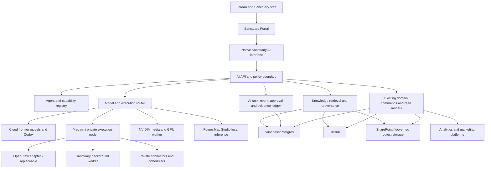
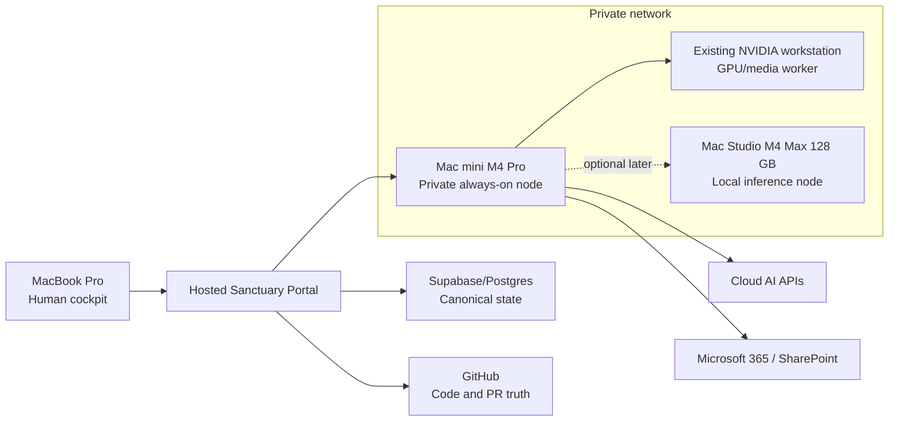
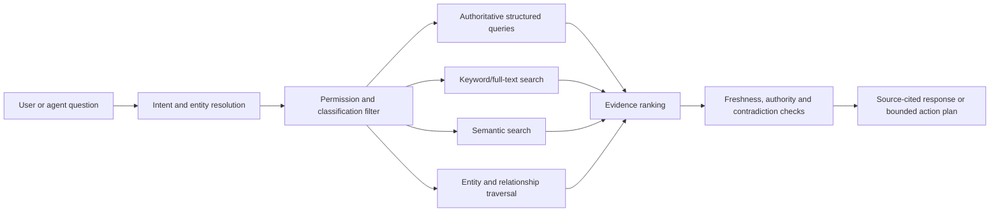
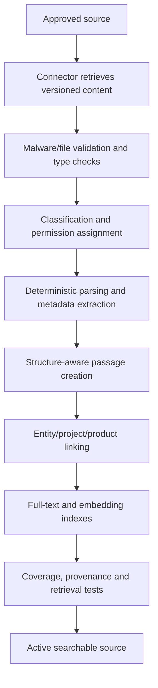
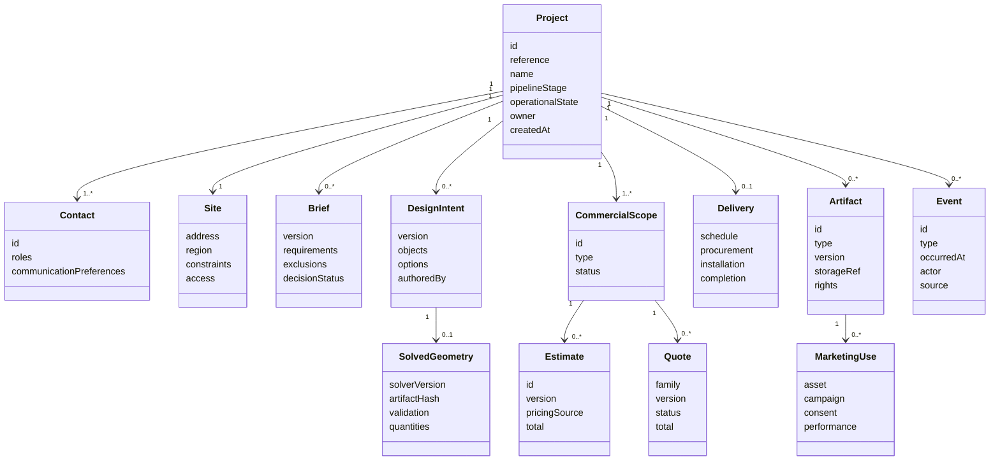
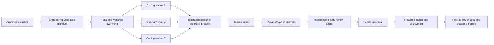
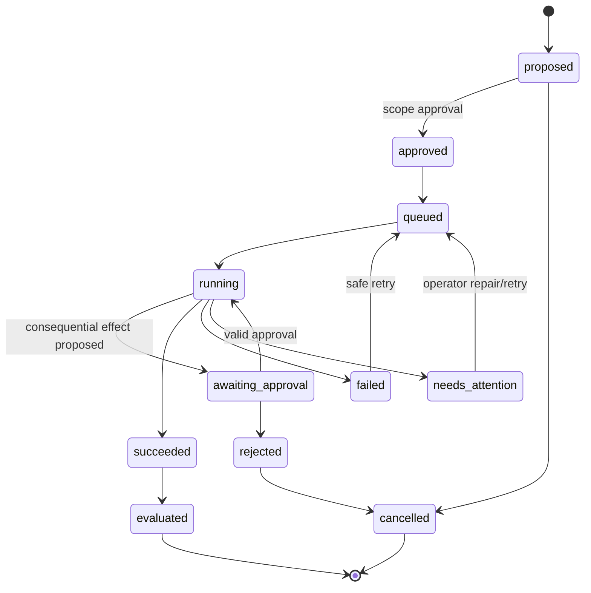
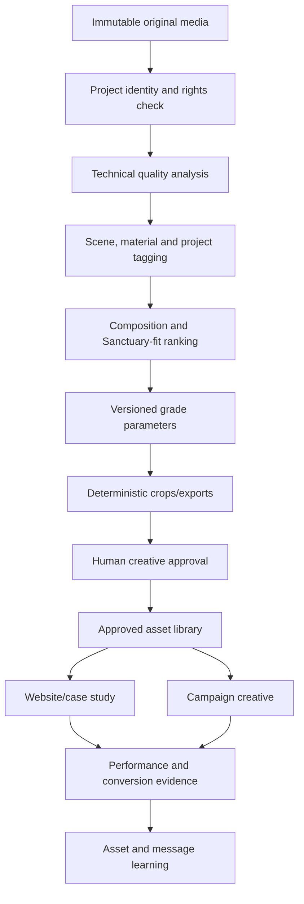
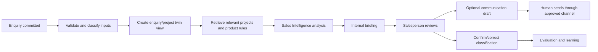
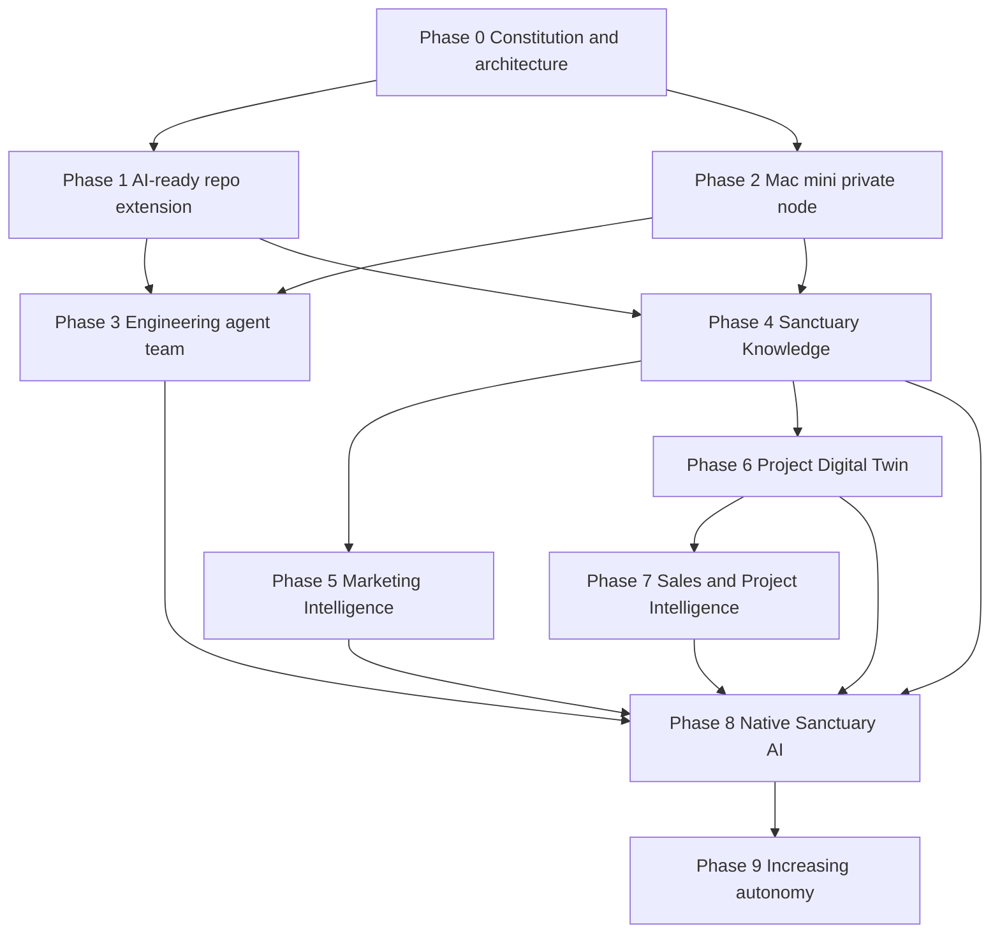

# Sanctuary AI Master Plan

**Status:** Proposed strategic and technical master plan
**Owner:** Jordan / Sanctuary Pergolas
**Scope:** 12-24+ month implementation programme
**Prepared:** 2026-08-17
**Review cadence:** Monthly during the first 90 days, then quarterly
**Intended repository location:** `docs/ai/sanctuary-ai-master-plan.md`

> Sanctuary AI is the native intelligence, coordination, and evidence layer for Sanctuary Pergolas. It should understand the business, projects, products, customers, brand, and operating rules; coordinate specialised software and agents; and progressively automate work from enquiry through design, costing, quoting, delivery, photography, and marketing without surrendering human control of consequential decisions.

## Read First

- This document is proposed strategy, not current repository behavior or blanket implementation approval.
- Start at `docs/ai/README.md` for programme routing and status authority.
- Current domain docs and `docs/target-architecture.md` remain authoritative for implemented boundaries.
- Implement only an explicitly approved, bounded PR slice and update its owner docs with current-state evidence.

## Contents

### Foundation and architecture

- [0. How to use this document](#0-how-to-use-this-document)
- [1. Executive decision](#1-executive-decision)
- [2. Programme objectives and measurable success](#2-programme-objectives-and-measurable-success)
- [3. Architectural constitution](#3-architectural-constitution)
- [4. Target architecture](#4-target-architecture)
- [5. Current-state assessment and gap analysis](#5-current-state-assessment-and-gap-analysis)

### Knowledge, projects, agents, and models

- [6. Sanctuary Knowledge architecture](#6-sanctuary-knowledge-architecture)
- [7. Project Digital Twin](#7-project-digital-twin)
- [8. Agent architecture](#8-agent-architecture)
- [9. Engineering agent team](#9-engineering-agent-team)
- [10. Model and execution router](#10-model-and-execution-router)

### Platform, user experience, and business capabilities

- [11. Orchestration and the Mac mini control node](#11-orchestration-and-the-mac-mini-control-node)
- [12. Native Sanctuary AI interface](#12-native-sanctuary-ai-interface)
- [13. Marketing AI system](#13-marketing-ai-system)
- [14. Sales AI](#14-sales-ai)
- [15. Project and operations AI](#15-project-and-operations-ai)
- [16. Security, permissions, and autonomy](#16-security-permissions-and-autonomy)
- [17. Memory architecture](#17-memory-architecture)
- [18. Evaluation and observability](#18-evaluation-and-observability)
- [19. Failure modes and unknown unknowns](#19-failure-modes-and-unknown-unknowns)

### Implementation roadmap

- [20. Implementation roadmap](#20-implementation-roadmap)
- [21. Phase 0 - Constitution and architecture](#21-phase-0---constitution-and-architecture)
- [22. Phase 1 - AI-ready repository extension](#22-phase-1---ai-ready-repository-extension)
- [23. Phase 2 - Mac mini private node](#23-phase-2---mac-mini-private-node)
- [24. Phase 3 - Engineering agent team](#24-phase-3---engineering-agent-team)
- [25. Phase 4 - Sanctuary Knowledge](#25-phase-4---sanctuary-knowledge)
- [26. Phase 5 - Marketing Intelligence](#26-phase-5---marketing-intelligence)
- [27. Phase 6 - Project Digital Twin](#27-phase-6---project-digital-twin)
- [28. Phase 7 - Sales and Project Intelligence](#28-phase-7---sales-and-project-intelligence)
- [29. Phase 8 - Native Sanctuary AI](#29-phase-8---native-sanctuary-ai)
- [30. Phase 9 - Increasing autonomy](#30-phase-9---increasing-autonomy)
- [31. Prioritisation by time horizon](#31-prioritisation-by-time-horizon)

### Decisions and immediate delivery

- [32. Hardware purchase and deployment sequence](#32-hardware-purchase-and-deployment-sequence)
- [33. Architectural decision register](#33-architectural-decision-register)
- [34. Repository documentation structure](#34-repository-documentation-structure)
- [35. Immediate next 10 implementation actions](#35-immediate-next-10-implementation-actions)
- [36. First set of small PRs](#36-first-set-of-small-prs)
- [37. Major unresolved architectural decisions](#37-major-unresolved-architectural-decisions)
- [38. Conditions that justify purchasing the 128 GB Mac Studio](#38-conditions-that-justify-purchasing-the-128-gb-mac-studio)
- [39. What Sanctuary AI should look like when substantially complete](#39-what-sanctuary-ai-should-look-like-when-substantially-complete)
- [40. Critical review of this plan](#40-critical-review-of-this-plan)
- [41. Official external implementation references](#41-official-external-implementation-references)
- [Appendix A - Terminology](#appendix-a---terminology)
- [Appendix B - Initial responsibility map](#appendix-b---initial-responsibility-map)
- [Appendix C - First production capability acceptance checklist](#appendix-c---first-production-capability-acceptance-checklist)
- [Appendix D - One-page programme summary](#appendix-d---one-page-programme-summary)

---

## 0. How to use this document

This is the strategic blueprint for the Sanctuary AI programme. It is deliberately more comprehensive than a normal current-state repository document because it defines a new platform, its operating model, and the sequence by which it should be introduced.

It does not replace the repository's current operational contracts. Until a phase is implemented and its owner documentation is updated, the following remain authoritative for current behaviour:

- `AGENTS.md`
- `docs/README.md`
- `docs/architecture.md`
- `docs/target-architecture.md`
- `docs/agent-playbook.md`
- `docs/platform-workflow.md`
- `docs/supabase-schema-map.md`
- `docs/security-privacy-quality.md`
- the current feature owner document for the affected workflow

When this plan conflicts with current production behaviour, the current owner document wins for current behaviour and this plan wins only as the approved target direction. Implementation PRs must update the relevant current-state owner documents as the target becomes real.

This master plan should eventually become an index and decision summary rather than a second copy of every implementation contract. Detailed sections should be split into canonical documents under `docs/ai/` as implementation begins.

### 0.1 Reading routes

| Reader | Read first |
| --- | --- |
| Jordan / business owner | Executive decision, target state, implementation roadmap, immediate actions, purchase sequence |
| Technical lead | Architecture, control plane, Project Digital Twin, security, data contracts, roadmap |
| Coding agent | Authority rules, repository integration, engineering workflow, first PRs, decision register |
| Marketing lead | Marketing AI system, Creative Director agent, measurement loop, autonomy matrix |
| Sales or project lead | Sales Intelligence, Project Intelligence, Project Digital Twin, approval rules |
| Security reviewer | Threat model, identities, prompt injection, approvals, retention, incident response |

---

# 1. Executive decision

## 1.1 The recommendation

Proceed with Sanctuary AI as a formal company platform and strategic programme, not as a collection of disconnected AI experiments.

Use the following hardware and deployment topology:

- **MacBook Pro:** Jordan's cockpit for review, design, approvals, and intervention.
- **Mac mini M4 Pro, approximately 48 GB / 1 TB / 10 GbE:** the proposed always-on private Sanctuary AI execution and connector node.
- **Existing NVIDIA workstation:** the GPU worker for architectural media, image and video pipelines, computer vision, CUDA workloads, and selected local models.
- **Cloud services:** the primary source of frontier reasoning, Codex engineering workers, durable hosted application access, and canonical business state.
- **Future Mac Studio M4 Max, 128 GB / approximately 2 TB:** a dedicated local inference node only after measured workloads justify it.

The critical refinement is this:

> The Mac mini is not the sole business control plane and must not become a new source of truth. Canonical workflow state remains in the hosted Sanctuary platform, GitHub, Supabase/Postgres, and governed document storage. The Mac mini is the private always-on execution, orchestration, connector, and local service node.

This preserves the desired separation between orchestration and heavy compute while avoiding an office computer becoming Sanctuary's single point of failure.

## 1.2 What Sanctuary already has

The repository is not starting from zero. It already contains many of the foundations that generic AI-platform plans would normally recommend building:

- a two-application npm workspace for marketing and portal;
- a dedicated Node 22 background worker;
- a shared durable jobs package;
- explicit costing, geometry, email-provider, quote-format, and theme packages;
- Supabase/Postgres with ordered migrations and strong access boundaries;
- extensive Vitest, Playwright, browser, performance, documentation, and architecture checks;
- a root `AGENTS.md` and active agent playbook;
- authenticated agent access to portal routes;
- deterministic seeded scenarios;
- page debug-export contracts;
- browser evidence capture;
- an agent scorecard and strictness ratchet;
- existing audit, project-work, commercial, email, and marketing-attribution evidence.

The correct move is therefore to extend the existing product architecture, not to install a separate automation universe beside it.

## 1.3 The target outcome

When the roadmap is substantially complete, Sanctuary staff should experience one coherent platform:

```text
Jordan and staff
      |
      v
Sanctuary Portal and Sanctuary AI interface
      |
      +--> understands the current project and user permissions
      +--> retrieves authoritative Sanctuary knowledge with sources
      +--> proposes or executes a bounded workflow
      +--> routes work to the correct specialist capability
      +--> records every material action, source, approval, cost, and result
      |
      v
Existing Sanctuary systems and domain owners
      |
      +--> Projects / Contacts / Project Work
      +--> Geometry / Costing / Estimates / Quotes / Invoices
      +--> Schedule / Running Jobs / Job Packs
      +--> SharePoint and project artifacts
      +--> Marketing, analytics, and media
      +--> GitHub and engineering workflows
```

The user should feel they are interacting with Sanctuary, not choosing among a collection of bots.

## 1.4 What should be built first

The highest-value starting sequence is:

1. ratify the Sanctuary AI constitution and architecture;
2. define AI task, approval, evidence, and model-routing contracts;
3. deploy the Mac mini securely as a private node;
4. operationalise the engineering agent team using the repo's existing agent foundations;
5. create the Sanctuary Knowledge source registry and provenance rules;
6. deliver read-only Marketing Intelligence;
7. create the Project Digital Twin as a typed projection over existing owners;
8. add Sales and Project Intelligence;
9. expose the native Sanctuary AI interface in the portal;
10. increase autonomy only where measured evidence supports it.

## 1.5 What should not be built first

Do not begin with:

- 20-30 role-playing agents;
- a new general-purpose vector database containing every file and email;
- automatic customer email;
- autonomous quote issue or price publication;
- broad database credentials for OpenClaw;
- a second queue and worker framework that competes with `packages/jobs` and `apps/worker`;
- a separate AI dashboard outside the Sanctuary Portal;
- a custom foundation model;
- a Mac Studio purchase justified only by the idea that local AI is desirable;
- direct UI automation of every desktop application;
- an AI-generated complete project timeline assembled from ungoverned records.

---

# 2. Programme objectives and measurable success

## 2.1 Business objectives

Sanctuary AI exists to improve five business outcomes:

1. **Reduce Jordan dependency.** Important business context, decisions, and workflows should be inspectable and repeatable without requiring Jordan to reconstruct them manually.
2. **Increase throughput without lowering quality.** Engineering, design administration, marketing, sales preparation, and project administration should move faster while preserving Sanctuary's premium standard.
3. **Create one reusable project knowledge loop.** Information created at enquiry, design, costing, delivery, and marketing stages should remain linked rather than being repeatedly re-entered.
4. **Make the company more observable.** Sanctuary should be able to answer what happened, why it happened, who or what acted, what evidence was used, and whether the result was useful.
5. **Build a compounding proprietary system.** Completed projects, operational outcomes, design rules, costing evidence, and marketing performance should make future work better.

## 2.2 Programme-level success criteria

The programme is successful when Sanctuary can demonstrate all of the following:

- a staff member can request a source-cited project briefing in less than two minutes;
- a new enquiry receives an internal, source-cited sales briefing without an agent sending anything to the customer;
- approved engineering objectives can progress from task definition to reviewed PR with minimal manual orchestration;
- every AI action has an accountable identity, policy version, input sources, output, cost, and outcome;
- authoritative business facts remain owned by existing domain systems rather than conversational memory;
- AI-generated recommendations visibly distinguish facts, inferences, missing evidence, and uncertainty;
- high-risk actions cannot execute without a valid approval envelope;
- model and vendor changes can be evaluated and rolled back without rewriting every workflow;
- failures degrade to safe manual workflows rather than blocking normal business operation;
- the measured value of each production agent exceeds its operating and review cost.

## 2.3 Non-goals

Sanctuary AI is not intended to:

- replace architectural, engineering, legal, employment, tax, or building-consent professionals;
- allow a model to invent physical, commercial, or project truth;
- automate all staff communication;
- eliminate human judgement from bespoke design;
- make local hardware the only way Sanctuary can operate;
- provide hostile multi-tenant execution for unrelated external users;
- expose private model reasoning or hidden chain-of-thought;
- become a new monolith that bypasses existing package, API, auth, and workflow owners.

---

# 3. Architectural constitution

The following principles are binding defaults. A deviation requires an explicit architecture decision record.

## 3.1 Sanctuary AI is the platform

OpenClaw, Codex, GPT models, local model servers, NVIDIA hardware, Apple hardware, embeddings, and individual SaaS connectors are replaceable components.

Sanctuary AI is the durable combination of:

- governed business knowledge;
- typed task and tool contracts;
- identity and permission policy;
- orchestration and durable execution;
- evidence and approval records;
- evaluation and observability;
- portal-native user experience;
- domain integrations that preserve existing sources of truth.

## 3.2 Agents are disposable; business memory is not

An agent process may be restarted, upgraded, or removed without losing important knowledge. Persistent truth belongs in Postgres, Git, governed file storage, immutable configuration snapshots, event logs, and search indexes that can be rebuilt.

## 3.3 Existing domain owners remain authoritative

- `@sp/geometry` owns physical geometry truth.
- `@sp/costing` owns commercial calculation truth.
- portal domain services and RPCs own project and commercial mutations.
- `@sp/jobs` owns durable job contracts and transition policy.
- `apps/worker` owns generic durable execution mechanics.
- GitHub owns code history and PR review evidence.
- SharePoint or approved object storage owns governed documents and originals.

AI may retrieve, explain, propose, compare, and invoke explicit commands. It must not silently fork those truths.

## 3.4 Every consequential action is observable

No production AI action should exist only in a transient transcript. Material actions must create structured evidence that can be inspected by a human and correlated to the business record affected.

## 3.5 Human control is designed, not implied

A vague statement that a human is "in the loop" is insufficient. Approval must specify:

- the exact action;
- the exact target;
- the exact frozen payload or payload hash;
- the authority required;
- the expiry;
- whether the approval is single-use;
- what changes would invalidate it.

## 3.6 Progressive autonomy is earned through evaluation

Workflows progress through these modes:

```text
shadow -> suggest -> draft -> approval-gated execution -> supervised autonomy -> audited autonomy
```

No workflow advances because it appears impressive in a demonstration. It advances because its evaluation set, production outcomes, incident history, and business value meet defined thresholds.

## 3.7 Deterministic software is preferred where agency is unnecessary

Use normal code for:

- calculations;
- validation;
- data transformations;
- state machines;
- permissions;
- schedules and retries;
- idempotency;
- file hashing;
- image resizing and format conversion;
- fixed report generation;
- schema mapping;
- known routing rules.

Use model reasoning where the task genuinely benefits from interpretation, synthesis, planning, generation, or uncertain judgement.

## 3.8 Untrusted content never becomes instruction authority

Email, uploaded documents, web pages, client notes, PDFs, and retrieved text are data. They cannot override the system policy, tool permissions, approval requirements, or workflow objective.

## 3.9 Local does not automatically mean private

A workload is private only when the complete path is understood: model execution, telemetry, logging, model downloads, browser extensions, remote access, backups, and external APIs. The word "local" is not itself a security control.

## 3.10 Safe failure is a product requirement

If a model, connector, Mac mini, GPU worker, or external API is unavailable:

- canonical business state remains intact;
- pending work is visible;
- no action is falsely shown as complete;
- idempotent retry is possible where safe;
- staff can continue through the existing manual workflow.

---

# 4. Target architecture

## 4.1 Logical architecture



## 4.2 Physical topology



## 4.3 The control-plane distinction

The phrase "control plane" can create confusion. Sanctuary should distinguish two forms:

### Business control plane

The hosted platform owns the durable business record:

- AI tasks and status;
- approval requests and decisions;
- agent identities and policies;
- audit and evidence;
- project relationships;
- source registry;
- model usage and evaluation results;
- staff-visible status.

This should remain available even when the office is offline.

### Private execution control node

The Mac mini owns private, always-on execution concerns:

- OpenClaw gateway or equivalent orchestration adapter;
- private connectors that should not run in a browser or serverless request;
- controlled access to the NVIDIA workstation;
- selected scheduler and event relay processes;
- local secret access where justified;
- local model endpoints and lightweight inference;
- worker process supervision where this deployment is selected;
- health and operational telemetry.

The Mac mini should consume durable tasks and publish results. It should not become the only place that task state or business decisions exist.

## 4.4 Component ownership

| Component | Owns | Must not own |
| --- | --- | --- |
| `apps/portal` | Staff AI UI, authenticated APIs, policy checks, read models, approvals | Local GPU implementation details; copied domain truth |
| `packages/ai` (new) | Typed AI task, agent, capability, policy, source, approval, result, and routing contracts | Provider credentials; DB persistence; UI |
| `packages/jobs` | Durable job kinds and execution-state contracts | Business-specific AI prompts or project logic |
| `apps/worker` | Generic claims, retries, leases, bounded execution, reconciliation, safe status | Project truth; copied portal modules; uncontrolled tools |
| Supabase/Postgres | Canonical structured state, audit, approvals, provenance, task/evaluation records | Model reasoning; raw unrestricted external content |
| OpenClaw adapter | Replaceable orchestration and tool invocation within policy | Canonical memory; broad direct database writes; unrestricted shell |
| NVIDIA worker | Media, vision, CUDA, selected local inference | Customer communication; project-state authority |
| Future Mac Studio | Large local/private inference service | Orchestration source of truth; sole platform availability |
| Cloud model adapters | Frontier reasoning and coding capability | Long-term memory; permission decisions |
| GitHub/Codex | Code tasks, branches, tests, reviews, PRs | Production merge without policy approval |
| SharePoint/object storage | Governed source files, originals, versions, retention | Authoritative structured project state |

## 4.5 Recommended repository integration

The near-term target should remain one workspace:

```text
apps/
  marketing/
  portal/
  worker/
packages/
  ai/                    # new: provider-neutral contracts and policy helpers
  costing/
  email-provider/
  geometry/
  jobs/
  quote-format/
  theme/
docs/
  ai/
    sanctuary-ai-master-plan.md
    00-vision.md
    01-architecture.md
    02-security-model.md
    03-sanctuary-knowledge-schema.md
    04-project-digital-twin.md
    05-agent-registry.md
    06-model-routing.md
    07-evaluation-framework.md
    08-roadmap.md
    09-decisions/
supabase/
  migrations/
```

Do not create an `apps/ai` service at the start. Add a separate long-running AI service only when one of these is true:

- portal request lifetimes materially constrain production workflows;
- AI API traffic requires independent scaling or deployment;
- security review requires a separate trust boundary;
- multiple products need the same hosted AI service;
- the worker cannot safely host the required execution mode;
- measured reliability would improve through separation.

Until then, keep authenticated API and user experience in Portal, shared contracts in `@sp/ai`, durable execution in the existing jobs/worker spine, and private adapters on the Mac mini.

---

# 5. Current-state assessment and gap analysis

## 5.1 Strong existing foundations

| Foundation | Current strength | Sanctuary AI implication |
| --- | --- | --- |
| Agent guidance | Root `AGENTS.md`, playbook, owner docs, decision log | New AI engineering workflows should inherit current routing and guardrails |
| Testability | Vitest, Playwright, authenticated access, fixtures, browser evidence | Engineering agent loop can become operational early |
| Domain separation | Costing, geometry, email, jobs and formatting packages | AI tools should call domain owners, not reproduce logic |
| Durable execution | Job contracts, worker, leases, retries, health, safe logs | Extend this instead of creating a second queue system |
| Project workflow | Project Work, command receipts, audit events and strict read models | AI should use semantic commands and projections |
| Marketing attribution | Lifecycle audit events and GA4 delivery boundary | Marketing Intelligence can connect performance to business outcomes |
| Documentation discipline | Canonical docs and doc-impact checks | AI programme can remain discoverable and maintainable |
| Security posture | Staff/admin helpers, RLS, service-role boundaries, tokenised public routes | Agent identities should extend existing least-privilege patterns |

## 5.2 Material gaps

The current repository is agent-friendly for coding, but it does not yet provide a general business-agent platform. The most important missing contracts are:

- a first-class AI task and run ledger;
- a capability and agent registry;
- a model/provider abstraction;
- approval envelopes bound to exact actions;
- a source and citation contract;
- a business knowledge registry with freshness and authority;
- Project Digital Twin projections across the complete lifecycle;
- a portal-native task, approval, and evidence interface;
- private node registration and health;
- GPU-worker task contracts;
- prompt-injection and untrusted-content policy;
- AI-specific evaluation datasets and promotion criteria;
- cost and usage accounting by business outcome;
- a staff operating model for supervising agents.

## 5.3 The highest-leverage architectural correction

A generic plan might recommend deploying OpenClaw, a vector database, a queue, and a dashboard on the Mac mini. That would duplicate several Sanctuary capabilities and create parallel truth.

The Sanctuary-specific design is:

```text
Existing hosted platform
  owns tasks, approvals, business truth, audit, and user experience

Existing jobs/worker spine
  owns durable technical execution mechanics

Mac mini
  hosts private agents, connectors, and local adapters

OpenClaw
  is one replaceable execution adapter behind Sanctuary contracts

NVIDIA workstation and future Mac Studio
  expose bounded compute capabilities rather than becoming autonomous business systems
```

## 5.4 Delivery principle

Every new AI capability should enter through this sequence:

1. identify the current source of truth and mutation owner;
2. define a typed read or command contract;
3. classify the risk and data sensitivity;
4. create an evaluation set;
5. implement in shadow or read-only mode;
6. record sources and outcomes;
7. add an approval boundary if it writes or communicates;
8. measure production results;
9. promote autonomy only if thresholds are met;
10. retain a manual fallback and kill switch.

---

# 6. Sanctuary Knowledge architecture

## 6.1 Purpose

Sanctuary Knowledge is the governed layer that lets AI answer a different question from ordinary document search:

> What does Sanctuary currently know, which source is authoritative, how current is it, and what is safe to do with that knowledge?

It must support retrieval without confusing a useful document, a model inference, and an authoritative business rule.

## 6.2 Knowledge classes

| Knowledge class | Examples | Canonical location | AI treatment |
| --- | --- | --- | --- |
| Structured authoritative truth | project state, quote status, accepted totals, cost config version, schedule dates | Postgres and domain packages | Query through owned APIs/read models; never replace with embeddings |
| Versioned executable truth | costing formulas, geometry solvers, validation, pipeline definitions | Git packages and reviewed config | Reference exact version or commit; execute through package boundary |
| Governed documents | warranty, product manuals, supplier data, SOPs, signed briefs, drawings | SharePoint or approved object storage | Index with version, owner, classification, and effective date |
| Current repository guidance | architecture, playbooks, decision log, feature owner docs | Git | Retrieve current branch/version and cite path/commit |
| Operational evidence | audit events, command receipts, project work events, email delivery status | Postgres append-only records | Use as evidence; do not reinterpret into unsupported state |
| Search index | passages, keywords, embeddings, entity links | Postgres search tables/indexes | Derived and rebuildable; never sole authority |
| Temporary context | current chat, task scratchpad, tool output | task-scoped storage | Expire or archive according to policy; not business memory |
| Derived AI assertion | classification, risk hypothesis, summary, recommendation | AI result/evidence tables | Store source links, model/policy version, confidence and expiry; never silently canonical |
| Human decision | approved scope, exception, policy, correction | owning domain record and audit/decision log | Highest authority within the person's role and workflow |

## 6.3 Source registry

Create a first-class registry of knowledge sources. A source is not merely a URL or file path. It needs enough metadata for policy and freshness decisions.

Conceptual contract:

```ts
export type KnowledgeSource = {
  id: string;
  key: string;                    // stable human-readable identifier
  title: string;
  sourceType:
    | "database_read_model"
    | "git_document"
    | "sharepoint_document"
    | "object_storage_asset"
    | "external_official_source"
    | "analytics_dataset"
    | "supplier_document";
  authority: "canonical" | "supporting" | "historical" | "unverified";
  owner: string;
  dataClassification: "public" | "internal" | "confidential" | "restricted";
  effectiveFrom?: string;
  effectiveTo?: string;
  reviewedAt?: string;
  reviewDueAt?: string;
  versionRef?: string;
  retrievalAdapter: string;
  allowedPurposes: string[];
  allowedAgents: string[];
  retentionPolicy: string;
  status: "active" | "superseded" | "quarantined" | "retired";
};
```

The registry should answer:

- who owns this source;
- whether it is authoritative or merely useful;
- who may retrieve it;
- whether it is current;
- what version was used;
- whether it may leave Sanctuary-controlled infrastructure;
- whether it may influence a recommendation, a draft, or an action;
- how to invalidate and re-index it.

## 6.4 Authority hierarchy

When sources disagree, Sanctuary AI should resolve them in this order unless a domain-specific rule says otherwise:

1. current immutable business records and explicit semantic command results;
2. current package/domain logic and published configuration snapshots;
3. current canonical repository owner documentation;
4. current governed company policy or signed project documents;
5. current supplier or professional documentation verified for the project;
6. staff-authored notes and correspondence;
7. historical records;
8. external web content;
9. model inference.

A lower source can identify a discrepancy, but it cannot silently overwrite a higher source.

## 6.5 Provenance contract

Every knowledge-backed answer should be able to return:

```ts
export type AnswerEvidence = {
  claimId: string;
  claim: string;
  evidence: Array<{
    sourceId: string;
    locator: string;              // table row/version, path+lines, page, message ID, etc.
    retrievedAt: string;
    sourceVersion?: string;
    excerptHash?: string;
    authority: KnowledgeSource["authority"];
  }>;
  basis: "direct" | "calculated" | "inferred";
  confidence: "high" | "medium" | "low";
  limitations?: string[];
};
```

The portal should show concise source links, not raw internal model reasoning.

## 6.6 Freshness model

Freshness is domain-specific. A universal expiry period would be wrong.

| Domain | Suggested freshness rule |
| --- | --- |
| Project state, quotes, invoices, work items | Query current read model at task execution; do not rely on cached embedding |
| Costing configuration | Bind to immutable published version and exact effective timestamp |
| Geometry | Bind to exact design intent and solver version |
| Supplier pricing | Owner-defined effective date; flag expired or unreviewed data |
| Warranty and process policy | Review at least annually or on policy change |
| Marketing performance | Timestamp every extraction; daily or near-real-time where useful |
| Website/repository docs | Bind to branch/commit; re-index on merge |
| External laws, standards, software APIs | Retrieve from current official source when material to the action |
| Completed-project facts | Stable unless corrected; preserve correction history |

A stale source should not simply disappear. It should be labelled stale and either excluded from action decisions or presented with a review requirement.

## 6.7 Search architecture

Use a layered retrieval strategy:



### Structured retrieval first

If the question can be answered from an owned read model, use it. Examples:

- current quote status;
- project owner;
- accepted value;
- next Project Work action;
- install date;
- estimate pricing version.

Do not search embeddings for these facts.

### Hybrid document retrieval

For documents and unstructured evidence, combine:

- exact identifiers and metadata filters;
- PostgreSQL full-text or keyword search;
- semantic similarity;
- recency;
- authority;
- project and entity relationships;
- document section and version.

Semantic similarity is a recall tool, not an authority score.

### Relationship retrieval

Many valuable queries are relational rather than semantic:

- projects with the same roof form, attachment, site constraint, and price range;
- all documents associated with an accepted quote version;
- photos produced by a completed project with permission for advertising;
- site issues associated with a certain detail or supplier component;
- campaigns using images from a specific project and the enquiries they produced.

These relationships should be modelled explicitly rather than inferred repeatedly from text.

## 6.8 Ingestion pipeline



Required ingestion controls:

- allowlisted source types and connectors;
- immutable original reference and content hash;
- file type, size, and malware checks;
- no execution of macros or embedded instructions;
- project, client, and access classification before indexing;
- page/section/row locators retained for citation;
- version and supersession relationships;
- deletion and legal-retention propagation;
- a re-index path that does not modify originals;
- retrieval tests for important facts;
- quarantine for unknown, malformed, or suspicious content.

## 6.9 Document-specific rules

### SharePoint and Microsoft 365

Use SharePoint as a governed document source where it already owns business files. Avoid copying every document into a second unmanaged file store. The knowledge index should retain a source reference, version, access classification, and indexed derivative.

Email should be ingested selectively and purposefully. A complete mailbox dump creates privacy, relevance, and prompt-injection risks. Prefer:

- project-linked messages;
- approved folders or labels;
- bounded date ranges;
- extracted correspondence events and attachments;
- explicit retention rules;
- sender, recipient, date, thread, and message identifiers.

### Git and repository documents

Index only current, relevant branches for normal agent use. Historical commits should be retrieved deliberately when investigating a decision, not mixed into current guidance. Every retrieved repository claim should retain commit SHA and path.

### Supplier information

Supplier documents require:

- supplier identity;
- document type;
- region/currency/tax basis;
- effective date;
- superseded date;
- who verified it;
- whether it is contractual, indicative, or marketing material;
- restrictions on external model use.

### Photos and media

Media records should store:

- original immutable asset reference;
- project relationship;
- photographer and rights;
- client release/consent status;
- permitted channels;
- people/minor/property-release flags;
- capture date and location sensitivity;
- technical metadata;
- derivative lineage;
- AI-edit history;
- colour-grade version;
- crop and output versions.

## 6.10 Derived knowledge policy

AI-derived knowledge must be treated as a proposal or observation until validated.

Examples:

| Derived assertion | Required handling |
| --- | --- |
| "This project is likely Custom Design & Build" | Store as classification with evidence and confidence; staff may confirm |
| "This image is one of the strongest marketing assets" | Store ranking and model/evaluation version; human approves campaign use |
| "A steel beam may be required" | Present as a design/engineering consideration, not a structural conclusion |
| "This supplier price is probably outdated" | Create review signal; do not replace price |
| "This client is unlikely to proceed" | Restrict use, explain evidence, avoid discriminatory or automatic adverse action |
| "This wording performs better" | Treat as experiment hypothesis until measured |

## 6.11 Sanctuary Knowledge initial domains

Build in this order:

1. **Repository and platform knowledge** - highest quality and easiest to verify.
2. **Product, material, costing, and construction rule registry** - structured and owner-reviewed.
3. **Completed project catalogue** - facts, attributes, images, rights, outcomes.
4. **Current sales and marketing claims** - tied to claims register and evidence.
5. **Project document registry** - project-linked, access-controlled, versioned.
6. **Supplier and warranty knowledge** - governed dates and review owners.
7. **Correspondence and operational evidence** - narrow, project-linked, threat-aware.
8. **External official sources** - retrieved on demand for current high-stakes facts.

## 6.12 Knowledge definition of done

Sanctuary Knowledge is not done when a chatbot can answer questions. Its first production milestone is done when:

- every indexed source has an owner, authority, classification, version, and status;
- structured facts are retrieved from structured owners;
- source locators are visible in answers;
- permissions are enforced before retrieval;
- stale and conflicting sources are labelled;
- deleted or superseded sources can be removed from indexes;
- important retrieval questions have automated tests;
- model output cannot convert derived assertions into canonical truth.

---

# 7. Project Digital Twin

## 7.1 Strategic role

The Project Digital Twin is the most important long-term data product in Sanctuary AI. It is the common, governed representation through which a project can be understood across its lifecycle:

```text
lead
  -> client and site
  -> requirements and brief
  -> design intent
  -> solved geometry
  -> engineering evidence
  -> costing and estimate
  -> quote and commercial scope
  -> documentation and procurement
  -> programme and installation
  -> completion and warranty
  -> photography and case study
  -> campaign use and measured revenue
```

The twin is not a 3D model alone. It is the linked identity, state, evidence, artifacts, events, and relationships of the project.

## 7.2 Do not build a monolithic twin table

Sanctuary already has authoritative domain records. Replacing them with one giant `project_digital_twin` JSON column would:

- duplicate truth;
- weaken write boundaries;
- hide data lineage;
- create difficult migrations;
- encourage agents to write arbitrary JSON;
- make reconciliation and access control harder.

The recommended pattern is a typed projection and graph over existing owners.

```text
Existing owner tables and packages
      |
      +--> owned adapters and stable IDs
      |
      v
ProjectTwinProjectionV1
      |
      +--> facts with owner, version, freshness and availability
      +--> related artifacts and events
      +--> AI-safe summaries and retrieval links
      |
      v
Portal, agent and reporting consumers
```

## 7.3 Twin design principles

1. **One stable project identity.** All project-related entities should resolve to the canonical `projects.id` or an explicit pre-project lead identity.
2. **No browser-derived truth.** Server-owned projections compose facts.
3. **Every fact names its owner.** The twin does not obscure where a fact came from.
4. **Missing is not false.** Unknown, unavailable, not recorded, stale, and not applicable are different states.
5. **Events are append-only evidence.** They do not replace current-state records.
6. **Artifacts are referenced, not embedded indiscriminately.** Originals stay in governed storage.
7. **Versions matter.** Design, geometry, costing, quote, and documents must retain exact versions.
8. **Writes go to domain commands.** The twin is not a general mutation surface.
9. **Sensitive facts are purpose-filtered.** A marketing agent should not receive all correspondence or financial details.
10. **Projection contracts are versioned.** Consumers can migrate safely.

## 7.4 Conceptual project model



## 7.5 Twin projection contract

A practical first contract might resemble:

```ts
export type ProjectTwinProjectionV1 = {
  schemaVersion: "project-twin-v1";
  project: TwinFact<ProjectIdentity>;
  contacts: TwinCollection<ProjectContact>;
  site: TwinFact<ProjectSite>;
  journey: TwinFact<ProjectJourney>;
  work: TwinFact<ProjectWorkProjection>;
  brief: TwinFact<CurrentBriefSummary>;
  design: TwinFact<CurrentDesignSummary>;
  geometry: TwinFact<SolvedGeometrySummary>;
  commercial: TwinFact<CommercialTruthSummary>;
  delivery: TwinFact<DeliverySummary>;
  artifacts: TwinCollection<ProjectArtifactReference>;
  recentMeaningfulEvents: TwinCollection<ProjectEvent>;
  marketing: TwinFact<ProjectMarketingSummary>;
  generatedAt: string;
  projectionVersion: string;
};

export type TwinFact<T> = {
  state: "available" | "unavailable" | "unknown" | "not_recorded" | "not_applicable" | "stale";
  value?: T;
  owner: string;
  sourceRefs: string[];
  version?: string;
  observedAt?: string;
  limitations?: string[];
};
```

This aligns with Sanctuary's existing trust posture: do not fabricate a complete summary when a source is absent or failed.

## 7.6 Structured entities

The following should be structured, not left only in files or embeddings:

### Project identity and lifecycle

- project ID and reference;
- project type and service pathway once an approved owner exists;
- pipeline stage;
- operational state;
- project owner and handover history;
- closed outcome;
- waiting reason/date;
- key lifecycle timestamps.

### Site

- normalized address and region;
- site access constraints;
- coastal/exposure classification when verified;
- planning/consent status;
- house attachment context;
- known services and hazards;
- measurement source and date;
- site visit and survey references.

### Brief and decisions

- requirements;
- exclusions;
- selected pathway;
- decisions required;
- decision owner;
- status and due date;
- approved decision outcome;
- source communication/document.

### Design intent

- object-first pergola, house, deck, opening, roof, attachment, and option records;
- version and author;
- selected materials, colours, roofing, drainage, blinds, lighting, heating;
- design status;
- compatibility or migration state.

### Physical truth

- exact geometry solver version;
- solved artifact identifier and hash;
- dimensions, spans, quantities, validation, and warnings;
- engineering input/output references;
- generated plan, section, 3D, and takeoff references.

### Commercial truth

- commercial scope identities for base and add-ons;
- estimate and quote families/versions;
- frozen pricing source;
- totals and GST basis;
- accepted/current status;
- payment schedule and reconciled financial summary;
- variations and approvals;
- actual cost calibration where governed.

### Delivery truth

- design package status;
- job pack references;
- procurement facts and supplier orders;
- Schedule V2 planned and actual dates;
- crew;
- Running Jobs operational facts;
- site issues;
- completion and handover;
- warranty events.

### Marketing truth

- completed-project eligibility;
- photo and video assets;
- rights and releases;
- case study status;
- website placement;
- campaign usage;
- enquiry, quote, and revenue attribution where supportable.

## 7.7 Artifact model

Create a common artifact registry before attempting to copy every file into one storage system.

```ts
export type ProjectArtifactReference = {
  id: string;
  projectId: string;
  artifactType:
    | "brief"
    | "site_photo"
    | "survey"
    | "rhino_model"
    | "drawing"
    | "engineering"
    | "estimate_snapshot"
    | "quote_pdf"
    | "invoice_pdf"
    | "job_pack"
    | "installation_photo"
    | "marketing_photo"
    | "case_study"
    | "other";
  sourceSystem: "sharepoint" | "supabase_storage" | "github" | "generated";
  sourceRef: string;
  sourceVersion?: string;
  contentHash?: string;
  createdAt?: string;
  effectiveAt?: string;
  classification: "public" | "internal" | "confidential" | "restricted";
  rights?: {
    owner?: string;
    customerRelease?: boolean;
    allowedChannels?: string[];
    expiresAt?: string;
  };
  derivedFrom?: string[];
  generatedByTaskId?: string;
};
```

## 7.8 Event and history model

The twin needs meaningful history, but not every database write should become a staff timeline item.

Use two layers:

1. **Domain evidence:** existing append-only audit, command, project-work, commercial, schedule, provider, and AI task events.
2. **Meaningful project events projection:** a bounded, normalized read model that selects events useful to staff and agents.

A meaningful event should have:

- stable event type;
- occurred-at time distinct from indexed-at time;
- actor type and identity;
- domain owner;
- project and related entity IDs;
- safe summary;
- source reference;
- correction/supersession relationship;
- visibility/classification;
- whether it may appear in customer-facing output.

Do not call the projection a complete timeline until its source coverage is explicitly defined and tested.

## 7.9 Version and lineage rules

- Design intent is immutable by version or produces a reconstructable change history.
- Solved geometry records exact design input version and solver version.
- Costing records exact commercial input and published pricing version.
- Quotes reference exact estimate/source versions and never reprice history implicitly.
- Generated artifacts retain content hash, generator version, and source versions.
- AI summaries retain the projection version and source snapshot used.
- Corrections append evidence rather than erasing historical decisions.
- A new version does not make the prior version disappear; it changes which version is current.

## 7.10 Agent interaction with the twin

Agents receive purpose-specific views, not the entire project by default.

| Agent | Default twin view |
| --- | --- |
| Chief of Staff | project identity, owner, state, next work, exceptions, commercial summary, recent meaningful events |
| Sales Intelligence | enquiry, contact, site, brief, relevant precedents, indicative complexity; no unnecessary payment detail |
| Engineering agent | repository/project technical context only where explicitly requested; no broad client correspondence |
| Creative Director | approved project facts, media, rights, brand context, campaign performance |
| Project Intelligence | brief, decisions, design/commercial status, delivery facts, correspondence evidence as permitted |
| Marketing Intelligence | privacy-safe project and conversion outcomes, campaign/asset relationships; no unnecessary personal data |

Write actions are explicit domain commands, for example:

```text
AI proposes: "Record the selected roof as light-grey acrylic"
      |
      v
Portal shows exact change, source and impact
      |
      v
Authorised staff approves
      |
      v
Owned design command validates and commits
      |
      v
Command receipt and twin projection update
```

The agent never patches the twin projection itself.

## 7.11 Migration path without a rewrite

### Stage A - identity and registry

- establish stable project and artifact references;
- document current owner systems;
- create source registry;
- expose current project summary through one versioned server projection;
- do not alter existing writes.

### Stage B - projection adapters

- add adapters for contact/site, Project Work, current design/commercial, schedule/running jobs, and artifacts;
- represent unavailable facts explicitly;
- add contract tests against seeded scenarios.

### Stage C - lifecycle linkage

- link inquiry attribution, estimate, quote, schedule, completion, media, and campaign records through stable IDs;
- add meaningful event projection;
- create reconciliation reports for missing links.

### Stage D - authored brief and decisions

- introduce a structured, versioned project brief and decision register where current records are inadequate;
- migrate only active projects where value justifies it;
- keep historical projects readable through adapters.

### Stage E - downstream feedback

- connect actual cost, delivery issue, warranty, asset, and campaign outcome evidence;
- enable analysis across project cohorts;
- preserve privacy and purpose limits.

## 7.12 Twin reconciliation

Provide explicit reports for:

- project records with no contact or site identity;
- estimates without reliable source metadata;
- artifacts not linked to a project;
- accepted quotes with missing downstream relationships;
- schedule/running-job conflicts;
- media without rights metadata;
- campaign assets without project lineage;
- AI-derived classifications awaiting confirmation;
- stale or failed projection owners.

Reconciliation should identify gaps. It should not silently repair commercial or lifecycle truth.

## 7.13 Project Digital Twin definition of done

The first production twin milestone is complete when:

- a versioned projection can represent a project from enquiry through current delivery state;
- every surfaced fact names an owner and source;
- missing and failed owners remain truthful;
- the same projection supports a portal project briefing and at least two specialist agents;
- artifacts have stable references and rights/classification metadata;
- writes continue through existing semantic commands;
- contract tests cover representative project states;
- projection latency and failures are observable;
- historical projects do not require a big-bang data migration.

---

# 8. Agent architecture

## 8.1 Definition of an agent

Within Sanctuary AI, an agent is a bounded decision-making runtime that:

- receives one explicit objective;
- has a declared role and capability set;
- receives only permitted context;
- can select from allowlisted tools;
- operates under a policy and cost budget;
- produces structured outputs and evidence;
- stops, escalates, or requests approval when required.

An agent is not:

- a permanent personality that owns business truth;
- an unrestricted shell session;
- a substitute for a state machine;
- an excuse to create an executive-role simulation;
- an autonomous employee with implicit authority.

## 8.2 Agent runtime contract

Every production agent invocation should bind to a frozen runtime contract:

```ts
export type AgentInvocation = {
  taskId: string;
  agentKey: string;
  agentVersion: string;
  policyVersion: string;
  objective: string;
  capabilityRequests: string[];
  contextRefs: string[];
  dataClassification: "public" | "internal" | "confidential" | "restricted";
  toolAllowlist: string[];
  maxSteps: number;
  maxCostCents: number;
  deadlineAt?: string;
  approvalMode: "none" | "before_tool" | "before_effect" | "before_completion";
  outputSchema: string;
  idempotencyKey: string;
};
```

The model may decide how to complete the objective inside this contract. It may not expand its own permissions, cost, purpose, or data access.

## 8.3 Initial agent registry

| Agent | Initial mode | Primary outcome | Maximum initial authority |
| --- | --- | --- | --- |
| Sanctuary Chief of Staff | Read-only and proposal | Prioritised daily/weekly brief and routed tasks | Create internal AI tasks and approval proposals |
| Engineering Lead | Proposal and branch orchestration | Bounded implementation plan and coordinated PR work | Create task manifests/branches/PRs; no production merge |
| Coding Worker | Isolated implementation | Scoped code change with tests | Write only to assigned branch/worktree |
| Testing Agent | Deterministic plus model diagnosis | Test evidence and failure classification | Run allowlisted commands; attach artifacts |
| Visual QA Agent | Read-only evaluation | Screenshot/render comparison and issue report | Capture and assess approved routes/fixtures |
| Code Review Agent | Read-only review | Risk-ranked review with evidence | Comment/recommend; no merge |
| Marketing Intelligence | Read-only | Performance explanation and experiment recommendations | Read governed analytics/attribution datasets |
| Creative Director | Draft and asset transformation | Ranked assets and approved-ready creative package | Create derivatives/drafts; no public publish |
| Sales Intelligence | Read-only and draft | New-enquiry and site-visit briefing | Create internal briefing and suggested follow-up draft |
| Project Intelligence | Read-only and proposal | Project brief, risks, decisions and next-step analysis | Create internal recommendations; no state change |

Security, policy, financial approval, and data-governance functions should initially remain deterministic rules and human roles, not theatrical "Security Agent" or "CFO Agent" personas.

## 8.4 Sanctuary Chief of Staff

### Purpose

Provide a trusted, source-cited view of what needs attention across Sanctuary and route bounded tasks to specialist workflows.

### Inputs

- current authenticated user and role;
- Project Work queue and exceptions;
- project owner/state summaries;
- engineering task and PR status;
- marketing performance and anomalies;
- AI approval inbox;
- agent health, failures, costs, and overdue tasks;
- user-selected time horizon and scope.

### Outputs

- concise daily or weekly brief;
- prioritised items with reason, owner, source, and safe next action;
- proposed specialist tasks;
- explicit unknowns and stale sources;
- approval requests requiring Jordan or another role.

### Tools

- read-only portal read models;
- AI task registry;
- GitHub PR/check summaries;
- marketing intelligence read model;
- project and event search;
- notification service;
- bounded task-creation command.

### Read access

Cross-domain summary projections appropriate to the authenticated user. It should not receive all raw emails, attachments, or personal information by default.

### Write access

- create an internal AI task with a frozen objective and scope;
- assign or propose an owner;
- save a briefing;
- request approval.

It does not directly modify project stage, pricing, quotes, schedules, or customer communication.

### Model requirements

Strong synthesis, prioritisation, tool selection, and uncertainty handling. Use a frontier reasoning model initially because the volume is low and the cost of poor prioritisation is meaningful.

### Memory strategy

- current task context;
- user-approved preferences stored as explicit settings;
- brief history in structured records;
- no hidden long-term personal memory as operational truth.

### Triggers

- user request;
- scheduled morning or weekly briefing;
- critical agent/system exception;
- a group of tasks awaiting the same approver;
- significant business metric anomaly.

### Human approval

Required before creating any downstream task that can produce an external or business-state effect. Internal read-only analyses may be routed automatically within cost limits.

### Evaluation

- percentage of brief items judged relevant;
- false-critical and missed-critical rate;
- source coverage;
- time saved preparing management review;
- number of routed tasks accepted versus discarded;
- duplicate/noise rate.

### Failure and escalation

If any required source is stale, failed, or permission-denied, the brief must name the limitation. It must not infer a green all-clear from partial data. A repeated source failure creates an operational alert rather than repeated model retries.

## 8.5 Engineering Lead

### Purpose

Translate an approved software objective into architecture-aware, non-overlapping implementation tasks and coordinate the engineering agent loop.

### Inputs

- approved objective and acceptance criteria;
- root and nested agent instructions;
- owner documents and decision log;
- repository status and relevant code;
- route/scenario/test catalogs;
- architecture and worktree reports;
- open PRs and lane ownership.

### Outputs

- task manifest;
- affected owner areas and docs;
- risk and dependency analysis;
- implementation slices;
- worker assignments and path ownership;
- integration order;
- verification matrix;
- recommendation to merge, revise, split, or stop.

### Tools

- GitHub repository and PR tools;
- Codex/cloud coding workers;
- repo search and read;
- task/branch creation;
- test and CI status;
- architecture reports;
- no production deployment credentials.

### Read access

Repository and engineering metadata. Project/customer data is included only when the approved objective genuinely requires a sanitized fixture or explicit authorised context.

### Write access

- create isolated branches/worktrees or coding tasks;
- create/update draft PRs;
- add structured review context;
- request human approval.

No direct merge to protected production branches initially.

### Model requirements

High-quality software planning and codebase reasoning. Use a strong coding/reasoning model and retain exact model snapshot in the task record.

### Memory strategy

Repository docs, task manifest, PR history, and decision records. The Engineering Lead should not depend on a private conversational memory of prior architecture.

### Triggers

- approved feature, bug, refactor, audit, or hardening objective;
- review feedback requiring re-planning;
- failed integration or conflicting worker scope;
- Chief of Staff routing with human approval.

### Human approval

Required for the objective, broad architecture changes, build-on-legacy exceptions, production merge, dependency changes with material risk, and any scope expansion.

### Evaluation

- planning accuracy;
- scope changes discovered after coding starts;
- PR acceptance rate;
- regressions and rework;
- architecture guard findings;
- human review time;
- parallel-worker conflict rate;
- time from approved objective to merge-ready PR.

### Failure and escalation

Stop and resurface when:

- source-of-truth ownership is unclear;
- a missed consumer changes scope;
- two workers need the same shared contract;
- current docs conflict materially;
- required fixtures or evidence do not exist;
- user approval is required by `AGENTS.md`;
- tests cannot establish correctness.

## 8.6 Coding/Implementation Worker

### Purpose

Implement one bounded task in an isolated lane.

### Inputs

- immutable task manifest;
- assigned paths and excluded paths;
- acceptance criteria;
- owner docs;
- expected tests;
- base commit and branch;
- dependencies on other worker outputs.

### Outputs

- scoped code and documentation diff;
- tests and fixtures;
- command results;
- decomposition/source-of-truth notes;
- residual risks;
- commit or draft PR.

### Tools

- isolated repository worktree;
- allowlisted build/test commands;
- browser fixtures when required;
- package manager within repository policy;
- no broad external network unless explicitly allowed.

### Read access

Repository content within the task scope plus owner docs. Secrets and production data are not required for normal implementation.

### Write access

Assigned branch/worktree and declared path lane only.

### Model requirements

Coding model selected by task complexity. Simple repetitive changes may use a less expensive model after evaluation; architecture-sensitive changes use the strongest proven option.

### Memory strategy

Task-local only. Durable lessons go into tests, docs, or the decision log.

### Triggers

Created by the Engineering Lead after task scope and lane assignment.

### Human approval

Not required for each edit inside the branch. Required if scope, owner, public behaviour, dependency, data model, or risk classification changes.

### Evaluation

- acceptance criteria passed;
- changed lines later modified by reviewer/human;
- test coverage and defect escape;
- owner-boundary compliance;
- unused code and architecture findings;
- cost and elapsed time.

### Failure and escalation

Stop rather than improvise when the task contract is wrong, files are outside lane, a migration/history rule is unclear, or a required external service cannot be safely tested.

## 8.7 Testing Agent

### Purpose

Execute the appropriate verification matrix, collect evidence, classify failures, and prevent false-green handoffs.

### Inputs

- changed paths;
- task risk classification;
- acceptance criteria;
- owner docs and canonical command catalog;
- known environment capabilities;
- base/head comparison.

### Outputs

- commands run and exact results;
- failing test signatures;
- browser evidence links;
- environment blockers separated from product failures;
- recommended next diagnostic step;
- pass/fail/blocked result.

### Tools

Primarily deterministic:

- Vitest;
- TypeScript;
- ESLint and repo guards;
- Playwright;
- build commands;
- browser evidence and fixtures;
- CI status;
- optional model analysis of failure output.

### Read/write access

Read repository and test environment; write only test artifacts, task evidence, and assigned test changes when the task explicitly includes them.

### Model requirements

A model is optional for command selection and diagnosis. Pass/fail must come from deterministic evidence, not model judgement.

### Memory strategy

Known failure fingerprints should become structured diagnostics or tests, not informal memory.

### Triggers

- worker handoff;
- PR update;
- CI failure;
- pre-merge verification;
- scheduled flaky-test or quality audit.

### Human approval

Not required to run safe tests. Required before using production data, mutating staging/production, or accepting a skipped required gate.

### Evaluation

- false-green rate;
- useful failure classification;
- time to root cause;
- flaky-test detection;
- percentage of required gates executed;
- evidence completeness.

### Failure and escalation

A blocked environment is reported as blocked, never passed. Unknown external side effects default to not run until a safe harness exists.

## 8.8 Visual QA Agent

### Purpose

Evaluate rendered marketing, portal, workbench, document, and email output against approved visual and interaction contracts.

### Inputs

- approved route/fixture/scenario;
- viewport/device matrix;
- baseline screenshots or reference artifacts;
- feature-specific visual contract;
- accessibility and interaction requirements;
- changed regions.

### Outputs

- screenshot and trace evidence;
- pixel or perceptual difference report where appropriate;
- issue classification by severity and ownership;
- geometry/content/layout distinction;
- recommendation to accept, reject, or request human design review.

### Tools

- Playwright browser evidence lane;
- screenshot comparison;
- DOM and accessibility tree inspection;
- canvas/render diagnostics;
- image analysis model for semantic review;
- no free-form redesign tool in a verification task.

### Read/write access

Read approved routes/fixtures and image artifacts. It may write test evidence and visual QA comments, not production UI.

### Model requirements

Vision model plus deterministic screenshot thresholds. Use model judgement for semantic issues such as missing mullions, hierarchy, crop, or premium-brand fit; use deterministic checks for dimensions, route errors, blank canvases, and regression masks.

### Memory strategy

Approved baselines, named visual contracts, and known defect fixtures are versioned artifacts.

### Triggers

- UI/image/document PR;
- baseline update request;
- captured visual defect;
- scheduled production parity check.

### Human approval

Required to update broad baselines, approve intentional cross-route style change, or accept a brand/geometry trade-off.

### Evaluation

- visual defects caught before merge;
- false-positive rate;
- human agreement with severity;
- geometry-preservation accuracy;
- time to actionable issue description.

### Failure and escalation

If the reference is ambiguous or the fixture is not reproducible, label the review inconclusive. Do not infer intended geometry from a screenshot alone when exact debug state should exist.

## 8.9 Code Review Agent

### Purpose

Perform a second, independent review of correctness, security, maintainability, tests, and architectural fit.

### Inputs

- task manifest and acceptance criteria;
- full diff and changed-file context;
- relevant owner docs and decisions;
- test evidence;
- architecture reports;
- known risk areas.

### Outputs

- risk-ranked findings;
- file/line evidence;
- missing tests or docs;
- source-of-truth and permission analysis;
- explicit no-blocking-findings result when justified.

### Tools

Read-only GitHub/branch access, code search, test evidence, static reports, and optional local analysis.

### Read/write access

Read repository/PR; write review comments only.

### Model requirements

A model independent from the implementation worker where practical. The reviewer should not inherit the worker's private reasoning or assume its conclusions.

### Memory strategy

Durable review rules live in repo docs, tests, lints, and review configuration.

### Triggers

- PR ready for review;
- material update after changes requested;
- high-risk migration or security boundary change.

### Human approval

The agent cannot approve on behalf of the required human owner for consequential changes. Its result is evidence for the human decision.

### Evaluation

- valid defect detection;
- false-positive/noise rate;
- defects found after an agent said clean;
- architecture and security finding quality;
- reviewer consistency.

### Failure and escalation

Request specialist human review when the change affects structural engineering, legal obligations, employment, tax, irreversible commercial history, or unclear business policy.

## 8.10 Marketing Intelligence Agent

### Purpose

Explain what marketing activity is producing qualified enquiries and revenue, identify anomalies and opportunities, and propose measurable experiments.

### Inputs

- GA4 and Search Console summaries;
- Meta and Google Ads data;
- website route and content metadata;
- consent-safe attribution;
- enquiry, quote, accepted value, deposit, loss, and completion outcomes;
- campaign, creative, audience, and landing-page relationships;
- known data-quality limitations.

### Outputs

- source-cited performance brief;
- funnel and cohort analysis;
- anomaly detection;
- hypothesis and experiment backlog;
- creative/landing-page observations;
- attribution-confidence statement;
- data-quality and tracking issues.

### Tools

Read-only analytics connectors, SQL/read models, web route metadata, campaign metadata, approved statistical calculations, and report generation.

### Read access

Privacy-minimised performance and project outcome datasets. Personal contact details are unnecessary for normal marketing analysis.

### Write access

Create internal reports, experiment proposals, and tasks. No campaign publication or budget change initially.

### Model requirements

Strong analytical synthesis, supported by deterministic aggregations and statistical checks. The model explains results; SQL/calculation owns totals.

### Memory strategy

Experiment registry, metric definitions, campaign lineage, and prior outcomes in structured records.

### Triggers

- daily anomaly scan;
- weekly performance brief;
- campaign review;
- material tracking change;
- user request.

### Human approval

Required before publishing creative, changing campaign settings, allocating spend, or changing public claims.

### Evaluation

- factual accuracy against source metrics;
- recommendations adopted;
- experiment lift;
- false anomaly rate;
- attribution caveats correctly surfaced;
- analyst time saved.

### Failure and escalation

When attribution is incomplete, report correlation and uncertainty rather than inventing causation. Data discrepancies create a tracking/reconciliation task before a budget recommendation.

## 8.11 Creative Director Agent

### Purpose

Apply Sanctuary's visual and verbal system to project media and marketing deliverables while preserving originals, geometry, rights, and human creative control.

### Inputs

- approved project facts and media;
- rights and release metadata;
- Sanctuary visual grade and brand rules;
- channel dimensions and content objective;
- campaign learning;
- approved claims and copy constraints;
- reference output where supplied.

### Outputs

- ranked image selection;
- technical and semantic quality report;
- derivative crops and grade parameters;
- case-study and campaign content drafts;
- channel-ready creative package for approval;
- provenance and edit history.

### Tools

- NVIDIA media pipeline;
- image metadata and quality models;
- deterministic crop/resize/format tools;
- versioned colour presets or transforms;
- approved image-generation/editing services;
- copy generation and claim checking;
- asset registry.

### Read access

Approved media, project facts needed for the content, brand guidance, campaign performance, and rights metadata.

### Write access

Create derivatives and drafts in a staging asset area. It cannot overwrite originals or publish publicly initially.

### Model requirements

High-quality vision and creative models, plus deterministic media processing. Local NVIDIA workloads are preferred for high-volume classification, embedding, quality scoring, and controlled media transforms when quality is proven.

### Memory strategy

Versioned brand rules, visual references, presets, approved/rejected examples, and evaluation labels.

### Triggers

- new completed-project media;
- campaign brief;
- case-study task;
- website content refresh;
- asset audit.

### Human approval

Required for final hero selection, material image edits, public claims, case-study publication, campaign creative, or any output containing identifiable people without confirmed rights.

### Evaluation

- human selection agreement;
- geometry and material preservation;
- output consistency with Sanctuary grade;
- derivative production time;
- creative performance;
- rights/compliance errors;
- percentage accepted with minor or no edits.

### Failure and escalation

Quarantine assets with unclear rights, sensitive location data, minors, misleading edits, or uncertain project identity. Never generate a finished-project representation that could be mistaken for completed work without clear labelling and approval.

## 8.12 Sales Intelligence Agent

### Purpose

Prepare staff to respond intelligently to a new enquiry or site visit without automatically communicating with the customer.

### Inputs

- enquiry submission and attribution;
- contact and site information;
- selected product/pathway;
- uploaded media;
- verified indicative calculation where present;
- relevant completed projects;
- product, material, costing, and service rules;
- current capacity or geography rules where approved.

### Outputs

A structured internal briefing:

```text
Likely pathway
Project summary
Evidence and confidence
Potential complexity/value band
Comparable projects
Site and technical considerations
Missing information
Suggested discovery questions
Suggested sales approach
Risks or claims to avoid
Recommended next internal action
```

### Tools

- enquiry/project twin read model;
- completed-project retrieval;
- site/address context through approved services;
- product and costing knowledge;
- internal drafting;
- no customer send tool in the initial version.

### Read access

Only data relevant to the enquiry and permitted precedents. Do not expose unrelated project/customer details.

### Write access

Save the internal briefing, propose a classification, create a bounded follow-up task, and prepare a draft for human review.

### Model requirements

Strong classification, multimodal understanding, retrieval, and cautious commercial reasoning.

### Memory strategy

Confirmed classifications, staff feedback, lead outcomes, and evaluation cases. Do not use demographic proxies or opaque personal scoring.

### Triggers

- successful enquiry intake;
- site visit preparation;
- staff request;
- new information or uploads.

### Human approval

Required for customer-facing communication, price commitment, project acceptance/rejection, or stage change.

### Evaluation

- pathway classification accuracy;
- comparable-project relevance;
- missing-information usefulness;
- sales staff acceptance/edit rate;
- response preparation time;
- conversion and qualification quality, analysed cautiously;
- unfair or unsupported recommendation rate.

### Failure and escalation

Low-confidence classification should be presented as options. Structural, consent, or price conclusions are always bounded as considerations unless an authoritative owner has supplied the fact.

## 8.13 Project Intelligence Agent

### Purpose

Create a trustworthy, current view of a project's brief, decisions, risks, correspondence, commercial/design status, delivery position, and required human attention.

### Inputs

- purpose-specific Project Digital Twin projection;
- project documents and correspondence as permitted;
- Project Work and owner state;
- design, geometry, estimate and quote evidence;
- schedule/running-job facts;
- decisions and unresolved issues;
- recent meaningful events.

### Outputs

- pre-site-visit or pre-meeting brief;
- current status and source freshness;
- decision register summary;
- outstanding information and owner;
- risk and dependency list;
- scope discrepancy report;
- handover and warranty brief;
- proposed next actions.

### Tools

Project twin, governed document search, correspondence retrieval, domain read models, comparison and report generation.

### Read access

Project-scoped, role-filtered information.

### Write access

Initially internal notes, briefing artifacts, proposed tasks, and approval requests only. Later it may invoke narrow semantic commands after evidence-based promotion.

### Model requirements

Long-context synthesis, contradiction detection, temporal reasoning, and source discipline.

### Memory strategy

Current project truth remains in owners; the agent stores task outputs, feedback, and approved structured decisions.

### Triggers

- project meeting/site visit;
- project owner request;
- lifecycle milestone;
- new material correspondence/document;
- detected discrepancy or overdue decision;
- handover or warranty event.

### Human approval

Required for state changes, scope acceptance, variations, customer communication, schedule commitments, procurement, and commercial actions.

### Evaluation

- factual and source accuracy;
- missed material issues;
- usefulness before meetings;
- duplicate/noise rate;
- time saved;
- staff correction rate;
- successful reconciliation of contradictions.

### Failure and escalation

The agent must separate a missing record from a negative fact. Conflicting sources should produce a discrepancy requiring owner review, not a guessed resolution.

## 8.14 What remains deterministic

The following should not become free-running agents:

| Function | Recommended implementation |
| --- | --- |
| Enquiry persistence and idempotency | Existing RPC/domain command |
| Project stage and operational state changes | Semantic commands with receipts |
| Costing and pricing | `@sp/costing` and immutable configuration |
| Geometry solution | `@sp/geometry` |
| Quote acceptance/invoice/payment truth | Existing commercial domain/RPC owners |
| Email provider transport | `@sp/email-provider` and durable effect policy |
| Schedule mutations | Schedule V2 command/API routes |
| Image resize, format and preset application | Deterministic media pipeline |
| Retry, leases and timeouts | `@sp/jobs` and worker runtime |
| Permission decision | Server policy and database roles |
| Approval validity | Deterministic hash/scope/expiry checks |
| Analytics totals | SQL/statistical calculations |
| Model cost limit | Policy engine and provider adapter |

An agent may decide that one of these commands should be proposed. It does not replace the command's validation and state transition.

---

# 9. Engineering agent team

## 9.1 Objective

Create a reliable software-development production line in which AI can perform substantial implementation work while repository architecture, tests, visual evidence, and human approval remain authoritative.

## 9.2 Workflow



Begin with one worker and one reviewer. Increase to two or three parallel workers only after path ownership and integration outcomes are measured.

## 9.3 Existing foundations to retain

Do not recreate the shipped capabilities in `docs/agent-centric-portal-plan.md`:

- authenticated portal agent access;
- route catalog;
- seeded scenario registry;
- page debug export contract;
- browser evidence lane;
- portal agent scorecard;
- strictness ratchet.

The immediate engineering-AI work is to connect these assets to a durable task/PR orchestration contract and complete the captured-reproduction loop for serious workbench defects.

## 9.4 Engineering task manifest

Every non-trivial AI engineering objective should start with a checked and stored manifest:

```yaml
schema: sanctuary-engineering-task-v1
task_id: eng_...
objective: "..."
requested_by: "..."
base_ref: "main@<sha>"
risk: low | medium | high | critical
owner_lane: "..."
read_first:
  - AGENTS.md
  - docs/...
owned_paths:
  - apps/portal/...
excluded_paths:
  - packages/costing/**
dependencies: []
acceptance_criteria:
  - "..."
required_tests:
  - "npm run ..."
visual_evidence:
  required: true
  scenarios: []
security_review: false
docs_to_consider:
  - docs/...
approvals:
  planning: "..."
  merge: "..."
max_workers: 1
max_cost_cents: 5000
stop_conditions:
  - "source-of-truth owner unclear"
  - "scope requires an excluded path"
```

The manifest is a contract, not just a prompt. Scope expansion creates a new revision and may require reapproval.

## 9.5 Context packs

For each task, generate a small deterministic context pack containing:

- task manifest;
- exact base commit;
- relevant `AGENTS.md` hierarchy;
- smallest owner-doc sections;
- relevant decision-log entries;
- owner files and known consumers;
- test/fixture routes;
- worktree ownership report;
- current related PRs;
- known production/staging limitations.

Do not give every worker the entire documentation corpus by default. More context can reduce accuracy when obsolete or irrelevant rules compete with the current owner contract.

## 9.6 Parallel worker rules

Parallelism is allowed only when:

- each worker has non-overlapping path ownership;
- shared types/contracts are implemented first or owned by one integration lane;
- base commits and dependencies are explicit;
- the Engineering Lead controls integration order;
- workers do not independently refactor adjacent architecture;
- a maximum worker count is declared;
- every lane has its own tests;
- the final integrated change runs the broad verification matrix.

Avoid parallelism when:

- the work changes a shared schema or source-of-truth contract;
- the correct architecture is still being discovered;
- the repository is already dirty in overlapping paths;
- a captured fixture is missing;
- the change is small enough that coordination costs exceed coding time.

## 9.7 PR requirements

An AI-produced PR should include:

- objective and scope;
- owner docs read;
- task manifest version;
- source-of-truth decision;
- changed files and lane ownership;
- acceptance criteria results;
- exact tests run;
- browser/visual evidence where relevant;
- security/data-boundary note;
- docs updated or why not;
- architecture report summary;
- limitations and residual risk;
- model/agent task IDs in internal metadata, not customer-facing content.

## 9.8 Merge policy

Initially:

- coding agents may create commits and draft PRs;
- test and review agents may attach evidence;
- required CI remains deterministic;
- a human reviews material changes;
- a human merges production;
- branch protection and required checks remain authoritative;
- no agent may weaken a required check to make its PR pass.

A narrow class of low-risk dependency-free changes may later use supervised auto-merge only after an explicit promotion decision and clean evaluation history.

## 9.9 Visual and workbench policy

For visual UI work:

- use named route/scenario fixtures;
- collect before/after evidence at required viewports;
- preserve portal and marketing UI-system separation;
- do not update broad baselines without approval;
- use accessibility and interaction checks, not screenshots alone.

For workbench/geometry work:

- capture exact debug payload before changing solver/render behaviour;
- turn the issue into a deterministic fixture;
- identify the first failing stage;
- preserve object-first and solved-geometry ownership;
- do not infer geometry from a screenshot when a captured repro can exist;
- comply with the current workbench gates in `AGENTS.md`.

## 9.10 Engineering promotion metrics

A workflow may gain more autonomy only if, over a meaningful sample:

- at least 90% of tasks stay within approved scope;
- required gates are not skipped;
- material regression rate remains below an agreed threshold;
- human review changes are small and declining;
- false-green review rate is acceptably low;
- merge/revert history is clean;
- cost per accepted outcome is favourable;
- incidents and near misses have produced durable guardrails.

The exact thresholds should be set after the first 20-50 representative tasks rather than guessed now.

---

# 10. Model and execution router

## 10.1 Purpose

Agents request a capability. The router selects an implementation based on quality, policy, privacy, cost, latency, availability, and evaluation evidence.

No business workflow should hardcode a provider model name throughout application code.

## 10.2 Capability taxonomy

```ts
export type AICapability =
  | "classify_text"
  | "classify_image"
  | "extract_structured_data"
  | "retrieve_and_answer"
  | "reason_complex"
  | "plan_software_change"
  | "implement_code"
  | "review_code"
  | "understand_image"
  | "generate_image"
  | "edit_image"
  | "rank_assets"
  | "generate_copy"
  | "summarise_project"
  | "detect_anomaly"
  | "create_embedding"
  | "private_local_reasoning";
```

Each request should include:

- required input modalities;
- output schema;
- data classification;
- maximum latency;
- quality tier;
- cost budget;
- locality requirement;
- context size;
- tool-use requirement;
- fallback policy;
- whether deterministic validation exists.

## 10.3 Routing matrix

| Workload | Default route | Alternative | Reason |
| --- | --- | --- | --- |
| Exact calculations and validation | Deterministic code | None | Accuracy and repeatability |
| Simple bulk classification | Proven inexpensive cloud or local model | NVIDIA local model | Volume/cost |
| Embeddings | One approved embedding model per index | Local only after migration/eval | Index compatibility and cost |
| Difficult business reasoning | Frontier cloud model | Future Mac Studio model if quality passes | Quality first |
| Code planning/implementation | Codex/cloud coding environment | Local coding model for bounded tasks after eval | Repo tooling and quality |
| Code review | Independent strong coding model | Human specialist | Separation of judgement |
| Project document synthesis | Frontier model through retrieval | Local Mac Studio for restricted/private cases | Quality/privacy balance |
| Image quality/tagging/embedding | NVIDIA worker | Cloud vision | High-volume GPU advantage |
| Architectural image generation/editing | NVIDIA/local or approved cloud creative model | Human workflow | Quality and control |
| Colour grade/crop/export | Deterministic versioned transforms | AI chooses parameters only | Consistency and provenance |
| Marketing totals/attribution | SQL/statistics | Model explanation | Numeric truth belongs to calculation |
| Low-latency portal classification | Small hosted model | local endpoint | UX latency |

## 10.4 Provider-neutral interface

```ts
export type ModelRouteRequest<TInput> = {
  capability: AICapability;
  input: TInput;
  outputSchema: string;
  policyContext: {
    dataClassification: string;
    allowedProviders: string[];
    locality: "any" | "cloud" | "sanctuary_private";
    retentionAllowed: boolean;
  };
  qualityTier: "economy" | "standard" | "frontier";
  maxCostCents: number;
  timeoutMs: number;
  modelSnapshotPolicy: "latest_evaluated" | "frozen";
};
```

Provider adapters should normalize:

- request identity;
- structured output validation;
- tool-call representation;
- usage and cost;
- latency;
- provider request IDs;
- timeout and retry classification;
- content-policy refusal;
- error redaction;
- model snapshot.

## 10.5 Model registry

Store model aliases in a versioned registry:

```text
frontier_reasoning_primary
coding_implementation_primary
coding_review_primary
vision_understanding_primary
bulk_text_classifier
image_embedding_v1
private_reasoning_primary
```

Each alias records:

- provider and exact model snapshot;
- approved capabilities;
- data classifications allowed;
- known limitations;
- evaluation set and score;
- cost/latency profile;
- effective dates;
- fallback route;
- retirement status.

A provider upgrade should be treated like a dependency/configuration change: evaluate, stage, compare, approve, and roll back if needed.

## 10.6 Model-selection policy

Use this decision order:

1. Can deterministic code complete the task?
2. Is the requested data permitted to reach the candidate route?
3. Which models have passed the task's evaluation set?
4. Is a frozen snapshot required for commercial or reproducibility reasons?
5. Which route meets quality and latency requirements?
6. Which of those routes has the lowest expected total cost, including human review and failure?
7. What fallback is safe?

The lowest token price is not necessarily the lowest business cost.

## 10.7 Cloud model use

Cloud frontier models remain the default for difficult reasoning and coding initially because:

- quality is the primary constraint for high-value work;
- workloads are still variable and difficult to size;
- there is no need to own idle capacity;
- provider upgrades can be evaluated without purchasing hardware;
- coding sandboxes and managed tools reduce local orchestration work.

Use a provider-neutral adapter. For OpenAI integrations, new work should use current supported Responses/agent tooling rather than the deprecated Assistants API. Keep model names in the registry, not business code.

## 10.8 NVIDIA workstation use

The NVIDIA workstation should expose bounded services such as:

- image quality score;
- blur/noise/exposure detection;
- image and project-style embeddings;
- object/material/scene tagging;
- approved image generation/editing workflows;
- video transcription or generation where evaluated;
- batch render/post-processing assistance;
- smaller local vision/language models;
- future local fine-tuning experiments.

Prefer a pull-based worker:

```text
NVIDIA worker asks for one permitted task
  -> receives signed input references and frozen parameters
  -> downloads only required assets
  -> executes in isolated workspace
  -> uploads derivatives and metrics
  -> reports result and hashes
  -> deletes task workspace according to policy
```

Do not give the workstation unrestricted database or SharePoint credentials.

## 10.9 Future Mac Studio use

The Mac Studio is best suited to:

- large local models that need more unified memory than the NVIDIA GPU provides;
- private long-context document reasoning;
- a dedicated always-on local inference endpoint;
- batch local inference that would otherwise create material cloud cost;
- fallback capability during cloud/API disruption;
- model comparison and controlled R&D.

It should not be purchased simply to run the orchestrator or because a model can technically fit in memory. The purchase gates are defined later in this document.

## 10.10 Fallback rules

Fallback must be capability- and risk-specific.

- A customer-facing or commercial task should not silently fall back to a materially weaker model.
- A local-only restricted task must not fall back to cloud without explicit policy.
- A failed classification may fall back to human review.
- A failed optional summary may show unavailable rather than retry indefinitely.
- A coding task may switch model only if the task record captures the change and review remains independent.
- Repeated tool or schema failures should stop the run rather than consume the budget in a loop.

## 10.11 Cost controls

Implement:

- per-task maximum cost;
- per-agent daily and monthly budgets;
- maximum steps and tool calls;
- context-size limits;
- caching only where data freshness and permissions allow;
- cheap pre-classification before expensive reasoning where evaluated;
- explicit approval for exceptional cost;
- media workload quotas;
- loop detection;
- dashboard by agent, model, project, and successful outcome.

## 10.12 Router definition of done

The first router milestone is complete when:

- at least two providers or one cloud and one local mock route implement the same contract;
- business code uses capability aliases rather than direct model names;
- structured outputs are validated;
- usage/cost/latency are logged;
- data-classification policy blocks disallowed routes;
- task-level budgets and timeouts are enforced;
- model upgrades can run shadow evaluations;
- no provider secret reaches browser code.

---

# 11. Orchestration and the Mac mini control node

## 11.1 Role of the Mac mini

The proposed Mac mini M4 Pro, approximately 48 GB unified memory, 1 TB storage, and 10 Gb Ethernet is appropriate as the always-on Sanctuary private node.

Its job is reliability and connectivity, not maximum model throughput.

It should host:

- the OpenClaw gateway or an equivalent replaceable orchestrator;
- Sanctuary AI private-node adapter services;
- approved connectors that need a persistent process;
- process supervision and health endpoints;
- selected `apps/worker` deployment processes if operationally appropriate;
- a local tool gateway with strict allowlists;
- lightweight local classification/embedding services where proven;
- event relays, schedulers, and webhooks that do not fit serverless execution;
- secure dispatch to the NVIDIA workstation;
- local operational logs and metrics forwarding;
- encrypted cached artifacts with short retention.

It should not host:

- the only copy of task state;
- the only copy of credentials or configuration;
- canonical project/business data;
- unrestricted personal email/browser sessions;
- the production Supabase database;
- a public inbound shell or dashboard;
- heavy local models merely because they can run slowly;
- ungoverned plugins or third-party agent skills.

## 11.2 Why a Mac mini before a Mac Studio

The control node requires:

- low idle power and noise;
- reliable 24/7 operation;
- enough memory for containers, browsers, connectors, and modest local services;
- fast networking to the NVIDIA workstation and storage;
- straightforward remote administration;
- separation from Jordan's mobile workstation.

A Mac Studio's extra compute does not materially improve these orchestration tasks. Keeping the node separate also lets the Studio or NVIDIA workstation be restarted, benchmarked, or repurposed without taking down coordination services.

## 11.3 Hidden infrastructure required

The computer alone is not the complete purchase. Plan for:

- a UPS sized for the Mac mini, network equipment, and graceful shutdown;
- reliable router and firewall configuration;
- a private overlay network or VPN;
- 10 Gb Ethernet switch/cabling only if the NVIDIA workstation, storage, and network also support it;
- encrypted backup for local configuration and recovery artifacts;
- monitored internet connectivity;
- remote power/recovery strategy;
- spare admin credentials stored through an approved recovery process;
- device inventory and patching ownership;
- physical security and ventilation;
- a documented rebuild procedure.

A 10 Gb port has limited value if the rest of the network remains 1 Gb or Wi-Fi. It is still reasonable future-proofing, but network design should be intentional.

## 11.4 Recommended service layout

```text
Mac mini host
|
+-- private VM/container runtime
|   |
|   +-- sanctuary-node-agent
|   |   +-- node registration and heartbeat
|   |   +-- task claim/dispatch adapter
|   |   +-- signed artifact transfer
|   |
|   +-- openclaw-gateway
|   |   +-- allowlisted Sanctuary tools only
|   |   +-- sandboxed execution
|   |   +-- approval hooks
|   |
|   +-- sanctuary-background-worker (optional deployment)
|   |   +-- existing @sp/jobs contracts
|   |   +-- dark-first rollout
|   |
|   +-- connector-workers
|   |   +-- M365 / SharePoint
|   |   +-- analytics extraction
|   |   +-- private browser automation where unavoidable
|   |
|   +-- model-gateway-lite
|   |   +-- small local models
|   |   +-- provider routing proxy if required
|   |
|   +-- observability-agent
|       +-- health, metrics and log forwarding
|
+-- encrypted local cache
+-- dedicated non-personal browser profile
+-- host monitoring and supervised restart
```

On macOS, container workloads normally run through a lightweight virtualised Linux environment. Regardless of runtime choice, application containers should run as non-root users, mount the minimum filesystem, and expose no public ports by default.

## 11.5 OpenClaw's place

OpenClaw should be treated as an execution adapter that can:

- maintain persistent agent sessions where useful;
- invoke allowlisted tools;
- coordinate scheduled or event-driven workflows;
- interact with private browsers or local services;
- request human approval;
- provide a convenient operational shell for Jordan.

It must sit behind Sanctuary policy:

```text
Sanctuary AI task and policy
   -> approved capability/tool manifest
   -> OpenClaw execution adapter
   -> sandboxed tool call
   -> structured result and evidence
   -> Sanctuary task ledger
```

OpenClaw must not:

- decide its own permissions;
- receive the Supabase service-role key as a general credential;
- use a personal everyday browser profile;
- treat retrieved documents or emails as trusted instructions;
- store the only copy of business memory;
- expose one gateway as a hostile multi-tenant service;
- install arbitrary plugins in production;
- bypass the approval ledger.

OpenClaw's official security model should be taken literally: a tool-enabled agent can potentially read/write files, execute commands, access network services, and send messages according to its granted permissions; sandboxing and approval policy must therefore be configured rather than assumed.

## 11.6 One trusted operator boundary initially

Start with the private gateway as a Jordan-controlled trusted-operator environment.

Do not immediately expose the same gateway to all staff. A gateway that is acceptable for one trusted operator is not automatically a secure multi-user boundary. Before staff access, either:

- expose actions through Portal APIs while the gateway remains private; or
- deploy separate gateway identities/instances and tool policies for distinct trust groups.

The preferred long-term staff experience is the Portal, not direct OpenClaw access.

## 11.7 Task state versus job state

Keep a deliberate separation:

### AI task

Business-facing record of the objective and result:

- who requested it;
- which agent/capability;
- project or business relationship;
- status;
- approvals;
- sources;
- output artifacts;
- cost;
- evaluation and outcome.

### Durable job

Technical execution record:

- frozen payload;
- queue pointer;
- lease/claim;
- retry and timeout;
- effect checkpoints;
- worker identity;
- terminal technical outcome.

One AI task may create several jobs. One job must point back to exactly one owning task or workflow intent. Do not force business-facing task semantics into the generic jobs ledger.

## 11.8 AI task state machine



Additional constraints:

- a task cannot enter `succeeded` merely because a provider accepted a request;
- external side effects require their own receipt/finalisation contract;
- cancellation prevents new effects but may need reconciliation of an already-started effect;
- repeated failure creates `needs_attention`, not an infinite loop;
- approval expiry or payload change returns the task to a safe state.

## 11.9 Proposed AI data model

Names are conceptual and should be reconciled with existing conventions before migration.

### `ai_tasks`

- `id`
- `task_type`
- `agent_key`
- `agent_version`
- `policy_version`
- `objective`
- `status`
- `risk_class`
- `data_classification`
- `requested_by`
- `project_id` nullable
- `parent_task_id` nullable
- `idempotency_key`
- `input_snapshot_hash`
- `max_cost_cents`
- `actual_cost_cents`
- `created_at`, `started_at`, `completed_at`
- `failure_code` and safe failure summary

### `ai_task_events`

Append-only event history:

- state transitions;
- agent/worker assignment;
- policy decisions;
- approval request/decision;
- tool-call summaries;
- retry/escalation;
- result publication;
- evaluation.

### `ai_approvals`

- action type and target;
- exact payload hash;
- requested authority/role;
- requester/task;
- rationale and impact summary;
- expiry;
- one-time-use flag;
- approver and decision;
- consumed-at time;
- invalidation reason.

### `ai_artifacts`

- task and project relationship;
- artifact type;
- storage reference;
- content hash;
- classification;
- source/derivative lineage;
- retention policy;
- approval/publication status.

### `ai_evidence_refs`

- task/result/claim relationship;
- source registry ID;
- locator and version;
- retrieved timestamp;
- authority;
- excerpt or content hash.

### `ai_usage_records`

- provider/model snapshot;
- capability;
- tokens/media/compute units;
- latency;
- cost;
- cache status;
- task/step correlation;
- safe provider request ID.

### `ai_evaluations`

- evaluator type;
- evaluation set/version;
- scores and threshold result;
- human feedback;
- production outcome;
- promotion recommendation.

## 11.10 Durable execution integration

Add AI job kinds only through `@sp/jobs`, for example:

```text
ai_agent_run_v1
ai_knowledge_index_v1
ai_media_analyse_v1
ai_media_transform_v1
ai_gpu_inference_v1
ai_evaluation_run_v1
ai_connector_sync_v1
```

Each kind needs:

- versioned payload schema;
- safe queue message;
- retry and timeout policy;
- concurrency class;
- idempotency strategy;
- permitted effect types;
- worker capability requirement;
- rollout flag;
- operator-safe status.

The first PR should define contracts and keep handlers/producers dark. This matches the worker's existing dark-first discipline.

## 11.11 Node and worker registration

A private worker should register:

- node ID and type;
- build version;
- supported capabilities and versions;
- concurrency limits;
- health and last heartbeat;
- locality and data classifications allowed;
- GPU/VRAM or memory profile where relevant;
- maintenance/draining state.

The scheduler assigns only compatible tasks. A node never receives a task simply because it is online.

## 11.12 Secure artifact transfer

Use short-lived signed references or a narrow streaming gateway:

- task grants access to exact input artifacts;
- worker downloads within expiry;
- input hash is verified;
- output is uploaded to a staging location;
- output hash, metadata, and lineage are recorded;
- separate approval controls publication or promotion;
- task workspace is removed after policy retention;
- raw restricted files are not copied into general logs or transcripts.

## 11.13 Networking

Recommended principles:

- no public inbound ports on Mac mini, NVIDIA worker, or future Studio;
- private overlay network or VPN for node-to-node communication;
- firewall allowlist by service and node identity;
- outbound restrictions where practical;
- separate management and workload credentials;
- TLS even on the private network where feasible;
- avoid exposing local model servers directly to the LAN;
- record node identity on every task result;
- revoke a node centrally if compromised.

## 11.14 Secrets

Use a dedicated secrets manager or protected host secret store. Secrets should be:

- scoped by connector and environment;
- separate for read and write capability;
- rotated;
- absent from prompts and logs;
- injected only into the process that needs them;
- revoked when a node or agent is retired;
- replaced with short-lived credentials where providers support it.

The Mac mini should use service identities, not Jordan's personal browser/keychain identity, wherever possible.

## 11.15 Process supervision and operations

All 24/7 services need:

- automatic start after reboot;
- non-zero exit restart;
- liveness and readiness checks;
- safe graceful shutdown;
- log rotation;
- disk-use alarms;
- heartbeat to the hosted platform;
- build/version visibility;
- dark/drain/active modes;
- maintenance window procedure;
- remote disable and credential revocation;
- tested rebuild from configuration.

Use the existing worker's lease, heartbeat, readiness, dark-rollout, and safe-log approach as the pattern for new local services.

## 11.16 Control-node failure behaviour

If the Mac mini is unavailable:

- Portal remains accessible;
- canonical data remains available;
- tasks requiring the private node stay queued or show blocked;
- cloud-only tasks may continue if policy allows;
- no task is marked complete;
- approvals remain valid only until their expiry and payload conditions;
- staff can use current manual workflows;
- node health creates an operator alert;
- restoration uses a documented rebuild rather than recovering unique local state.

## 11.17 First Mac mini deployment profile

Initial services should be deliberately limited:

1. private network and remote administration;
2. encrypted disk and dedicated service accounts;
3. node heartbeat/health adapter;
4. container runtime and non-root service pattern;
5. OpenClaw installed with sandboxing, strict tool allowlist, and no broad secrets;
6. existing worker deployed dark, if this is the chosen production host;
7. one read-only GitHub or repository orchestration proof;
8. one synthetic AI task end to end;
9. central logs/metrics;
10. backup/rebuild test.

Do not connect customer email, production writes, campaign accounts, or unrestricted SharePoint access during the initial deployment.

## 11.18 Control-node definition of done

The first production-ready Mac mini milestone is complete when:

- the machine can be rebuilt from documented configuration;
- it has no personal daily-use identity;
- disk encryption, private networking, patching, and recovery are configured;
- every service has health, version, and restart supervision;
- OpenClaw is sandboxed and tool-restricted;
- the node can claim one synthetic task through Sanctuary contracts;
- results and evidence return to the hosted task ledger;
- global and node-specific kill switches work;
- loss of the node leaves Portal and business truth intact;
- no production side-effect tool is enabled.

---

# 12. Native Sanctuary AI interface

## 12.1 Product goal

The interface should make AI an accountable part of the existing operating system, not a separate chat product.

The primary entry point belongs in the Sanctuary Portal. Direct OpenClaw, model-provider, and local-node interfaces remain technical/admin tools.

## 12.2 Information architecture

Recommended initial navigation:

```text
Sanctuary AI
  Overview
  Ask Sanctuary
  Approvals
  Tasks and activity
  Knowledge sources
  Agents and capabilities       [admin]
  Evaluations and cost          [admin]
  Nodes and health              [admin]
```

Project-specific AI should also appear contextually within the existing project experience rather than forcing staff to leave the project.

## 12.3 Overview

The AI Overview should answer:

- What needs my attention?
- Which AI tasks are running, blocked, or awaiting approval?
- Which projects have unresolved AI-identified discrepancies?
- What failed or exceeded budget?
- Which agent recommendations were recently accepted or rejected?
- Are any knowledge sources stale?
- Are the Mac mini and compute workers healthy?
- What measurable value did AI create this week?

It should not display a decorative map of agents talking to each other.

## 12.4 Ask Sanctuary

The conversational surface should support:

- free-text questions;
- project, customer, campaign, repository, or time-range context;
- suggested high-value actions;
- explicit mode: answer, analyse, draft, or execute;
- source-cited claims;
- permissions and data-scope visibility;
- structured outputs when the request maps to a known workflow;
- conversion of an answer into a bounded task;
- safe handling of unavailable or stale sources.

Example response structure:

```text
Answer

Key evidence
- source and version
- source and timestamp

What is inferred
- explicit inference and confidence

What is missing
- unavailable or conflicting evidence

Recommended next action
- exact bounded action and required approval
```

## 12.5 Project-specific AI

Within a project, provide actions such as:

- Prepare a current project briefing.
- Explain what changed since the last meeting.
- Identify outstanding client or Sanctuary decisions.
- Compare current design, estimate, and quote scope.
- Find completed projects with similar constraints.
- Prepare a site-visit brief.
- Draft an internal designer or project-manager handover.
- Review project evidence for a potential variation.
- Prepare completion, case-study, or warranty context.

The interface should pass the project ID and purpose-specific twin view automatically. It must not silently widen access to unrelated projects.

## 12.6 Approval inbox

Each approval card should show:

- agent/task identity;
- requested action;
- exact target;
- frozen payload summary and hash;
- business impact;
- source evidence;
- model confidence where relevant;
- validation already completed;
- what will happen after approval;
- expiry;
- approve, reject, edit-and-resubmit, or inspect options.

Editing an action invalidates the prior approval and produces a new payload hash.

Group approvals only when every item is visible and independently reversible or intentionally approved as one atomic set.

## 12.7 Task activity

A task view should expose:

- objective and requester;
- status and current owner;
- agent/model/policy versions;
- data classification;
- steps as concise operational events;
- sources and artifacts;
- tool calls as safe summaries;
- approvals;
- tests/evaluations;
- cost and elapsed time;
- failure/retry history;
- final output and business outcome.

Do not display hidden chain-of-thought. Show action summaries, decisions, sources, checks, and uncertainty.

## 12.8 Trust states

Use explicit states:

| State | UI behaviour |
| --- | --- |
| Proposed | No execution has started; scope can be reviewed |
| Queued | Waiting for compatible worker/capacity |
| Running | Current safe step and budget visible |
| Awaiting approval | Exact effect frozen; no further consequential action |
| Blocked | Names missing permission, source, dependency, or node |
| Needs attention | Operator reconciliation or decision required |
| Failed | Safe failure code, retry posture, and evidence visible |
| Succeeded | Output complete and effect finalised where applicable |
| Evaluated | Human/system outcome and quality score recorded |
| Stale | Underlying source changed after output; refresh recommended |

## 12.9 Confidence and uncertainty

Confidence is not a decorative percentage. Prefer a small vocabulary linked to evidence:

- **High:** direct authoritative evidence or repeatedly evaluated task pattern.
- **Medium:** sufficient supporting evidence with stated assumptions.
- **Low:** incomplete, conflicting, or indirect evidence.

For calculations and state, show validity and source instead of model confidence.

## 12.10 Permissions

Portal roles should govern:

- domains visible;
- projects visible;
- source classifications visible;
- agents/capabilities available;
- task budget;
- approval authority;
- action types;
- administrative configuration.

The AI must not become a permission bypass. A user who cannot see a project record cannot retrieve it by asking the AI.

## 12.11 Notifications

Notify users only for:

- approvals assigned to them;
- critical failure or needs-attention state;
- task completion they requested;
- material source discrepancy;
- scheduled brief they subscribed to;
- node or connector outage relevant to their role.

Avoid notification spam for every tool call or agent step.

## 12.12 Interface rollout

1. Read-only AI activity and source-cited answers.
2. Task creation with no effects.
3. Approval inbox for synthetic or internal effects.
4. Narrow production drafts and branch/PR actions.
5. Project and marketing specialist workflows.
6. Selected semantic writes after promotion.

## 12.13 Interface definition of done

The first native interface milestone is complete when:

- authenticated staff can ask a project-scoped question;
- the answer cites governed sources and labels missing evidence;
- a user can create and monitor a task;
- an approver can inspect and decide an exact approval request;
- activity, cost, model, agent, and policy versions are visible;
- permissions match current Portal access;
- no direct OpenClaw or provider UI is required for normal staff use;
- task failure does not damage or obscure current manual workflow.

---

# 13. Marketing AI system

## 13.1 Objective

Create a closed learning loop from project truth and media through marketing activity to qualified enquiry and revenue evidence:

```text
Completed project
  -> approved facts and media rights
  -> asset ingestion and quality analysis
  -> Sanctuary grade and derivative production
  -> website/case study/campaign content
  -> campaign, route and creative identity
  -> enquiry and consent-safe attribution
  -> quote, deposit, loss and completion outcomes
  -> performance learning
  -> improved project/asset/message selection
```

## 13.2 Current advantage

Sanctuary already has a meaningful start: enquiry intake, audit events, consent-aware attribution, and downstream GA4 lifecycle delivery exist in the current platform. Marketing AI should extend this evidence rather than create a parallel attribution spreadsheet.

The first Marketing Intelligence phase should be read-only and reconcile what can be known reliably before recommending budget changes.

## 13.3 Marketing data model

Create stable relationships among:

- project;
- project attributes and pathway;
- asset and derivative;
- content item;
- website route;
- campaign/ad/ad set/audience;
- creative version;
- message angle and copy version;
- landing experience;
- enquiry/submission;
- attribution consent and identifiers;
- quote/accepted/deposit/loss/completion outcomes;
- experiment and hypothesis;
- metric definition and reporting window.

Do not infer these relationships from filenames after the fact when they can be recorded at publication.

## 13.4 Asset ingestion workflow



## 13.5 NVIDIA workstation advantage

Use the existing NVIDIA workstation for high-volume, GPU-efficient work:

- perceptual hashing and duplicate detection;
- blur, noise, exposure, clipping, and sharpness analysis;
- image embeddings and similarity search;
- scene, roof form, material, people, pool, furniture, and context tagging;
- composition and crop candidate scoring;
- local image generation/editing where approved;
- masking, upscaling, denoising, and batch processing;
- video analysis/transcription and future generation;
- A/B creative derivative generation in a controlled staging area.

The workstation should consume task manifests and produce versioned derivatives, not watch an unrestricted folder and publish automatically.

## 13.6 Sanctuary architectural colour grade

Treat the colour grade as a versioned production system:

- a curated reference set of approved images;
- explicit visual characteristics: white balance, contrast, highlights, shadow density, saturation, greens, timber, sky, charcoal, skin tones, and CGI restraint;
- one or more versioned Lightroom/XMP or equivalent transform presets;
- deterministic export settings;
- AI-assessed adjustment suggestions per image;
- human-approved final grade for high-value hero assets;
- before/after and parameter lineage;
- output evaluation on varied lighting and source cameras.

Avoid relying primarily on an agent clicking Lightroom's interface. UI automation is brittle and difficult to reproduce. Prefer preset/parameter generation and deterministic image-processing interfaces, with Lightroom retained as the human review and finishing environment where needed.

## 13.7 Asset scoring

Use separate scores rather than one opaque "quality" score:

- technical quality;
- geometry/material accuracy;
- composition;
- Sanctuary brand fit;
- project-story usefulness;
- channel suitability;
- novelty versus existing library;
- rights certainty;
- expected campaign relevance.

Human reviewers should be able to disagree with one dimension without retraining the entire idea of quality.

## 13.8 Website and case-study generation

AI may prepare:

- verified project fact sheet;
- project story draft;
- challenge/response/outcome structure;
- image sequence recommendations;
- alt text and metadata;
- related project links;
- service/product taxonomy;
- SEO title/description options;
- social and campaign adaptations.

Publication requires:

- project facts confirmed;
- claims register compliance;
- rights confirmed;
- image edits approved;
- route/content review;
- no invented customer quote or outcome;
- human approval initially.

## 13.9 Campaign intelligence

The agent should answer questions such as:

- Which completed-project images produce qualified enquiries rather than only clicks?
- Which message angles work for Simple, Custom, Commercial, and Professional audiences?
- Which routes create high-intent enquiry and accepted value?
- Where does mobile traffic abandon the journey?
- Are outcomes changing by region, device, campaign, creative, or project type?
- Which experiments have enough evidence to retain or stop?
- Are tracking breaks or consent changes distorting the result?

Every conclusion should distinguish:

- measured fact;
- attribution limitation;
- plausible explanation;
- proposed experiment.

## 13.10 Experiment registry

Each experiment records:

- hypothesis;
- target audience and journey;
- primary and guardrail metrics;
- creative/route versions;
- start/end and minimum observation rule;
- budget and owner;
- known concurrent changes;
- result and uncertainty;
- decision: adopt, reject, repeat, or inconclusive;
- assets/messages learned.

This prevents AI from repeatedly rediscovering the same marketing idea.

## 13.11 Marketing autonomy path

```text
Read and explain
  -> propose experiment
  -> prepare creative and setup draft
  -> human publishes
  -> AI monitors and recommends
  -> approval-gated bounded changes
  -> supervised automation for proven low-risk controls
```

Budget increases, public claims, campaign publication, audience policy, and major landing-page changes remain approval-gated until explicitly promoted.

## 13.12 Initial marketing MVP

The first useful version should:

- ingest read-only GA4, Search Console, Meta, and Google Ads summaries;
- reconcile campaign/landing/enquiry/lifecycle identifiers;
- produce one weekly source-cited report;
- identify data-quality gaps;
- rank project/creative performance cautiously;
- create an experiment backlog;
- perform no campaign writes;
- establish baseline time spent and decisions influenced.

---

# 14. Sales AI

## 14.1 Target workflow



## 14.2 Internal briefing contract

A production briefing should include:

### Identity and request

- customer and organisation where supplied;
- site/suburb/region;
- selected pathway and stated objective;
- dimensions, attachments, images, and other submitted facts;
- attribution source where permitted.

### AI interpretation

- likely service pathway;
- likely project form and complexity;
- possible value band as an internal hypothesis, not a quote;
- confidence and evidence;
- missing information that materially affects advice.

### Precedent retrieval

- three to five comparable Sanctuary projects;
- exact matching attributes;
- important differences;
- approved images or case studies;
- no exposure of unrelated client details.

### Technical/site considerations

- attachment and house context;
- dimensions and span considerations;
- drainage and roofing questions;
- consent/planning questions;
- access, coastal, pool, or service constraints;
- explicit note that these are considerations until verified.

### Recommended sales approach

- discovery questions;
- Simple versus Custom positioning;
- likely next step;
- claims or assumptions to avoid;
- who should own follow-up.

## 14.3 Complexity and value estimation

Use transparent features and bands rather than an opaque lead score. Possible features include:

- footprint and span;
- roof form;
- attachment complexity;
- house/site geometry;
- roofing/ceiling choice;
- blinds/heating/lighting/fireplace/other trades;
- consent or engineering likelihood;
- access and region;
- commercial/professional involvement;
- uploaded evidence quality.

The result should say why it reached a band and which missing facts could change it. It must not become automatic price discrimination or an unreviewed reason to reject a customer.

## 14.4 Similar-project retrieval

Comparable projects should be selected using structured attributes first, then semantic/image similarity:

```text
service pathway
+ roof form
+ dimensions/scale
+ attachment/site condition
+ materials/options
+ architectural context
+ commercial outcome where permitted
+ media availability/rights
```

Similarity should be explainable. "Looks similar" alone is insufficient for technical or commercial comparison.

## 14.5 Site-visit preparation

The agent may prepare:

- enquiry and correspondence summary;
- known dimensions and unresolved measurements;
- photo-based observations with uncertainty;
- project precedents;
- questions and required photos;
- access/safety considerations;
- likely design/costing decisions;
- customer expectations or promises already recorded;
- route and appointment context.

It does not replace site measurement, structural review, or professional judgement.

## 14.6 Communication policy

Initially:

- the agent can draft;
- staff reviews, edits, and sends through the normal approved channel;
- customer replies are recorded through existing workflow evidence;
- the model cannot mark an email sent;
- no autonomous call, email, SMS, quote, or project closure;
- drafts must not include unsupported price, timing, structural, consent, or warranty claims.

## 14.7 Sales feedback loop

After staff review, record:

- confirmed pathway;
- corrected project type/complexity;
- whether comparable projects were useful;
- missing/incorrect facts;
- briefing usefulness;
- outcome through the existing project lifecycle;
- review time.

Use this for evaluation, not as uncontrolled fine-tuning data.

---

# 15. Project and operations AI

## 15.1 Objective

Reduce the cost of understanding and coordinating projects while preserving current workflow ownership and staff accountability.

## 15.2 Read-only capabilities first

Start with:

- current project briefing;
- what changed since a selected date/event;
- outstanding decisions and owners;
- design/commercial discrepancy analysis;
- correspondence and document summary;
- schedule and procurement risk indicators;
- meeting and site-visit preparation;
- handover and warranty context;
- similar issue/project retrieval.

These deliver value without granting mutation authority.

## 15.3 Correspondence understanding

Correspondence ingestion should:

- retain message/thread identity and time;
- link to project/contact explicitly;
- treat message text and attachments as untrusted data;
- distinguish a customer request, a Sanctuary commitment, a question, and a decision;
- identify who needs to confirm an extracted decision;
- preserve direct source access;
- avoid copying full sensitive correspondence into broad prompts where a bounded extract suffices.

An extracted promise or scope change is not authoritative until the owned workflow records or confirms it.

## 15.4 Decision register

A structured project decision should include:

- decision key and category;
- question;
- options considered;
- required-by date;
- owner and approver;
- evidence/source references;
- status;
- selected outcome;
- impact on design, commercial scope, programme, or procurement;
- related command/artifact;
- correction/supersession history.

The agent may propose a decision row from correspondence. A human or owned command confirms it.

## 15.5 Variation support

AI may prepare a variation evidence pack:

- original approved scope and version;
- requested change and source;
- design/geometry implications;
- costing inputs requiring recalculation;
- schedule/procurement implications;
- missing approvals;
- draft internal scope description.

`@sp/costing`, commercial commands, and authorised staff own prices and issue. The agent cannot invent or commit a variation value.

## 15.6 Procurement support

Potential later capabilities:

- required-item extraction from approved job pack/BOM;
- supplier and lead-time comparison from current governed data;
- missing or late item detection;
- order-ready draft;
- reconciliation against delivered/installed evidence.

Purchase orders and supplier commitments remain approval-gated and should use deterministic line-item and identity contracts.

## 15.7 Schedule risk

AI may detect patterns such as:

- unresolved design decision near procurement/install date;
- required material not recorded ordered;
- overlapping crew/resource constraints;
- incomplete site readiness;
- weather-sensitive activity;
- unresolved payment/commercial precondition;
- repeated delay pattern from similar projects.

The system should state the evidence and avoid changing Schedule automatically. Deterministic rules should own obvious deadline checks; model reasoning can explain combined risk.

## 15.8 Site issues

A site-issue workflow should capture:

- project, location and time;
- reporter;
- photos/files;
- category and severity;
- immediate safety status;
- description and source;
- affected design/scope/item;
- proposed options;
- owner and due date;
- approved resolution;
- commercial/schedule impact;
- completion evidence.

AI may classify, retrieve precedent, and prepare options. Safety-critical or structural decisions escalate to qualified people.

## 15.9 Handover and warranty

AI can assemble:

- approved scope and installed configuration;
- relevant manuals/warranty terms;
- completion evidence;
- care and maintenance information;
- outstanding defects;
- final project contacts and artifacts;
- customer-facing draft pack.

Warranty triage may classify the issue and retrieve similar cases, but it must preserve Sanctuary's service policy and route uncertain/safety issues to a person.

## 15.10 Project write autonomy path

Potential narrow writes should be promoted individually, for example:

1. create an internal AI-suggested task;
2. save a briefing artifact;
3. propose a structured decision;
4. approval-gated confirmation of a decision;
5. approval-gated update through an existing semantic project command;
6. supervised autonomy for a proven, reversible, low-risk internal update.

There should never be a generic "AI can edit project" permission.

---

# 16. Security, permissions, and autonomy

## 16.1 Security objective

Sanctuary AI should assume that models can misunderstand instructions, retrieved content can be malicious, credentials can be over-scoped, and apparently harmless tools can combine into a consequential capability.

The goal is not to make the model trustworthy. The goal is to make the complete system safe despite model fallibility.

## 16.2 Threat model

| Threat | Example | Primary controls |
| --- | --- | --- |
| Prompt injection | A client PDF says to ignore policy and email project files externally | Treat content as data, instruction hierarchy, tool policy, source isolation, output review |
| Tool misuse | Agent invokes shell or browser outside the task | Capability allowlist, sandbox, path/network restrictions, approval, step limit |
| Credential compromise | Plugin or process reads broad API keys | Per-service identities, secret isolation, short-lived tokens, rotation, node revocation |
| Excessive authority | One agent can read all files and send all email | Purpose-scoped access, separate connectors, read/write separation, no generic service role |
| Cross-project leakage | Sales briefing retrieves another client's private detail | Project/role filters before retrieval, privacy-safe precedent projection, tests |
| Stale knowledge | Agent uses expired supplier price or old policy | source registry, effective dates, freshness checks, fail/flag stale |
| Hallucinated state | Agent says a quote is accepted without evidence | structured reads, provenance contract, output validation, no model-owned state |
| Duplicate side effect | Retry sends two emails or creates two orders | idempotency keys, frozen payloads, effect checkpoints, reconciliation |
| Approval substitution | Approval given for one payload is reused after edits | exact payload hash, expiry, single-use consumption, immutable record |
| Agent loop/cost runaway | Agents repeatedly ask each other or retry a failed tool | max steps/cost/time, loop detection, terminal failure, operator escalation |
| Malicious plugin | Third-party extension exfiltrates data | plugin allowlist, code review, isolated secrets, outbound controls, signed versions |
| Local node compromise | Mac mini or GPU worker is stolen or breached | disk encryption, node identity, revocation, minimal cached data, no canonical state |
| Supply-chain compromise | Model/runtime/package update introduces unsafe behaviour | pinned versions, evaluation, dependency review, staged rollout, rollback |
| Human rubber stamping | Approver clicks approve without understanding impact | concise impact view, no excessive approvals, role-specific training, sampling/audit |
| Model/vendor retention | Restricted data retained unexpectedly by provider | provider policy registry, route blocking, contractual review, local-only option |
| Misleading creative | AI render presented as completed project | artifact classification, labelling, publication approval, rights and truth checks |
| Biased lead treatment | Opaque model deprioritises people unfairly | transparent features, no protected-attribute inference, human decision, outcome audits |

## 16.3 Data classification

Use four levels:

### Public

Already approved for public use:

- published website content;
- approved public project images;
- public guides and product claims;
- public repository content where intended.

### Internal

Normal operating information with limited harm if exposed:

- internal procedures;
- non-sensitive product rules;
- engineering task metadata;
- aggregate performance reports;
- internal drafts without customer data.

### Confidential

Business or personal data requiring controlled access:

- project details;
- customer/contact information;
- correspondence;
- quotes and commercial records;
- supplier pricing;
- unpublished media;
- staff information;
- internal analytics tied to projects.

### Restricted

Highest-risk data or authority:

- service-role and provider secrets;
- payment/bank information;
- auth tokens and password-reset material;
- legal/HR records;
- raw identity documents;
- security incident evidence;
- unredacted exports containing broad personal data;
- especially sensitive designs or contracts.

Each source, task, artifact, agent, tool, provider route, and node should declare the classifications it may handle.

## 16.4 Identity architecture

Use distinct identities for:

- human portal users;
- each production agent role;
- hosted server components;
- Mac mini node;
- NVIDIA worker;
- future Mac Studio;
- each external connector;
- each environment: local, test, staging, production.

Do not share one catch-all "Sanctuary AI" API key across all services.

An AI task should carry:

- requesting human or system identity;
- acting agent identity;
- executing node/worker identity;
- tool/service identity;
- approving human identity for effects;
- finalising domain command identity.

## 16.5 Least-privilege pattern

```text
Human permission
  intersects with
Agent role permission
  intersects with
Task purpose and project scope
  intersects with
Tool permission
  intersects with
Node/provider data-classification permission
  intersects with
Approval envelope for the exact effect
```

The effective permission is the narrowest intersection, not the broadest credential available somewhere in the system.

## 16.6 Database access

- Browser clients continue through staff/admin APIs and current RLS patterns.
- AI read models should use the authenticated user's access context or a narrowly scoped server identity with an explicit purpose check.
- Agents do not receive raw service-role credentials.
- Service-role access remains in allowlisted server/domain helpers and private RPC boundaries.
- AI tables require RLS/grant design consistent with task requester, project access, approver role, and admin oversight.
- Private payloads and approval hashes should not be browser-readable except through safe projections.
- Write actions call semantic commands and return command receipts.
- Direct arbitrary SQL is not a production agent tool.

## 16.7 Tool capability design

Prefer narrow tools:

```text
get_project_twin(project_id, view="sales")
find_similar_projects(project_id, filters)
create_internal_brief(project_id, artifact)
create_engineering_task(manifest)
request_quote_send_approval(quote_version_id, frozen_request_hash)
```

Avoid broad tools:

```text
run_sql(query)
write_any_project_field(project_id, patch)
run_shell(command)
open_browser_and_do_whatever(instructions)
send_email(to, subject, body)
```

Broad developer tools may exist in isolated engineering sandboxes, but not as general business-agent capabilities.

## 16.8 Sandboxing

Production agent execution should default to sandboxed environments with:

- no host filesystem except explicit mounts;
- no arbitrary network except required endpoints;
- non-root process identity;
- bounded CPU, memory, disk, time, and process count;
- disposable workspace;
- no inherited personal browser/session;
- explicit artifact import/export;
- safe log filtering;
- container or VM teardown after task where practical.

OpenClaw sandboxing must be explicitly enabled and tested. Elevated/host execution should be off by default and reserved for named operational tools with separate approval.

## 16.9 Prompt-injection defence

### Instruction hierarchy

1. Sanctuary system policy and law/safety constraints.
2. Approved task contract and agent policy.
3. Authenticated human request within their authority.
4. Tool and source metadata.
5. Retrieved content, emails, files, websites, and external text as untrusted evidence only.

### Retrieval separation

- mark retrieved text with source and trust metadata;
- do not concatenate external content into the system instruction;
- isolate tool descriptions from source content;
- require structured extraction before action where possible;
- scan for suspicious instruction patterns as a signal, not the sole defence;
- never allow a document to request more tools or broader data.

### Action separation

Use two passes for consequential effects:

1. an analysis agent prepares a structured proposed action and evidence;
2. deterministic policy validates it and a separate approval/execution boundary performs it.

Do not let the same unreviewed model response both interpret a malicious document and execute the requested external effect.

## 16.10 Approval envelope

Conceptual contract:

```ts
export type ApprovalEnvelope = {
  id: string;
  taskId: string;
  actionType: string;
  targetType: string;
  targetId: string;
  payloadHash: string;
  payloadSummary: string;
  requestedRole: string;
  requestedByAgent: string;
  createdAt: string;
  expiresAt: string;
  singleUse: true;
  impact: string[];
  validations: Array<{ key: string; passed: boolean; evidenceRef?: string }>;
  decision?: "approved" | "rejected";
  decidedBy?: string;
  decidedAt?: string;
  consumedAt?: string;
};
```

Execution checks all of the following atomically:

- approval is approved and unexpired;
- approver had the required role at decision time;
- target still exists and is in an allowed state;
- exact payload hash matches;
- approval has not been consumed;
- current preconditions still hold;
- task and effect are not cancelled;
- idempotency key has not already completed.

## 16.11 Autonomy matrix

| Action | Initial status | Later potential | Conditions |
| --- | --- | --- | --- |
| Read public website/repo docs | Autonomous | Autonomous | Normal access and citation |
| Read role-permitted portal summaries | Autonomous | Autonomous | Auth and project scope enforced |
| Read analytics aggregates | Autonomous | Autonomous | Read-only connector and privacy-safe dataset |
| Generate internal analysis/brief | Autonomous within budget | Autonomous | Sources, evaluation, no external effect |
| Generate customer communication draft | Autonomous draft | Autonomous draft | Claims validation; no send |
| Create image/copy derivatives in staging | Autonomous | Autonomous | Rights and provenance preserved |
| Create code task/branch | Approval of objective, then autonomous | Supervised autonomy | Lane and cost policy |
| Modify assigned code branch | Autonomous in sandbox | Autonomous | Manifest and path ownership |
| Run tests/build/visual capture | Autonomous | Autonomous | Safe environment |
| Open draft PR | Autonomous after gates | Autonomous | Structured PR evidence |
| Merge production code | Human approval | Narrow supervised auto-merge | Proven low-risk class and required checks |
| Deploy production | Existing deployment policy | Narrow supervised automation | Protected pipeline and rollback |
| Create internal project task/proposal | Autonomous or approval by risk | Supervised autonomy | Reversible, visible, evaluated |
| Change project stage/state | Approval required | Possibly narrow supervised | Existing semantic command, clear authority |
| Change design intent | Approval required | Possibly supervised for low-risk edits | Exact diff, validation, reversible history |
| Change pricing/configuration | Approval required | Approval required | Admin authority, impact preview, immutable version |
| Create/issue quote | Approval required | Approval required | Exact commercial owner and review |
| Send customer email | Approval required | Possibly approved templates/events only | Exact frozen message, recipient, idempotency, outcomes |
| Publish website content | Approval required | Narrow supervised | Claims/rights/preview gates |
| Publish advertising | Approval required | Possibly campaign-template supervised | Budget, audience, creative and tracking gates |
| Increase advertising spend | Approval required | Approval required initially | Defined caps and measured outcomes |
| Create supplier order | Approval required | Approval required | Exact line items, cost, supplier, delivery |
| Delete records/files | Approval and recovery path | Rarely autonomous | Soft delete, retention, backups, exact target |
| Irreversible historical/commercial mutation | Prohibited unless existing admin command | Human only | Domain/legal policy |
| Make financial payment | Prohibited for agents | Human only | Separate financial controls |
| Use unrestricted service-role/SQL/shell | Prohibited for business agents | Prohibited | Engineering break-glass only, human controlled |

## 16.12 Kill switches

Provide independently controllable switches for:

- all AI task producers;
- all AI workers;
- one agent;
- one capability;
- one model/provider;
- one connector;
- one node;
- all external effects;
- a specific effect type such as email or campaign publish;
- task claiming while allowing drain/reconciliation;
- new approvals while preserving audit access.

Kill switches must be server-owned, logged, role-restricted, and testable. Turning off a producer is different from safely draining already accepted work.

## 16.13 Logging and transcript policy

Record enough to investigate and evaluate without creating a new sensitive-data warehouse.

Store:

- task objective and structured context references;
- policy, agent, tool and model versions;
- tool-call names and safe parameters/results;
- source references;
- usage/cost/latency;
- approvals and effects;
- safe failure codes;
- final outputs and evaluation.

Avoid or minimise:

- raw secrets;
- complete provider payloads by default;
- unnecessary full emails/documents;
- unrestricted screenshots containing personal data;
- hidden chain-of-thought;
- raw provider error bodies;
- indefinite storage of temporary browser sessions or downloaded files.

Set retention by data class and purpose. Provide deletion/hold procedures that propagate to derived indexes and caches.

## 16.14 Backups and recovery

Back up each truth according to its owner:

- Supabase/Postgres database and point-in-time recovery where configured;
- object/storage files through a separate backup or governed replication process;
- SharePoint through its retention/versioning and an assessed business-continuity policy;
- GitHub through normal Git history plus repository recovery/ownership controls;
- Mac mini configuration as code and encrypted recovery material;
- model and policy registry versions;
- critical prompts/evaluation sets in Git;
- AI artifacts according to classification and business need.

Important: database backup does not necessarily back up object-storage contents. Sanctuary must explicitly test restoration of files, not assume the database backup covers them.

Recovery exercises should prove:

- Portal works without the Mac mini;
- the Mac mini can be rebuilt;
- node credentials can be reissued;
- queued tasks do not duplicate effects after restoration;
- AI indexes can be rebuilt from canonical sources;
- approvals and audit history remain intact;
- media originals and rights metadata can be restored together.

## 16.15 Incident response

Create an AI-specific incident playbook:

1. stop affected producer/effect/capability;
2. isolate or revoke compromised node/credential;
3. preserve safe audit evidence;
4. determine affected tasks, sources, projects, users, and external effects;
5. reconcile uncertain effects;
6. notify appropriate business/security/privacy owners;
7. restore from trusted configuration/data;
8. add tests, policy, or decision-log guardrail;
9. review whether autonomy should be reduced;
10. document the incident and customer/regulatory response if required.

Incident categories should include:

- data exposure;
- incorrect external communication;
- incorrect business-state mutation;
- duplicate external effect;
- prompt injection/tool escape;
- credential compromise;
- model/provider outage;
- runaway cost;
- unsafe or misleading creative;
- project/customer cross-contamination.

## 16.16 Vendor and model governance

For each provider, record:

- services and exact purpose;
- data classifications allowed;
- retention/training policy relied upon;
- region/data residency where material;
- subprocessors and contractual status where required;
- credentials and owner;
- model snapshots in use;
- rate limits and outage behaviour;
- export/exit path;
- cost controls;
- security review date;
- incident contact/process.

Do not allow an agent to add a new provider or plugin simply because its documentation is useful.

## 16.17 Security verification

Add tests for:

- cross-project and cross-role retrieval;
- direct browser access denial;
- service-role boundary reporting;
- approval hash/expiry/single-use behaviour;
- prompt injection attempts in emails, PDFs, web content, and image metadata;
- sandbox path/network restrictions;
- node revocation;
- kill switches;
- duplicate/retry effects;
- log secret/PII redaction;
- task budget/step limits;
- provider route blocking by data classification;
- artifact signed URL expiry;
- deletion and index-removal propagation.

## 16.18 Security definition of done

The first production agent is not ready until:

- it has a named identity and purpose;
- tools and data are allowlisted;
- prompt-injection tests exist;
- sandboxing is verified;
- secrets are scoped and absent from prompts/logs;
- write/effect actions use exact approval and idempotency contracts;
- audit and kill switches work;
- manual fallback exists;
- an incident owner and response path are named;
- production access has been reviewed separately from a successful demo.

---

# 17. Memory architecture

## 17.1 Principle

Persistent memory is a data architecture problem, not a feature toggle on an agent.

Agents should be able to forget everything and reconstruct the correct working context from governed sources.

## 17.2 Memory layers

| Layer | Purpose | Storage | Lifetime |
| --- | --- | --- | --- |
| Task scratch | Temporary reasoning inputs, intermediate structured state | isolated task workspace / private payload | task lifetime plus short diagnostic retention |
| Conversation context | User's current interaction and references | task/conversation record | purpose-based, bounded |
| User settings | Explicit preferences, defaults, notification choices | structured Portal settings | until changed/deleted |
| Agent configuration | role, tools, policy, output schema | Git/config registry | versioned |
| Business truth | projects, commercial state, schedules, decisions | existing domain systems | business retention |
| Document knowledge | governed originals and metadata | SharePoint/object storage | source retention |
| Search memory | chunks, embeddings, indexes | derived Postgres/index stores | rebuildable |
| Event memory | task, command and audit events | append-only database records | policy retention |
| Evaluation memory | examples, labels, outcomes, incidents | Git + structured evaluation tables | versioned/retained |

## 17.3 What belongs in long-term memory

- explicit user preferences that affect future workflow;
- approved business rules;
- confirmed project facts through owners;
- source registry and version history;
- task outcomes and human feedback;
- evaluation examples;
- decisions and corrections;
- reusable lessons promoted to docs/tests;
- model/provider/policy performance.

## 17.4 What does not belong in long-term memory by default

- hidden chain-of-thought;
- speculative model assertions;
- temporary downloaded customer files;
- complete raw browser sessions;
- secrets or tokens;
- every tool result;
- stale summaries detached from sources;
- personal facts unrelated to a business purpose;
- unrestricted full-mailbox copies;
- rejected or incorrect claims without a clear evaluation purpose.

## 17.5 Conversational memory

A conversation can store:

- selected project or scope;
- previously cited sources;
- user-approved decisions within the task;
- draft state;
- task IDs and artifacts;
- explicit preferences.

When a conversation resumes, the system should refresh material project/analytics facts rather than treating old prose as current truth.

## 17.6 Derived assertion lifecycle

```text
model proposes assertion
  -> source/provenance attached
  -> confidence and expiry assigned
  -> human or domain validation where required
  -> confirmed fact written through owner OR remains derived
  -> source change invalidates/rechecks assertion
  -> expired/rejected assertion excluded from normal retrieval
```

## 17.7 Search index lifecycle

Indexes must support:

- source version upsert;
- supersession;
- access-control changes;
- deletion and retention holds;
- embedding-model version;
- rebuild from originals;
- retrieval-quality tests;
- project/entity link correction;
- stale-source exclusion;
- separation of production and test data.

Changing embedding model generally requires a controlled re-embedding/migration plan; different embedding spaces must not be compared as though they were interchangeable.

## 17.8 Memory definition of done

- every persistent memory item has an owner and purpose;
- important facts can be traced to canonical sources;
- task scratch data expires;
- permissions apply at retrieval time;
- index deletion and rebuild work;
- rejected/stale assertions do not reappear as facts;
- agents can be replaced without losing business knowledge;
- user preferences are explicit and editable.

---

# 18. Evaluation and observability

## 18.1 Evaluation before trust

A model being capable in a general benchmark does not prove a Sanctuary workflow is reliable. Every production capability needs a Sanctuary-specific evaluation set.

Evaluation has four levels:

1. **Contract validation:** output schema, permission, timeout, budget, and tool constraints.
2. **Task quality:** correctness, evidence, relevance, completeness, and safety.
3. **Workflow outcome:** whether the result reduced time, errors, or improved the business process.
4. **Business impact:** conversion, throughput, margin, customer experience, project performance, or risk reduction.

## 18.2 Task observability record

Each task should record at least:

```text
Task ID
Parent task / business workflow
Project or campaign relationship
Requested by
Agent and version
Policy version
Objective and task type
Trigger
Risk and data classification
Input source references and versions
Model route and exact snapshot
Tools used
Worker/node/build version
Started/ended/duration
Usage and cost
Output schema and artifact references
Tests/validations
Approval requests and decisions
Effect receipts/finalisation
Confidence and limitations
Human edits
Human acceptance/rejection
Production outcome
Failure code and reason
Evaluation set/version and score
```

## 18.3 Evaluation datasets

Build representative, permission-safe sets for:

### Engineering

- scoped bug fixes;
- repository navigation;
- current owner-doc selection;
- tests and visual evidence;
- migrations and security boundaries;
- workbench captured fixtures;
- intentionally misleading/stale docs;
- parallel-lane conflicts.

### Sales

- Simple versus Custom versus Commercial/Professional enquiries;
- sparse versus complete submissions;
- misleading photo cues;
- projects with no reliable price basis;
- comparable-project retrieval;
- site and consent uncertainty;
- fairness and privacy cases.

### Project intelligence

- complete and incomplete projects;
- conflicting correspondence and records;
- stale documents;
- multiple commercial scopes;
- schedule/running-job disagreement;
- correction and supersession history;
- permission boundaries.

### Marketing

- tracking gaps;
- attribution ambiguity;
- creative/project lineage;
- misleading correlations;
- campaign anomalies;
- rights-restricted assets;
- claims requiring evidence.

### Creative

- varied cameras and lighting;
- geometry-preservation cases;
- CGI versus completed project;
- people/release cases;
- strong and weak compositions;
- Sanctuary grade consistency;
- channel crops.

## 18.4 Golden tasks and adversarial tasks

Each evaluation set should include:

- ordinary representative tasks;
- high-value difficult tasks;
- known past failures;
- deliberately incomplete evidence;
- conflicting sources;
- prompt-injection content;
- over-permission attempts;
- requests to bypass approval;
- cost/loop traps;
- tasks where the correct answer is "unavailable" or "requires human review".

## 18.5 Scoring dimensions

| Dimension | Example measure |
| --- | --- |
| Factual correctness | claims supported by authoritative sources |
| Source quality | correct owner/version selected |
| Completeness | material requested fields covered |
| Restraint | does not invent unavailable facts or act beyond scope |
| Permission compliance | no inaccessible source/tool use |
| Action safety | approval/idempotency/semantic command used |
| Relevance | human judges output useful and concise enough |
| Consistency | repeated runs remain within acceptable variance |
| Cost/latency | meets workflow budget/SLO |
| Business outcome | accepted, time saved, defect avoided, lift observed |

## 18.6 Human feedback

Use structured feedback rather than only thumbs up/down:

- accepted as is;
- accepted with minor edits;
- accepted with major edits;
- rejected;
- fact wrong;
- source wrong/stale;
- missing key issue;
- too verbose/noisy;
- unsafe or over-authoritative;
- permission/privacy concern;
- action useful/not useful;
- estimated time saved;
- final business outcome where observable.

## 18.7 Promotion gates

A workflow can progress from one autonomy mode to the next only when:

- its evaluation set passes agreed minimums;
- production samples show stable quality;
- material failures have bounded recovery;
- human review burden is acceptable;
- cost per successful outcome is justified;
- no unresolved security/privacy incident exists;
- data/source coverage is sufficient;
- responsible business owner approves the new authority;
- rollback and kill switch are tested.

Promotion applies to one exact capability and action class, not the entire agent.

## 18.8 Suggested initial metrics

### Cross-platform

- tasks completed successfully;
- tasks accepted without edits;
- human review minutes per task;
- cost per accepted task;
- failure/needs-attention rate;
- repeated retry/loop rate;
- source-citation coverage;
- stale-source use;
- approval acceptance/rejection;
- incidents and near misses;
- hours saved and who saved them.

### Engineering

- time from objective to merge-ready PR;
- tests passed/failed;
- escaped defects;
- reverts;
- human changed-line ratio;
- architecture/dead-code findings;
- PR review time;
- parallel conflict rate.

### Sales

- internal briefing preparation time;
- pathway classification accuracy;
- comparable-project usefulness;
- missing-information accuracy;
- response time;
- qualified-enquiry and conversion outcomes, with attribution caveats.

### Project operations

- meeting/brief preparation time;
- missed decision/risk rate;
- staff correction rate;
- admin hours per project;
- time to resolve site issues;
- handover/warranty preparation time.

### Marketing

- reporting time;
- data-quality issues found;
- experiments completed;
- creative throughput;
- qualified enquiry and accepted-value outcomes;
- asset/message performance;
- marketing ROI and confidence level.

## 18.9 Cost accounting

Measure total cost, not only API tokens:

```text
model/API cost
+ local compute and power
+ storage/egress
+ connector/software licences
+ engineering/maintenance
+ human review
+ failure/rework
- saved labour
- avoided defects
- increased throughput/revenue
- reusable knowledge value
```

Allocate task cost to the business workflow and outcome where possible.

## 18.10 Service levels

Initial SLO examples:

| Workflow | Initial target |
| --- | --- |
| Source-cited internal answer | 95% complete within 60 seconds or truthful blocked state |
| New-enquiry briefing | 95% within 5 minutes after committed intake |
| Daily Chief of Staff brief | delivered by configured time or explicit source/node failure |
| Engineering task status | visible throughout execution; no silent run |
| Approval execution | idempotent and finalised or needs attention; never ambiguous success |
| Knowledge freshness | domain-specific freshness status visible on every material answer |
| Node health | stale heartbeat detected and surfaced within defined interval |

Set final numbers after measuring baseline and infrastructure.

## 18.11 Evaluation dashboard

The admin dashboard should show:

- agent and capability volume;
- pass/accept/edit/reject rates;
- cost and latency distributions;
- top failure codes;
- source and connector health;
- model comparison/shadow results;
- autonomy level and last promotion review;
- incidents and open mitigations;
- business outcome metrics;
- recommended next evaluation or retirement action.

## 18.12 Retirement

Retire or reduce a capability when:

- it no longer saves time;
- a deterministic implementation is better;
- source quality is inadequate;
- costs rise without value;
- a vendor/model change degrades quality;
- staff do not use or trust it;
- security/privacy risk exceeds benefit;
- it duplicates another owner;
- the workflow itself has changed.

Retirement should preserve relevant audit/evaluation history and remove credentials, tools, producers, and stale documentation.

---

# 19. Failure modes and unknown unknowns

## 19.1 Core failure register

| Failure mode | Why it matters for Sanctuary | Mitigation |
| --- | --- | --- |
| Multi-agent theatre | Expensive conversations create appearance of work without outcomes | One objective, bounded workflow, deterministic checks, measured output |
| Architectural drift | Agents add parallel helpers or duplicate business truth | Owner docs, task manifests, package boundaries, independent review, architecture checks |
| Hallucinated physical/commercial fact | Could create unsafe design or incorrect price | Execute geometry/costing owners; label inference; professional/human review |
| Stale knowledge | Supplier, policy, software or project facts change | Source registry, effective dates, live structured queries, stale state |
| Prompt injection | Customer/email/document tries to control tools | Untrusted-content boundary, sandbox, separate action pass, approval |
| Hidden scope expansion | Agent discovers adjacent cleanup and changes too much | Frozen manifest, lane ownership, stop conditions, reapproval |
| Conflicting agents | Two workers change shared contract or project state | Single owner, task dependencies, path lanes, semantic command serialization |
| Infinite retry/loop | Cost and duplicate-effect risk | Step/cost/time caps, failure classification, needs-attention terminal state |
| False-green testing | Agent interprets blocker as pass | Deterministic gates, blocked state, evidence artifacts, independent review |
| Automation debt | Fragile integrations accumulate faster than maintained | Owner per workflow, observability, retirement review, prefer APIs/contracts |
| Model lock-in | Business logic depends on one provider's response shape | `@sp/ai` adapter, capability aliases, evaluation and fallback |
| OpenClaw lock-in | Orchestrator becomes business memory and UI | Keep task/memory/policy in Sanctuary platform; replaceable adapter |
| Hardware lock-in | Local node becomes required for business continuity | Cloud canonical state, queued private tasks, manual fallback, rebuildable node |
| Hidden cloud cost | Large contexts/media/loops scale unexpectedly | budgets, usage ledger, routing, sampling, outcome accounting |
| Local hardware false economy | Expensive machine runs weaker model or sits idle | benchmark real workloads and purchase gates |
| Approval fatigue | Humans approve without reading | reduce effect frequency, grouped only when safe, clear impact, sampling/audit |
| Human deskilling | Staff lose understanding of pricing/project processes | explanations, training, periodic manual checks, preserve owner accountability |
| Over-automation | Premium design/customer judgement becomes generic | keep human creative/commercial decisions, measure quality not volume only |
| Data leakage through logs | Prompts, screenshots, errors contain PII/secrets | safe structured logs, redaction, retention, access controls |
| Cross-project retrieval | Precedent search reveals private client details | privacy-safe projection, permission filters, automated tests |
| Rights/copyright failure | Unapproved photography or generated media published | rights metadata, immutable originals, approval and provenance |
| Misrepresentation | Render/AI edit appears to be completed project | artifact type, labels, review, publication rules |
| Attribution overconfidence | Agent reallocates budget from noisy/correlated data | causal restraint, confidence, experiments, tracking reconciliation |
| Unfair lead scoring | Model deprioritises customer based on opaque proxies | transparent project features, human decision, fairness review |
| Shadow IT | Staff connect new tools/accounts outside governance | useful Portal experience, connector inventory, policy and training |
| Staff resistance | Agents create extra work or unclear accountability | start with painful workflows, co-design, feedback, transparent limitations |
| Bus factor | Jordan alone understands the platform | docs, runbooks, role ownership, training, vendor/credential inventory |
| Internet/power failure | Private nodes stop | UPS, queueing, health, cloud state, manual operation |
| Office device theft | Cached project data and credentials exposed | encryption, minimal cache, short-lived tokens, revocation |
| Backup misunderstanding | DB restored but files/media missing | separate storage backup, restore tests, artifact inventory |
| Vendor terms change | Data use, price, API or model availability shifts | vendor register, model abstraction, periodic review, exit plan |
| Evaluation drift | Golden set no longer represents current products/workflows | version sets, production sampling, quarterly refresh |
| Optimising wrong metric | More content/PRs but lower quality or margin | business outcome metrics, guardrail metrics, human owner review |

## 19.2 Unknown unknown: the interface can become the real bottleneck

Once models can generate large volumes of work, human attention becomes scarce. The platform must optimise which decisions reach Jordan, not merely increase task throughput.

Design implications:

- rank approvals by impact and urgency;
- bundle context, not opaque actions;
- route ordinary decisions to the correct staff owner;
- minimise low-value drafts;
- measure review burden;
- retire workflows that create more supervision than value.

## 19.3 Unknown unknown: source quality dominates model quality

A frontier model cannot compensate for:

- unlabeled project files;
- contradictory prices;
- unrecorded decisions;
- missing photo rights;
- ambiguous project ownership;
- stale supplier documents;
- disconnected campaign and enquiry identifiers.

A significant share of the programme is therefore data and operating-process improvement, not model work.

## 19.4 Unknown unknown: the most valuable moat is feedback linkage

Many businesses can use the same models. Sanctuary's defensible advantage is linking:

- exact design choices;
- solved geometry and quantities;
- expected and actual cost;
- delivery issues;
- finished visual outcome;
- client/project outcome;
- marketing creative and resulting revenue.

This creates project-level learning that generic AI tools do not possess.

## 19.5 Unknown unknown: design liability needs explicit boundaries

As Sanctuary AI begins analysing geometry, photos, site context, or structural constraints, users may over-trust fluent output.

Every relevant interface should distinguish:

- observed project fact;
- package-calculated result;
- AI design consideration;
- qualified-engineer or consent authority conclusion;
- required site verification.

Do not allow a generic confidence score to blur these categories.

## 19.6 Unknown unknown: local inference operations are a product

A local model server creates ongoing work:

- model acquisition and licensing;
- quantisation/version management;
- security patches;
- performance and quality benchmarking;
- uptime and monitoring;
- power and thermal management;
- API compatibility;
- task scheduling;
- fallback and incident response.

The Mac Studio purchase should include ownership of this operational product, not just hardware.

## 19.7 Unknown unknown: document and email ingestion expands the attack surface

The more business context an agent can read, the more malicious or accidental instructions it will encounter. Ingestion must be purpose-bound and content must remain untrusted even when it comes from a known customer or colleague.

## 19.8 Unknown unknown: generated code can pass tests and still reduce optionality

Tests do not automatically catch:

- duplicated architecture;
- poor domain ownership;
- excessive coupling;
- confusing abstractions;
- increased maintenance burden;
- subtle permission expansion.

Human and agent review must include architecture and source-of-truth fit, not only behaviour.

## 19.9 Unknown unknown: approval is not accountability unless outcomes are reviewed

A human click does not guarantee a good decision. Periodic audits should sample:

- approved external communications;
- merged AI PRs;
- campaign changes;
- project-state updates;
- rejected recommendations;
- near misses.

The programme should learn whether approval screens give the right evidence and whether authority sits with the correct person.

## 19.10 Unknown unknown: data ownership and client expectation

Sanctuary should decide and document:

- whether customer/project data is permitted in each provider;
- how AI use is represented in privacy notices and contracts where required;
- which project designs/media may train internal classifiers or evaluation sets;
- how client-requested deletion affects derived indexes and evaluations;
- ownership and permitted use of generated creative, renders, and project knowledge;
- whether architects/builders have additional confidentiality obligations.

## 19.11 Opportunity: an agent-readable product and rules graph

A structured graph of product forms, profiles, constraints, materials, options, compatible details, costing inputs, and evidence could eventually support:

- better website configurators;
- instant internal feasibility checks;
- more consistent design briefs;
- quantity takeoff and pricing linkage;
- automatic documentation selection;
- precedent retrieval;
- training and quality assurance.

This should grow from existing geometry/costing owners, not become an AI-authored parallel catalogue.

## 19.12 Opportunity: actual-cost and delivery learning

Where data quality permits, Sanctuary can compare:

- estimated labour/material/overhead;
- actual labour and procurement;
- design complexity;
- site constraints;
- variation and defect history;
- margin and customer outcome.

AI can identify cohorts and hypotheses, while pricing changes remain governed through Calculator Brain and immutable published configurations.

## 19.13 Opportunity: automatic project-to-marketing handover

At completion, a deterministic readiness workflow could check:

- project facts complete;
- commercial details appropriately excluded;
- photo rights recorded;
- image assets ingested;
- final design/material taxonomy confirmed;
- case-study candidate score;
- campaign/channel eligibility.

The Creative Director then prepares, rather than discovers, the marketing package.

## 19.14 Opportunity: staff training and quality assurance

Source-cited Sanctuary AI can become a training interface:

- explain why a quote or design is structured a certain way;
- retrieve the relevant process and precedent;
- simulate enquiry/site/project scenarios;
- review a proposed action against policy;
- identify gaps before work is committed.

This may create more value than autonomous execution in some domains.

---

# 20. Implementation roadmap

## 20.1 Roadmap principles

- Deliver one useful, observable workflow at a time.
- Prefer vertical slices over large platform-only buildouts.
- Keep every new effect dark or read-only until its owner, tests, approval, and recovery path exist.
- Reuse current packages, worker, domain APIs, fixtures, and docs.
- Avoid blocking useful cloud-based work on local hardware delivery.
- Separate platform readiness from autonomy.
- Measure the baseline before claiming time or revenue improvement.
- Do not proceed to a later phase merely because the earlier code exists; use definitions of done.

## 20.2 Dependency map



Phases can overlap where dependencies are satisfied. Phase 3 engineering can begin before the complete knowledge/twin programme because its repository foundations already exist.

## 20.3 Phase summary

| Phase | Primary outcome | Expected posture |
| --- | --- | --- |
| 0. Constitution and architecture | Approved platform, policy, scope, decisions and baseline | Documents/contracts only |
| 1. AI-ready repo extension | First-class AI task/approval/contracts and stronger engineering orchestration | Synthetic/read-only |
| 2. Mac mini private node | Secure rebuildable always-on execution node | Dark, synthetic tasks |
| 3. Engineering team | Reliable objective-to-reviewed-PR workflow | Branch/PR effects; human merge |
| 4. Sanctuary Knowledge | Governed sources, provenance, retrieval and citations | Read-only answers |
| 5. Marketing Intelligence | Closed-loop read-only marketing analysis | Recommendations only |
| 6. Project Digital Twin | Versioned project projection across owner systems | Read-only shared context |
| 7. Sales and Project Intelligence | Useful internal briefings and recommendations | Draft/proposal only |
| 8. Native Sanctuary AI | Portal interface, approvals, tasks, sources and health | Selected approval-gated effects |
| 9. Increasing autonomy | Evidence-based promotion of narrow workflows | Supervised/audited autonomy |

---

# 21. Phase 0 - Constitution and architecture

## 21.1 Objective

Turn the agreed vision into an approved programme with unambiguous ownership, source-of-truth rules, security boundaries, success measures, and implementation decisions.

## 21.2 Scope

- approve this master plan;
- document current architecture and integration points;
- establish AI constitution and non-goals;
- define data classification and initial autonomy matrix;
- define task, agent, capability, approval, evidence, and node concepts;
- select initial use cases and business owners;
- establish baseline metrics;
- create the AI documentation and ADR structure;
- decide Mac mini purchase/deployment owner;
- create programme backlog and review cadence.

## 21.3 Concrete deliverables

1. Approved `sanctuary-ai-master-plan.md`.
2. `docs/ai/README.md` routing page.
3. `docs/ai/00-vision.md` with constitution and non-goals.
4. `docs/ai/01-architecture.md` with current/target diagrams and ownership.
5. `docs/ai/02-security-model.md` with classification, identity, threat model, and autonomy matrix.
6. Initial ADRs for the decisions in Section 33.
7. Named programme owner and domain owners.
8. Inventory of current systems, providers, credentials, sources, and sensitive data.
9. Baseline measurement plan for engineering, sales, marketing, and project admin.
10. Prioritised first 90-day backlog.

## 21.4 Dependencies

- access to current repository and docs;
- Jordan's approval of strategic boundaries;
- input from staff who own sales, projects, marketing, and administration;
- inventory of existing account/provider access;
- no new hardware required to complete this phase.

## 21.5 Recommended technologies

- Markdown and Mermaid in Git;
- repository ADRs;
- GitHub issues/project board or existing task system for programme backlog;
- current docs guards and navigation checks;
- no new orchestration product required.

## 21.6 Security considerations

- do not place secrets or credential values in the inventory;
- classify systems and data, not only documents;
- document current service-role and browser boundaries;
- identify personal accounts that should become service identities;
- identify any current AI tool with broad access.

## 21.7 Tests and evaluation

- architecture walkthrough against current repo owners;
- threat-model review;
- document-link and docs-guard checks;
- scenario review: enquiry, code PR, project briefing, media pipeline, external email;
- confirm each scenario identifies source, authority, approval, audit, failure, and manual fallback.

## 21.8 Definition of done

- Jordan approves the programme outcome and initial autonomy boundary;
- every major system has an owner and classification;
- initial use cases and non-goals are explicit;
- no proposed component duplicates an existing source of truth without a recorded reason;
- the first PR backlog is small and ordered;
- baseline measures can be collected;
- unresolved decisions are documented rather than hidden.

## 21.9 Explicitly not built yet

- production agents;
- local model service;
- broad knowledge ingestion;
- customer communication;
- production database writes;
- campaign automation;
- a custom Portal AI UI beyond optional static prototype;
- Mac Studio.

## 21.10 Small PR sequence

### PR 0.1 - Master plan and docs routing

- add this document under `docs/ai/`;
- add `docs/ai/README.md`;
- link from `docs/README.md` and `AGENTS.md` only where appropriate;
- clarify authority versus current-state docs;
- run docs guards.

### PR 0.2 - AI constitution and ADR template

- extract constitution/non-goals;
- add ADR template and first decisions;
- add review cadence and owners.

### PR 0.3 - Security and autonomy baseline

- extract classification, threat model, autonomy matrix;
- map current roles/identities/connectors;
- add initial security review checklist.

### PR 0.4 - Programme scorecard baseline

- define baseline metrics and owners;
- no speculative value claims;
- capture current engineering/admin/reporting times through a short sampling period.

---

# 22. Phase 1 - AI-ready repository extension

## 22.1 Objective

Add the minimum durable platform contracts needed to represent AI work safely while extending the repo's already-strong agent engineering foundation.

## 22.2 Scope

- create provider-neutral `@sp/ai` contracts;
- define AI task, event, source, artifact, evaluation, approval, and node contracts;
- add initial database schema and RLS/RPC boundaries;
- add read-only Portal APIs;
- create synthetic task lifecycle and observability;
- connect task manifests to engineering workflow;
- complete captured-reproduction work for workbench defects;
- add model/provider mock adapter and evaluation harness;
- keep all production effects disabled.

## 22.3 Concrete deliverables

1. `packages/ai` with schemas and public exports.
2. AI task and approval schema migration.
3. safe staff/admin read models and APIs.
4. synthetic task producer and deterministic mock executor.
5. AI task state-machine tests.
6. approval hash/expiry/single-use tests.
7. task/event/usage/evaluation logging contracts.
8. engineering task manifest schema.
9. PR template or task handoff section for agent-produced work.
10. captured-repro workflow integrated into engineering task requirements.
11. model registry config with mock route only or one non-production provider adapter.
12. docs split for architecture, security, agent registry, and evaluation.

## 22.4 Dependencies

- Phase 0 decisions;
- current auth/RLS and schema owner guidance;
- `@sp/jobs` and worker contracts;
- current route/scenario/test catalog;
- current Portal staff/admin role model.

## 22.5 Recommended technologies

- TypeScript and schema validation consistent with the repo;
- `packages/ai` as public contract owner;
- Supabase ordered forward migrations;
- staff/admin API routes in Portal;
- existing Vitest/Playwright infrastructure;
- existing architecture/docs guards;
- provider mock/fake for deterministic tests.

## 22.6 Security considerations

- no provider secrets in browser or shared package;
- AI task private payload separate from browser-safe summaries;
- RLS and APIs enforce requester/project/admin access;
- approval payload details are safe to inspect but exact secrets remain private;
- task objective and outputs are classified;
- no arbitrary tool or SQL executor;
- migration includes retention and deletion considerations.

## 22.7 Tests and evaluation

- state-transition property tests;
- idempotent task creation;
- duplicate approval consumption rejection;
- role and cross-project access tests;
- schema/output validation;
- safe log snapshot tests;
- synthetic task end-to-end browser test;
- docs impact and architecture reports;
- test that no producer can execute a real effect.

## 22.8 Definition of done

- a staff user can create and inspect a synthetic AI task;
- task events, sources, usage, result, and evaluation are represented;
- an admin can request/approve/reject a synthetic exact action;
- approval cannot be replayed or used after payload change;
- contracts are provider-neutral;
- all production effect kinds remain disabled;
- current manual/domain workflows are unchanged;
- tests and owner docs identify the new boundaries.

## 22.9 Explicitly not built yet

- direct OpenClaw production integration;
- production model router;
- business-data knowledge indexing;
- autonomous branch creation unless separately approved;
- customer/project mutations;
- broad Portal chat experience;
- local GPU media processing.

## 22.10 Small PR sequence

### PR 1.1 - `@sp/ai` contract package

Add types/schemas only:

- agent/capability registry;
- task and event;
- source/evidence;
- approval;
- artifact;
- usage/evaluation;
- node capability.

No database or provider adapter.

### PR 1.2 - AI task ledger migration

Add ordered migration, RLS/grants, indexes, and schema tests. Keep private input/payload separate from safe staff projections.

### PR 1.3 - Read-only AI task APIs

Add authenticated staff list/detail and admin configuration reads. No mutation beyond synthetic local/test fixtures.

### PR 1.4 - Synthetic lifecycle commands

Add semantic create/cancel/approval commands with idempotency and receipts. No model call.

### PR 1.5 - Mock executor and usage/evaluation evidence

Run a deterministic synthetic task through task -> job -> result -> evaluation.

### PR 1.6 - Engineering task manifest

Add schema, generator, PR metadata and integration with worktree/path ownership.

### PR 1.7 - Captured-reproduction requirement

Finish the current workbench captured-repro lane and make the manifest require a named repro for relevant defect classes.

### PR 1.8 - Model registry and provider adapter interface

Add capability aliases, adapter contract, mock provider, timeouts, budgets, and structured output validation. No production key.

---

# 23. Phase 2 - Mac mini private node

## 23.1 Objective

Deploy a secure, observable, rebuildable always-on private execution node that can process synthetic Sanctuary tasks and communicate with the hosted platform without becoming canonical state.

## 23.2 Scope

- purchase and baseline the Mac mini;
- configure device, network, service identities, encryption, patching, and recovery;
- deploy node agent and health;
- install container/VM runtime;
- deploy OpenClaw sandboxed and dark;
- optionally deploy current worker dark;
- implement signed task/artifact exchange;
- connect one synthetic task;
- establish remote administration, logging, UPS, and rebuild runbook.

## 23.3 Concrete deliverables

1. Hardware and network inventory.
2. Dedicated Sanctuary device ownership/account policy.
3. Encrypted, patched host with automatic restart.
4. Private network identity and firewall rules.
5. Container runtime and non-root base pattern.
6. `sanctuary-node-agent` registration/heartbeat.
7. Node capability and maintenance/drain state in Portal/admin API.
8. OpenClaw with sandboxing and strict allowlist.
9. One synthetic task executed and evidenced end to end.
10. Central logs/metrics and offline alert.
11. UPS and graceful-shutdown/restart test.
12. Rebuild and credential-revocation runbook.

## 23.4 Dependencies

- Phase 0 security decisions;
- Phase 1 node/task contracts;
- network and physical location;
- service identities and secret storage;
- no Mac Studio dependency.

## 23.5 Recommended technologies

- Mac mini M4 Pro, approximately 48 GB / 1 TB / 10 GbE;
- macOS with FileVault and dedicated service/admin users;
- private overlay network such as Tailscale or an equivalent managed VPN;
- a maintained macOS container runtime;
- system service/process supervisor;
- OpenClaw behind Sanctuary adapter;
- existing `apps/worker` container dark if selected;
- hosted monitoring/task status in Portal/Supabase;
- UPS with supported monitoring/shutdown path.

## 23.6 Security considerations

- no personal Apple account where avoidable;
- no everyday browser profile;
- no public inbound ports;
- no broad service-role or email credentials during bring-up;
- separate service accounts per connector;
- sandbox and approval policy tested;
- local caches encrypted and short-lived;
- node can be revoked centrally;
- plugins disabled or explicitly allowlisted;
- recovery credentials stored outside the machine.

## 23.7 Tests and evaluation

- host reboot and automatic service recovery;
- network disconnect/reconnect;
- node heartbeat timeout;
- task lease/claim loss;
- signed input expiry and wrong-hash rejection;
- node revocation;
- sandbox filesystem/network escape tests;
- kill switch;
- UPS shutdown/restart;
- rebuild from runbook;
- confirm Portal/manual workflows remain available while node is off.

## 23.8 Definition of done

- the node executes a synthetic task and returns structured evidence;
- it can be disabled and rebuilt without data loss;
- loss of the node does not affect canonical business access;
- no public effect or broad data connector is active;
- health, build, capabilities, and last heartbeat are visible;
- logs contain no secrets or unrestricted source content;
- sandboxing and private network boundaries are verified;
- a named person owns patching and incident response.

## 23.9 Explicitly not built yet

- broad SharePoint/email ingestion;
- customer email or campaign tools;
- unsandboxed host shell for general agents;
- unrestricted browser automation;
- full local model stack;
- NVIDIA worker dispatch;
- staff direct OpenClaw access;
- Mac Studio.

## 23.10 Deployment sequence

1. Build the node in an isolated environment.
2. Register it to non-production/staging.
3. Run health and synthetic tasks.
4. Test revocation and rebuild.
5. Connect production task ledger in dark/no-effect mode.
6. Observe for at least one normal operating cycle.
7. Enable one read-only capability.
8. Review logs, access, cost, and failure behaviour.

---

# 24. Phase 3 - Engineering agent team

## 24.1 Objective

Make the engineering workflow reliably capable of taking approved objectives through scoped planning, implementation, tests, visual QA, independent review, and human merge.

## 24.2 Scope

- Engineering Lead and worker task orchestration;
- cloud Codex/coding integration;
- branch/worktree/path ownership;
- test and visual-evidence automation;
- independent review;
- PR evidence and task outcome;
- first measured production use cases;
- no automatic production merge initially.

## 24.3 Concrete deliverables

1. Engineering Lead task creator using task manifest.
2. Codex/cloud coding worker adapter.
3. isolated branch/worktree provisioning.
4. path ownership and conflict checks.
5. test-agent command selection and evidence attachment.
6. visual QA integration for UI/workbench changes.
7. independent review-agent workflow.
8. structured draft PR generation.
9. task-to-PR/check/merge outcome linkage.
10. engineering evaluation set and dashboard.
11. human merge approval and post-deploy outcome capture.
12. incident/revert feedback into decision log and evaluation.

## 24.4 Dependencies

- Phase 1 contracts and task manifest;
- Mac mini node for persistent orchestration, although coding can use cloud independently;
- GitHub access and branch policy;
- current test/fixture/agent-access infrastructure;
- representative backlog of bounded tasks.

## 24.5 Recommended technologies

- GitHub connector/API and existing branch/PR workflows;
- Codex/cloud coding environments;
- existing `AGENTS.md`, docs routing and scripts;
- existing Playwright and browser evidence;
- `@sp/ai` task/evaluation records;
- OpenClaw only as optional coordinator, not code/source owner.

## 24.6 Security considerations

- no production secrets in coding environment;
- use sanitized fixtures;
- repository permissions scoped to branch/PR needs;
- protected branch and required checks;
- no agent check weakening;
- dependency/network changes reviewed;
- code-review agent independent from implementation;
- task paths and maximum workers enforced.

## 24.7 Tests and evaluation

Run a staged task set:

1. docs-only current-state update;
2. isolated unit-test bug;
3. small UI fix with screenshot evidence;
4. API/read-model change;
5. package and consumer change;
6. migration with role tests;
7. workbench captured-repro fix;
8. intentionally ambiguous task that should stop/escalate.

Measure scope adherence, review edits, defects, time, cost, and human attention.

## 24.8 Definition of done

- at least 20 representative tasks have completed through the full loop;
- scope and lane conflicts are rare and visible;
- required tests and evidence are not silently skipped;
- independent review adds measurable value;
- no material regression or secret exposure;
- human review time is lower than the baseline;
- task cost and outcome are visible;
- merge remains human controlled;
- the workflow has a safe stop/retry/rollback path.

## 24.9 Explicitly not built yet

- broad autonomous issue selection;
- automatic production merge for general tasks;
- agents rewriting architecture without approved objective;
- unlimited parallel workers;
- direct production debugging with customer data;
- self-modifying policy/agent instructions.

## 24.10 Rollout lanes

### Lane A - documentation and tests

Low-risk tasks that prove task/PR/evidence plumbing.

### Lane B - bounded marketing UI

Visual evidence and route checks without commercial mutations.

### Lane C - portal read models and fixtures

Stronger architecture/test requirements; no new business effects.

### Lane D - controlled domain changes

Packages, migrations, commercial or background-job boundaries only after earlier lanes meet thresholds.

---

# 25. Phase 4 - Sanctuary Knowledge

## 25.1 Objective

Provide permission-aware, source-cited, freshness-aware answers over governed Sanctuary sources without treating a vector index as canonical memory.

## 25.2 Scope

- source registry;
- repository/current docs indexing;
- structured knowledge owners;
- hybrid search and provenance;
- completed-project metadata and approved media registry;
- selected SharePoint ingestion;
- source health and review workflow;
- read-only Ask Sanctuary proof.

## 25.3 Concrete deliverables

1. Knowledge source and version registry.
2. retrieval permission policy.
3. repository/document ingestion contracts.
4. keyword/full-text and semantic retrieval.
5. source locators and claim evidence.
6. stale/superseded/quarantined handling.
7. completed-project taxonomy and rights metadata.
8. first structured product/material/rule registry.
9. answer output contract with fact/inference/unknown distinction.
10. retrieval evaluation set.
11. admin source-health and re-index controls.
12. read-only Portal Q&A for one or two domains.

## 25.4 Dependencies

- Phase 1 source/evidence contracts;
- security/data classification;
- current docs and source owners;
- SharePoint connector design;
- completed-project data cleanup;
- approved embedding model/index strategy.

## 25.5 Recommended technologies

- Postgres metadata, full-text search and vector support where appropriate;
- versioned ingestion jobs through existing worker spine;
- SharePoint/M365 connector with least privilege;
- Git webhook/re-index trigger;
- provider-neutral embedding adapter;
- Portal source-health/read-only interfaces.

## 25.6 Security considerations

- permission filter before retrieval;
- source content remains untrusted;
- project/customer access controls;
- no complete mailbox ingestion by default;
- separate raw source and searchable derivative access;
- deletion/retention propagation;
- embedding/provider classification policy;
- malicious document and file handling;
- rights metadata for media.

## 25.7 Tests and evaluation

- authoritative structured fact questions;
- current versus stale doc conflict;
- superseded source exclusion;
- cross-role/project leakage tests;
- exact citation/locator validation;
- keyword versus semantic recall;
- adversarial prompt-injection documents;
- deletion and re-index;
- "correct answer is unknown" cases;
- source-owner human review.

## 25.8 Definition of done

- at least 90% of the initial golden questions retrieve the correct owner source;
- every material claim has a source locator;
- permissions are tested;
- stale and conflicting sources are visible;
- indexes can be rebuilt;
- no indexed output becomes canonical automatically;
- one useful Portal answer workflow saves measurable time;
- source owners can review, supersede, quarantine, or retire sources.

## 25.9 Explicitly not built yet

- all-company document dump;
- automatic ingestion of every email;
- unrestricted external web search for business action;
- Project Digital Twin write model;
- autonomous policy updates;
- fine-tuning on raw customer content;
- Mac Studio-dependent local reasoning.

---

# 26. Phase 5 - Marketing Intelligence

## 26.1 Objective

Create a trustworthy read-only system that connects marketing activity to consent-safe enquiry and downstream business outcomes, then converts those findings into an evidence-based experiment backlog.

## 26.2 Scope

- GA4, Search Console, Meta, and Google Ads read-only ingestion;
- existing Sanctuary attribution and lifecycle event reconciliation;
- campaign, creative, route, enquiry, and outcome identity mapping;
- metric definitions and data-quality checks;
- weekly performance brief;
- anomaly detection;
- experiment registry;
- first asset lineage and performance view;
- no campaign writes.

## 26.3 Concrete deliverables

1. Marketing source registry entries and connector identities.
2. Read-only extraction jobs with timestamps and source versions.
3. Privacy-safe marketing performance read model.
4. campaign/creative/landing/enquiry relationship schema.
5. reconciliation report for missing or inconsistent IDs.
6. canonical metric dictionary.
7. weekly Marketing Intelligence report.
8. anomaly rules plus model explanation.
9. experiment registry and outcome workflow.
10. asset/project/campaign lineage pilot.
11. baseline report-preparation time and decision log.
12. Marketing Intelligence evaluation set.

## 26.4 Dependencies

- Phase 4 knowledge/provenance;
- current marketing attribution implementation;
- access to analytics/advertising accounts;
- clear consent/privacy owner;
- campaign naming and identity cleanup;
- business outcome read models.

## 26.5 Recommended technologies

- scheduled read-only connector jobs;
- Postgres staging/normalised reporting tables or materialised views;
- deterministic SQL metrics;
- model layer for explanation, hypothesis and report narrative;
- Portal dashboard/report artifact;
- existing audit event and conversion-delivery relationships.

## 26.6 Security considerations

- use aggregate/privacy-minimised datasets;
- no advertising write scopes;
- do not expose customer contact details to the analysis agent;
- preserve consent status and data-purpose limits;
- sanitize landing/referrer data;
- classify campaign/account identifiers;
- record connector and metric freshness;
- no unsupported enhanced-conversion or cross-platform identity joining.

## 26.7 Tests and evaluation

- reconcile sample campaign totals against source interfaces;
- test timezone/currency/GST definitions;
- test duplicate and delayed lifecycle events;
- simulate consent-disabled enquiries;
- test missing click/client identifiers;
- validate report claims against SQL outputs;
- test correlation-versus-causation language;
- human marketing review of recommendations;
- measure false anomaly rate.

## 26.8 Definition of done

- weekly reporting can be produced without manual spreadsheet assembly;
- metric definitions and source timestamps are visible;
- campaign/route/creative performance can be related to qualified outcomes where evidence supports it;
- missing attribution is quantified;
- recommendations distinguish fact, inference, and experiment;
- at least three experiments are registered and followed to a decision;
- no campaign setting or budget can be changed by the agent.

## 26.9 Explicitly not built yet

- automated budget allocation;
- campaign creation or publication;
- automatic public copy changes;
- causal claims from observational attribution alone;
- personal-level lead scoring;
- bulk creative generation without rights/brand workflow;
- unrestricted website experimentation.

---

# 27. Phase 6 - Project Digital Twin

## 27.1 Objective

Deliver a versioned, permission-aware project projection that links existing owner systems across the project lifecycle and becomes the shared context contract for staff and agents.

## 27.2 Scope

- stable project identity and pre-project linkage;
- artifact registry;
- `ProjectTwinProjectionV1`;
- owner adapters for project, work, design, geometry, commercial, delivery and marketing facts;
- explicit availability/freshness states;
- meaningful event projection;
- reconciliation reports;
- representative historical and active project support;
- no generic twin writes.

## 27.3 Concrete deliverables

1. `@sp/ai` or appropriate package contracts for twin facts/projection.
2. server-owned project twin builder.
3. project/contact/site/journey adapter.
4. Project Work adapter.
5. current design/geometry adapter.
6. commercial truth adapter.
7. schedule/running-job/delivery adapter.
8. artifact registry and storage references.
9. meaningful event projection contract.
10. marketing/media summary adapter.
11. reconciliation dashboard/report.
12. seeded scenario and contract-test matrix.
13. project briefing using the twin.

## 27.4 Dependencies

- Phase 4 source registry and provenance;
- current project command-centre and domain owner contracts;
- stable IDs and current schema map;
- artifact/source-storage access;
- rights and classification metadata;
- explicit owner for project type/brief fields not currently governed.

## 27.5 Recommended technologies

- typed server projection in Portal domain layer;
- owned read-model functions and bounded RPCs;
- Postgres artifact/source relationship tables;
- versioned JSON response contract only as projection output, not arbitrary storage;
- contract tests against seeded scenarios;
- cache only with freshness and invalidation rules;
- existing query/API patterns.

## 27.6 Security considerations

- role/project access before projection;
- purpose-specific views;
- no broad correspondence/media by default;
- artifact signed references;
- private commercial and personal fields excluded from marketing views;
- source failures do not cause fallback to less-trusted data;
- historical corrections and restricted events handled explicitly.

## 27.7 Tests and evaluation

Representative scenarios:

- new enquiry with sparse information;
- Contacted/Site Visit project;
- project with multiple estimates and quote versions;
- accepted base plus add-on commercial scopes;
- Scheduled/Running installation;
- completed/paid project;
- archived/lost/cancelled project;
- stale or failed owner source;
- missing artifact rights;
- cross-role access;
- corrected/superseded events;
- legacy project requiring adapters.

Validate source owners, availability states, exact versions, latency, and no unsupported inferred facts.

## 27.8 Definition of done

- one versioned projection supports representative lifecycle states;
- every fact names owner/source/version/freshness;
- a project brief and two specialist-agent use cases consume the same contract;
- current writes remain unchanged and semantic;
- artifact lineage and rights are visible;
- reconciliation identifies gaps without silently repairing truth;
- contract tests prevent owner drift;
- legacy projects remain readable without full migration.

## 27.9 Explicitly not built yet

- a monolithic twin table;
- arbitrary agent patching;
- complete historical timeline claims;
- automatic decision extraction as canonical truth;
- full BIM/digital fabrication platform rewrite;
- automatic engineering approval;
- mandatory migration of all historical projects.

## 27.10 Delivery slices

### PR Twin.1 - Projection shell and availability semantics

Project identity, source references, projection version, and unavailable states only.

### PR Twin.2 - Project Work and orientation

Reuse current command-centre/project-work owners.

### PR Twin.3 - Current design and commercial

Strict existing resolver and version references; no new pricing fallback.

### PR Twin.4 - Artifact registry

Source refs, classification, hash, rights, and project linkage.

### PR Twin.5 - Delivery facts

Schedule/Running Jobs bounded summaries, preserving owner separation.

### PR Twin.6 - Meaningful events

Named coverage and explicit incompleteness; no generic table-write feed.

### PR Twin.7 - Briefing and reconciliation

Project briefing consumer plus data-gap report.

---

# 28. Phase 7 - Sales and Project Intelligence

## 28.1 Objective

Use Sanctuary Knowledge and the Project Digital Twin to provide high-quality internal sales and project briefings, recommendations, and draft work while preserving human communication and business-state control.

## 28.2 Scope

- Sales Intelligence on committed enquiries;
- similar-project retrieval;
- project/site-visit briefing;
- project status and decision analysis;
- correspondence/document synthesis;
- structured human feedback;
- draft communication preparation;
- no automatic send or project mutation.

## 28.3 Concrete deliverables

1. Sales briefing schema and Portal view.
2. enquiry-triggered read-only task producer.
3. comparable-project service with privacy-safe outputs.
4. site-visit briefing.
5. Project Intelligence briefing and change-since report.
6. source-cited decision/discrepancy analysis.
7. optional customer communication draft artifact.
8. structured feedback and correction capture.
9. Sales and Project evaluation sets.
10. outcome and time-saved dashboard.
11. human owner and escalation runbook.

## 28.4 Dependencies

- Phase 4 knowledge;
- Phase 6 twin;
- current enquiry/project workflows;
- completed-project taxonomy;
- approved product/costing/claims knowledge;
- correspondence connector and prompt-injection controls;
- staff co-design and baseline measurement.

## 28.5 Recommended technologies

- frontier model through model router;
- twin purpose-specific views;
- hybrid precedent retrieval;
- structured outputs and evidence refs;
- Portal project/enquiry integration;
- existing Project Work/task creation only through owned commands;
- no direct send tool.

## 28.6 Security considerations

- project-scoped retrieval;
- no unrelated customer data in precedents;
- correspondence untrusted;
- protected-attribute and opaque lead scoring prohibited;
- no price/consent/structural conclusion without owner evidence;
- drafts labelled and retained according to policy;
- staff feedback not automatically treated as model-training consent.

## 28.7 Tests and evaluation

- representative enquiry classes;
- sparse and conflicting evidence;
- no-price and custom cases;
- malicious attachment/email;
- cross-project privacy;
- misleading image cues;
- project with multiple commercial scopes;
- stale correspondence;
- correct escalation to person;
- staff blind review against manually prepared briefings.

## 28.8 Definition of done

- staff judge at least 80% of initial briefings useful, with exact target refined after pilot;
- briefing preparation time materially falls;
- comparable projects are relevant and privacy-safe;
- unsupported claims are rare and surfaced through evaluation;
- no customer communication is sent automatically;
- corrections feed structured evaluation;
- project/twin facts remain source-cited;
- low-confidence cases escalate appropriately.

## 28.9 Explicitly not built yet

- autonomous lead rejection;
- automatic customer email/SMS/calls;
- automated quoting;
- automatic project stage changes;
- opaque probability-to-close scores;
- broad mailbox access;
- procurement/schedule commitments;
- autonomous variation approval.

---

# 29. Phase 8 - Native Sanctuary AI

## 29.1 Objective

Unify tasks, source-cited questions, project intelligence, engineering work, approvals, health, and outcomes inside the Sanctuary Portal so staff interact with one governed Sanctuary system.

## 29.2 Scope

- Sanctuary AI navigation and overview;
- Ask Sanctuary;
- project contextual AI;
- task/activity pages;
- approval inbox;
- source and confidence display;
- agent/capability/node admin;
- notifications;
- selected approval-gated effects;
- role-based access and audit.

## 29.3 Concrete deliverables

1. `/staff/ai` or approved portal route family.
2. AI Overview.
3. Ask Sanctuary conversation/task surface.
4. project-scoped AI drawer/panel/action entry points.
5. approval inbox.
6. task detail and evidence timeline.
7. source preview/linking.
8. admin model/agent/node/knowledge health views.
9. notification subscriptions.
10. first approval-gated production effect, likely engineering branch/PR or internal artifact publication rather than customer communication.
11. accessibility, responsive, performance, and security tests.
12. staff training and operating guide.

## 29.4 Dependencies

- task/approval/evidence platform;
- stable specialist use cases;
- source registry and twin;
- role and policy model;
- reliable node/worker health;
- evaluation and cost records;
- product/UX design approval.

## 29.5 Recommended technologies

- existing Portal UI system and route/auth patterns;
- server components/read models where appropriate;
- streaming only with safe state semantics;
- existing query/cache/local-first patterns;
- accessible approval and evidence components;
- Playwright agent access/scenarios/evidence;
- no marketing UI token migration.

## 29.6 Security considerations

- no AI permission bypass;
- protected cache clearing on access-ending states;
- source links respect current role;
- task/object IDs do not expose private payloads;
- approval controls resist double submission and stale payload;
- streamed partial output cannot trigger effects;
- no chain-of-thought display;
- sensitive tool output redacted;
- mobile approval UX must show full impact, not truncate it.

## 29.7 Tests and evaluation

- direct loads and auth roles;
- project-context isolation;
- stale/fresh/failed source states;
- task lifecycle and ambiguous retries;
- approval expiry/change/duplicate consumption;
- mobile 360/390/430 and desktop;
- keyboard and assistive technology;
- protected data after 401/403/404;
- node outage and queued state;
- cost budget exceeded;
- source-citation navigation;
- user tests with Jordan and staff roles.

## 29.8 Definition of done

- staff can complete the supported AI workflows without opening OpenClaw/provider tools;
- answers, tasks, approvals, costs, sources, and failures are transparent;
- project context and permissions are reliable;
- mobile and accessibility tests pass;
- at least one real approval-gated effect is safe and useful;
- staff understand what the system can and cannot do;
- review burden and task value are measured;
- manual workflows remain available.

## 29.9 Explicitly not built yet

- general autonomous company operator;
- broad staff access to private gateway/shell;
- every domain action in one chat box;
- automatic approval based on model confidence;
- hidden background decisions;
- cross-company/customer AI product;
- portal-wide redesign.

---

# 30. Phase 9 - Increasing autonomy

## 30.1 Objective

Promote proven, narrow, reversible workflows from suggestion and approval into supervised or audited autonomy while retaining policy, evidence, monitoring, and rapid rollback.

## 30.2 Scope

Potential candidates, subject to evidence:

- routine engineering task setup and low-risk PR progression;
- read-only daily/weekly brief generation;
- internal media ingestion/tagging/derivative production;
- knowledge re-indexing;
- data-quality/reconciliation task creation;
- approved-template internal notifications;
- low-risk internal project work creation;
- bounded marketing monitoring and pausing under pre-approved safety rules;
- selected customer communication only much later and only as exact approved workflow classes.

## 30.3 Concrete deliverables

1. Capability-level autonomy registry.
2. promotion criteria and signed decision record.
3. shadow comparison before promotion.
4. production sampling and audit schedule.
5. rollback/kill-switch drill.
6. authority caps and rate limits.
7. incident and near-miss review.
8. quarterly autonomy review.
9. retirement/demotion path.
10. business outcome report.

## 30.4 Dependencies

- stable Phase 8 interface and approvals;
- sufficient production samples;
- clean incident history;
- business owner and security approval;
- reliable sources and recovery;
- clear metric improvement;
- staff readiness.

## 30.5 Recommended technologies

No special new framework is required. Autonomy should be a policy/configuration layer over the same task, tool, approval, job, and audit contracts.

## 30.6 Security considerations

- autonomy applies to exact action class and limits;
- preserve rate/cost/project caps;
- continue random human sampling;
- maintain separation of duties;
- no autonomy expansion from model self-assessment;
- external effects remain idempotent and reversible where possible;
- automatic demotion on incident or evaluation regression.

## 30.7 Tests and evaluation

Before promotion:

- shadow run against current human decision;
- adversarial and stale-source tests;
- rollback/reconciliation drill;
- rate/cost cap test;
- source/permission change during execution;
- provider/node outage;
- human sampling of successful cases;
- expected business-value calculation.

After promotion:

- continuous outcome and drift monitoring;
- periodic replay against current model/policy;
- incident/near-miss review;
- comparison with pre-promotion baseline.

## 30.8 Definition of done

Phase 9 is never globally "done." A capability is autonomously mature when:

- exact scope and authority are documented;
- sufficient evaluation and production evidence exists;
- business owner accepts residual risk;
- effect is observable and recoverable;
- sampling and monitoring continue;
- cost/value remains positive;
- rollback has been tested;
- no broader implicit permission is created.

## 30.9 Explicitly prohibited from autonomous promotion initially

- financial payments;
- irreversible deletion;
- structural/engineering approval;
- legal or employment decisions;
- unrestricted price publication;
- broad customer commitment on scope, price, or programme;
- credential/permission expansion;
- self-modification of policy, tool allowlist, or autonomy level.

---

# 31. Prioritisation by time horizon

## 31.1 First week

The first week should produce decisions and runnable foundations, not an elaborate demo.

### Outcomes

1. Ratify this master plan as the programme baseline.
2. Decide the initial three production use cases:
   - engineering agent team;
   - read-only Marketing Intelligence;
   - internal sales/project briefing.
3. Name owners for programme, security, engineering, data/knowledge, marketing, sales, and projects.
4. Add the `docs/ai/` structure and first ADRs.
5. Inventory current AI tools, credentials, data sources, and personal-account dependencies.
6. Record baseline human time for selected workflows.
7. Finalise Mac mini specification and hidden infrastructure list.
8. Define `@sp/ai` package scope and first task/approval contracts.
9. Select the first 10 representative engineering evaluation tasks.
10. Create the first small PR backlog and GitHub issues/tasks.

### Decision at end of week

Proceed only if the programme has a named owner, current-source boundaries are accepted, and the first 90-day work can be delivered without broad production permissions.

## 31.2 First 30 days

### Platform

- docs/AI constitution, architecture, security and decisions merged;
- `@sp/ai` contracts implemented;
- AI task/approval/evidence schema in non-production;
- synthetic lifecycle visible through a minimal Portal/admin interface;
- model adapter interface and deterministic mock working;
- initial evaluation harness and scorecard.

### Hardware

- Mac mini purchased or received;
- secure device baseline complete;
- private networking, UPS, encryption, service users, monitoring and rebuild runbook configured;
- node executes synthetic tasks only;
- OpenClaw installed dark/sandboxed with no broad credentials.

### Engineering

- task manifest and branch/PR linkage working;
- 5-10 low-risk engineering tasks processed through plan, implementation, tests and independent review;
- captured-repro workflow completed for a real workbench issue;
- no automatic merge.

### Business discovery

- marketing source/metric inventory;
- project source and artifact map;
- completed-project taxonomy pilot;
- sales/project briefing golden examples assembled;
- staff workflow baselines captured.

## 31.3 First 90 days

### Expected production capability

- secure Mac mini private node operating reliably;
- engineering agent team used on real bounded work;
- AI task, approval, source, cost, and evaluation records in production;
- repository/current-doc knowledge search with citations;
- read-only weekly Marketing Intelligence report;
- initial completed-project/asset registry;
- `ProjectTwinProjectionV1` shell for selected projects;
- internal enquiry briefing pilot in shadow or staff-requested mode;
- Portal AI task/activity/approval MVP;
- no autonomous customer communication or commercial mutations.

### Evidence required

- at least 20 engineering tasks evaluated;
- at least four weekly marketing reports;
- at least 20 sales/project briefing examples;
- node outage/rebuild and kill-switch tests;
- prompt-injection/security test suite;
- measured human review and time-saved results;
- documented incidents/near misses and guardrail updates.

## 31.4 First 6 months

### Target state

- engineering team reliably handles a material share of bounded repo work;
- Sanctuary Knowledge covers repository, product/rule, completed-project, and selected governed project documents;
- Project Digital Twin supports representative project lifecycle states;
- Marketing Intelligence links creative/routes/campaigns to qualified outcomes with stated confidence;
- Creative Director pilot ingests and ranks project media through the NVIDIA worker;
- Sales and Project Intelligence produce useful staff briefings;
- native Portal AI interface is the normal user entry point;
- selected internal effects use exact approval envelopes;
- evaluation and cost dashboards support promotion/retirement decisions;
- Mac Studio decision is made from measured demand, not anticipation.

### Organisation

- at least one staff member besides Jordan can operate and supervise the platform;
- runbooks and source owners are current;
- quarterly vendor/security/autonomy review is established;
- AI use is reflected appropriately in privacy, customer, and internal policies.

## 31.5 12-24 month target state

Sanctuary AI should be a production operating layer with:

- one portal-native interface for questions, tasks, approvals, sources and outcomes;
- a governed Project Digital Twin across enquiry, design, commercial, delivery and marketing;
- specialised engineering, marketing, creative, sales and project capabilities;
- local/private and cloud model routes selected by policy and evidence;
- an NVIDIA media pipeline producing versioned, rights-aware derivatives;
- possibly a Mac Studio local inference service if justified;
- reliable source-cited project and business briefings;
- closed-loop project-to-marketing learning;
- structured actual-cost and delivery feedback into analysis;
- selected low-risk autonomous workflows with continuous audits;
- consequential customer, pricing, structural, financial and irreversible decisions still governed by people and owned commands;
- measurable reduction in Jordan's coordination load and staff administration time;
- documented business value by capability.

---

# 32. Hardware purchase and deployment sequence

## 32.1 Recommended sequence

### Step 1 - Buy the Mac mini now

Recommended target:

- Mac mini with M4 Pro;
- approximately 48 GB unified memory;
- 1 TB internal storage;
- 10 Gb Ethernet;
- appropriate AppleCare/business support decision;
- UPS and required network hardware.

This is a sound control-node specification. More internal storage is useful only if local media/cache requirements are deliberately increased; originals and canonical records should not depend on the mini's disk.

### Step 2 - Deploy the control node before expanding authority

The first milestone is secure synthetic execution, not AI capability volume.

### Step 3 - Connect the existing NVIDIA workstation

After task/artifact/node contracts are proven, expose a bounded GPU worker. Start with image analysis or synthetic assets before private project media.

### Step 4 - Continue using cloud frontier models

Use cloud reasoning and coding while measuring volume, latency, data sensitivity, and cost. Do not delay engineering/knowledge work while waiting for local models.

### Step 5 - Benchmark actual local-inference candidates

Before a Studio purchase, test representative Sanctuary tasks on:

- the existing NVIDIA workstation;
- cloud models;
- a borrowed/rented/comparable high-memory Apple Silicon machine where possible;
- candidate local model sizes and quantisations.

Evaluate quality, speed, concurrency, power, operational effort, and total cost.

### Step 6 - Buy the Mac Studio only when the gates in Section 38 are met

Recommended target if justified:

- Mac Studio with M4 Max;
- 128 GB unified memory;
- approximately 2 TB storage;
- high-speed private network;
- dedicated inference service role;
- no orchestration source-of-truth dependence.

## 32.2 What the combo achieves

```text
Mac mini
  reliable, low-power, always-on coordination and private connectors

Mac Studio
  large-memory local inference and private model service

NVIDIA workstation
  CUDA, media, vision, image/video generation and rendering

MacBook Pro
  Jordan's portable cockpit and design/review environment

Cloud
  frontier reasoning, coding, elasticity and managed services
```

The combination is strong because each machine has a distinct role. It is wasteful if all machines run overlapping general-purpose agents without a task router or measured workload.

---

# 33. Architectural decision register

Each decision should become an ADR under `docs/ai/09-decisions/` when this plan is adopted.

| ID | Decision | Rationale | Revisit when |
| --- | --- | --- | --- |
| AI-ADR-001 | Sanctuary AI is the platform; OpenClaw is replaceable | Prevent orchestrator lock-in and preserve business memory/policy | OpenClaw becomes an unavoidable product dependency or is replaced |
| AI-ADR-002 | Canonical business control state remains hosted | Avoid office hardware as a single point of failure | On-premise/data-residency requirement materially changes |
| AI-ADR-003 | Mac mini is the private always-on execution/control node | Separates persistent coordination from user and heavy compute devices | Hosted private workers become clearly simpler/cheaper or node proves unnecessary |
| AI-ADR-004 | Heavy compute is separated from orchestration | Lets GPU/Studio restart or scale independently | Workloads remain so small that separation adds unjustified operations |
| AI-ADR-005 | Existing `@sp/jobs` and worker are the durable execution spine | Avoid duplicate queues, retries, leases and audit semantics | Required workload cannot fit the job contract after documented analysis |
| AI-ADR-006 | Add provider-neutral `@sp/ai` contracts | Model/vendor independence and testability | Package boundaries create more coupling than value; reassess after implementation |
| AI-ADR-007 | Agents do not own canonical memory | Agents must be disposable and auditable | Never expected to change; only implementation details may evolve |
| AI-ADR-008 | Project Digital Twin is a typed projection, not a monolithic table | Preserve existing owners and incremental migration | Existing owners are intentionally consolidated through a separate approved programme |
| AI-ADR-009 | Structured retrieval precedes semantic retrieval | State/calculations need authoritative owners | A domain has no feasible structured owner and documented alternative is approved |
| AI-ADR-010 | Consequential actions require exact approval envelopes initially | Human control must be enforceable and auditable | One narrow capability earns supervised autonomy |
| AI-ADR-011 | Cloud frontier models remain primary for difficult reasoning initially | Quality and elasticity exceed speculative local savings | Local route matches quality and improves privacy/latency/economics |
| AI-ADR-012 | Local AI is used for measured privacy, volume, latency or economic reasons | Prevent hardware-driven architecture | Always reviewed per capability |
| AI-ADR-013 | Deterministic software is preferred where agency is unnecessary | Reliability, cost and observability | A genuinely uncertain planning/interpretation need is proven |
| AI-ADR-014 | Staff interact through Portal, not direct agent infrastructure | Preserve auth, context, trust and usability | Technical/admin users may retain bounded direct access |
| AI-ADR-015 | One trusted OpenClaw operator boundary initially | Gateway is not treated as hostile multi-tenant isolation | Separate staff gateway/identity model passes security review |
| AI-ADR-016 | Retrieved content is untrusted data | Defend against prompt injection | Never expected to change |
| AI-ADR-017 | No automatic customer communication in early phases | High brand/commercial risk and existing human workflow | Exact workflow has evaluation, consent, idempotency, approval and incident evidence |
| AI-ADR-018 | No Mac Studio purchase before workload gates | Architecture and value should drive hardware | Gates in Section 38 are met |
| AI-ADR-019 | AI task state is separate from technical job state | Business objective and durable execution have different semantics | Evidence shows one model can remain clear without duplication |
| AI-ADR-020 | Do not build on deprecated Assistants API | Avoid near-term platform migration and lock-in | Never; use current supported provider interfaces behind adapters |
| AI-ADR-021 | Marketing analysis is read-only before campaign automation | Establish metric trust and attribution limits | Data quality and experiment workflow meet promotion criteria |
| AI-ADR-022 | Media originals are immutable and derivatives retain lineage | Protect rights, truth and reproducibility | Never expected to change |
| AI-ADR-023 | Do not expose hidden chain-of-thought | It is unnecessary for trust and may contain sensitive/internal reasoning | Never expected to change; expose evidence and concise rationale instead |
| AI-ADR-024 | Autonomy is granted per action class, not per agent persona | Prevent broad implicit authority | Never expected to change |

## 33.1 ADR format

```markdown
# AI-ADR-XXX: Decision title

Status: Proposed | Accepted | Superseded | Retired
Date:
Owners:

## Context

## Decision

## Consequences

## Security and data impact

## Alternatives considered

## Evidence and evaluation

## Revisit conditions

## Related docs, code, tests and incidents
```

---

# 34. Repository documentation structure

## 34.1 Recommended structure

```text
docs/ai/
  README.md
  sanctuary-ai-master-plan.md
  00-vision.md
  01-architecture.md
  02-security-model.md
  03-sanctuary-knowledge-schema.md
  04-project-digital-twin.md
  05-agent-registry.md
  06-model-routing.md
  07-evaluation-framework.md
  08-roadmap.md
  09-decisions/
    README.md
    AI-ADR-001-sanctuary-ai-platform.md
    AI-ADR-002-hosted-business-control-plane.md
    ...
  operations/
    mac-mini-runbook.md
    node-rebuild-and-revocation.md
    ai-incident-response.md
    provider-and-connector-register.md
  evaluations/
    README.md
    engineering-evaluation-set.md
    sales-evaluation-set.md
    project-intelligence-evaluation-set.md
    marketing-evaluation-set.md
```

## 34.2 Purpose of each document

### `README.md`

Routing page: what is current, proposed, approved, or historical; which doc to read for a task.

### `sanctuary-ai-master-plan.md`

Programme vision, major decisions, phase dependencies, current progress, and links to canonical detailed owner docs.

### `00-vision.md`

Constitution, business outcomes, non-goals, and strategic target.

### `01-architecture.md`

Current/target topology, component ownership, task/job flow, node integration, and repository boundaries.

### `02-security-model.md`

Classification, identities, threat model, sandboxing, approvals, autonomy matrix, incidents, retention, and recovery.

### `03-sanctuary-knowledge-schema.md`

Source registry, authority, freshness, ingestion, provenance, retrieval and deletion.

### `04-project-digital-twin.md`

Projection contract, owner adapters, artifacts, events, versions, migration and reconciliation.

### `05-agent-registry.md`

Active agents only: versions, tools, permissions, triggers, evaluations, owner, autonomy level, and status.

### `06-model-routing.md`

Capability aliases, providers, data policy, model snapshots, cost/latency, fallbacks, and evaluation results.

### `07-evaluation-framework.md`

Datasets, scoring, production sampling, promotion, incidents and scorecards.

### `08-roadmap.md`

Current programme status, next approved work, dependencies, blockers, and definitions of done.

### `09-decisions/`

One decision per ADR with evidence and revisit conditions.

## 34.3 Split strategy

On adoption:

1. commit the full master plan;
2. create the routing page and initial ADRs;
3. split architecture/security/evaluation sections as their first implementation PRs land;
4. replace duplicated detail in the master with concise summaries and links;
5. keep current-state docs authoritative for implemented behaviour;
6. retire obsolete planning prose rather than preserving competing rules.

This respects the repository's current preference for one canonical owner document per behaviour.

## 34.4 Documentation status labels

Use consistent labels:

- **Strategic target:** approved direction, not current behaviour.
- **Current contract:** implemented behaviour and owner boundary.
- **Active roadmap:** approved next work and status.
- **Active protocol:** required operating procedure.
- **Decision record:** durable choice and rationale.
- **Evidence record:** observed validation or audit result.
- **Historical:** retained context, not implementation authority.

---

# 35. Immediate next 10 implementation actions

These are the recommended actions in priority order.

## 1. Approve the platform constitution and topology

Confirm:

- Sanctuary AI is the enduring platform;
- hosted services remain canonical business state;
- Mac mini is the private execution node;
- OpenClaw is replaceable;
- existing domain/job owners remain authoritative;
- autonomy is capability-specific and earned.

## 2. Add this master plan and AI docs routing to the repository

Create the durable programme home before more implementation conversations fragment the strategy.

## 3. Create the first architecture decision records

At minimum, record AI-ADR-001 through AI-ADR-010 and the Mac Studio purchase gate.

## 4. Define and implement `@sp/ai` contracts

Start with types/schemas only. Do not combine this with provider calls or UI.

## 5. Design the AI task, event, approval, evidence, usage and evaluation schema

Review against existing jobs, audit, command receipt, RLS, and service-role patterns before migration.

## 6. Establish the engineering task manifest and evaluation set

Choose 10-20 representative tasks and baseline the current human/AI workflow.

## 7. Purchase and securely baseline the Mac mini

Include UPS, network, service identities, remote recovery, and rebuild ownership. Run no production effects.

## 8. Complete one synthetic task end to end

Portal/task command -> durable job -> private node -> structured result -> evidence -> evaluation. No customer/project effect.

## 9. Operationalise the engineering agent loop

Use real bounded repo tasks with human merge and independent review.

## 10. Start source and Project Digital Twin inventories

Map authoritative project, product, document, artifact, media, marketing, and correspondence sources before building broad retrieval.

---

# 36. First set of small PRs

The exact numbering should follow the repository's normal workflow. The intended slices are:

## PR-AI-001 - Master plan and routing

**Changes**

- add `docs/ai/sanctuary-ai-master-plan.md`;
- add `docs/ai/README.md`;
- update `docs/README.md` routing;
- add status/authority language;
- no application code.

**Verification**

- `npm run docs:guard`
- `npm run docs:navigation`
- `npm run text:mojibake`

## PR-AI-002 - Constitution and ADR scaffold

**Changes**

- add `00-vision.md`;
- add ADR template and initial accepted decisions;
- add owners/review cadence.

**No code or schema.**

## PR-AI-003 - AI contract package skeleton

**Changes**

- create `packages/ai`;
- task, agent, capability, approval, source, evidence, artifact, usage, evaluation and node schemas;
- public exports and package tests;
- no provider dependency.

**Guardrail**

Keep the package free of secrets, DB clients, UI, and business-domain implementation.

## PR-AI-004 - AI task ledger schema

**Changes**

- ordered forward migration;
- safe/public versus private payload separation;
- RLS/grants/indexes;
- idempotent semantic RPCs for synthetic task create/cancel;
- migration and access tests.

**No model call or worker handler.**

## PR-AI-005 - Approval envelope schema and commands

**Changes**

- request/approve/reject/consume/invalidate contracts;
- payload hash, expiry and single-use enforcement;
- role checks and command receipts;
- adversarial tests.

**Effect remains synthetic.**

## PR-AI-006 - AI task staff read API and minimal activity fixture

**Changes**

- authenticated list/detail APIs;
- safe task/event/evidence projection;
- fixture-only or admin QA page;
- access-ending and cross-project tests.

**No production navigation requirement yet.**

## PR-AI-007 - Synthetic AI job kind and mock executor

**Changes**

- add `ai_synthetic_v1` contract to `@sp/jobs`;
- dark handler/mock executor;
- task/job linkage;
- usage and evaluation result;
- no external network or effect.

## PR-AI-008 - Private node registration and heartbeat

**Changes**

- node identity/capability/health contract;
- service-only registration/heartbeat;
- admin-safe read model;
- revocation and stale-heartbeat tests.

## PR-AI-009 - Engineering task manifest

**Changes**

- manifest schema/generator;
- owner paths, exclusions, tests, docs and stop conditions;
- PR metadata integration;
- worktree ownership checks.

## PR-AI-010 - Engineering orchestration pilot

**Changes**

- one approved objective -> coding worker task -> branch -> tests -> draft PR;
- no automatic merge;
- evidence and cost linkage;
- use a low-risk real task.

## PR-AI-011 - Model adapter interface and deterministic fake

**Changes**

- capability request/response;
- structured output validation;
- timeout, usage, cost and safe error contract;
- fake provider for tests;
- no production secret.

## PR-AI-012 - Knowledge source registry

**Changes**

- source metadata/status/version/classification schema;
- staff/admin read and admin update commands;
- no content ingestion yet.

## PR-AI-013 - Repository knowledge ingestion pilot

**Changes**

- current-branch Git docs only;
- path/commit/section locators;
- full-text first, optional embedding behind evaluated adapter;
- source-cited answer fixture;
- stale/superseded tests.

## PR-AI-014 - Project Twin shell

**Changes**

- `ProjectTwinProjectionV1` availability/source contract;
- identity/orientation only;
- seeded scenario tests;
- no generic writes.

## PR-AI-015 - Marketing read-only source inventory and metric contract

**Changes**

- metric dictionary and source schema;
- synthetic/read-only connector fixtures;
- no account write scopes or live automation.

These PRs intentionally separate contracts, schema, UI, workers, providers, and business workflows so mistakes remain reviewable and reversible.

---

# 37. Major unresolved architectural decisions

These should be resolved through small discovery tasks or ADRs, not hidden inside implementation PRs.

## 37.1 Exact hosted task/orchestration boundary

Question: Should AI task creation, policy and orchestration remain entirely in Portal/server functions, or should a separately deployed hosted service be introduced later?

Current recommendation: Portal plus existing worker initially. Reassess after measured traffic, execution duration, deployment coupling, and security review.

## 37.2 Mac mini worker deployment

Question: Should the current `apps/worker` production runtime move to the Mac mini, remain hosted elsewhere, or run multiple workers?

Current recommendation: deploy dark on the mini as a proven option, but do not make production durable workflows depend on one office node without redundancy and clear operational ownership.

## 37.3 Container runtime and host management

Question: Which maintained macOS virtualisation/container runtime and process supervisor will Sanctuary standardise on?

Decision criteria:

- security isolation;
- automatic start/recovery;
- resource limits;
- networking;
- configuration as code;
- operational simplicity;
- licence/support.

## 37.4 Secrets manager

Question: Which service owns production secrets for Portal, Mac mini, NVIDIA worker, and connectors?

Avoid a mixture of personal keychains, `.env` files, and copied secrets without inventory/rotation.

## 37.5 Private networking

Question: Which overlay network/VPN and access-control model will connect private nodes and administrators?

Decide node identity, ACL ownership, recovery, logs, and exit procedure.

## 37.6 Knowledge storage/index placement

Question: Should all search metadata and vectors live in the existing Supabase project, a dedicated schema/project, or a separate search service?

Current recommendation: start in Postgres/Supabase with explicit schemas and indexes. Split only after measured scale, security, or operational need.

## 37.7 SharePoint source design

Questions:

- which sites/libraries/folders are authoritative;
- whether agents receive direct read access or use a connector service;
- how file version, permissions, deletion and retention propagate;
- which content is excluded;
- whether connector data can be sent to each model route.

## 37.8 Email ingestion boundary

Question: Which project-linked messages and attachments should be searchable, and how will they be linked and retained?

Current recommendation: no complete mailbox dump. Start with explicit project/thread scopes and read-only extraction.

## 37.9 Project type and structured brief ownership

The current platform may not yet have one complete owner for every project classification and brief field needed by the twin. Define the owner before adding AI-derived values.

## 37.10 Artifact storage strategy

Question: Which artifacts remain in SharePoint, which in Supabase Storage, and which generated AI artifacts need a staging/published lifecycle?

The registry should abstract references without hiding rights, backup, or retention differences.

## 37.11 Model provider policy and contract review

Question: Which providers may process Confidential or Restricted data, under which account settings and contracts?

Do not encode assumptions from consumer chat products into API/business policy.

## 37.12 Initial Portal UX location

Question: Should the first AI interface be a dedicated `/staff/ai` route, contextual project panel, command palette, or a combination?

Current recommendation: task/approval overview route plus project-context actions; avoid a global chat bubble as the only interface.

## 37.13 Initial business owner for AI operations

Jordan can sponsor the programme, but day-to-day source review, incident response, and task supervision need named operational ownership beyond one person.

## 37.14 Evaluation thresholds

Final promotion thresholds should be set after representative baseline samples. Avoid declaring arbitrary precision before data exists.

## 37.15 Data/privacy/customer communication policy

Review NZ/Australian privacy, contractual, employment, marketing, and client-confidentiality implications with appropriate professional advice before broad ingestion or external automation.

---

# 38. Conditions that justify purchasing the 128 GB Mac Studio

Purchase the Mac Studio only when most of the following are true.

## 38.1 Workload fit

- A real Sanctuary workflow requires a model or context size that does not fit comfortably in the NVIDIA workstation's VRAM.
- The workload benefits from 128 GB unified memory rather than simply more GPU throughput.
- It is expected to run frequently enough to justify dedicated capacity.
- The model has passed Sanctuary-specific quality evaluation.

## 38.2 Privacy or control

- Confidential data cannot or should not use the preferred cloud route under approved policy.
- A local route materially reduces data exposure while the full local stack is itself governed.
- The model, telemetry, storage and network path have been reviewed.

## 38.3 Economics

- Measured cloud cost for the target workload is material and recurring.
- A total-cost comparison includes hardware, power, support, maintenance, engineering time, and depreciation.
- The expected payback is reasonable for Sanctuary, not based on theoretical maximum usage.
- The machine will not merely sit idle as a fallback.

## 38.4 Latency and availability

- Local inference materially improves a user or batch workflow.
- Cloud rate limits/outages are a recurring operational constraint.
- The dedicated node improves availability compared with sharing the NVIDIA workstation used for design/rendering.

## 38.5 Operational readiness

- Mac mini control node, task router, model gateway, monitoring, and node registration are already stable.
- There is a named owner for model versions, patching, benchmarking and incidents.
- Local models can be swapped without business-code changes.
- The Studio can be rebuilt and revoked like other nodes.
- Cooling, power, networking and physical security are ready.

## 38.6 Benchmark evidence

Before purchase, record:

- candidate model and quantisation;
- representative Sanctuary prompts/tasks;
- quality compared with cloud and NVIDIA routes;
- tokens/second or task latency;
- context size and concurrency;
- memory use;
- power and sustained workload behaviour;
- failure and fallback;
- cost per successful task;
- expected monthly volume.

## 38.7 Clear purchase triggers

A purchase is justified when at least one high-value case is proven, for example:

- private long-context project/document analysis that meets quality and saves substantial staff time;
- continuous high-volume local inference with clear cloud-cost payback;
- a large-memory local model that materially outperforms the NVIDIA route for Sanctuary's evaluated tasks;
- a dedicated local service required because the NVIDIA workstation cannot be available 24/7;
- a business-continuity requirement with tested local fallback.

## 38.8 Non-triggers

Do not purchase because:

- 128 GB sounds future-proof;
- a very large model can technically load;
- local tokens feel free;
- the Mac mini is not a powerful model server;
- the system has not yet been architected;
- a benchmark online is impressive but unrelated to Sanctuary tasks;
- the hardware is expected to create use cases by itself.

---

# 39. What Sanctuary AI should look like when substantially complete

A new enquiry arrives through the normal website intake. The platform commits the contact, project, enquiry, attribution and approved indicative information through existing owners. Sanctuary AI receives an event and creates a bounded Sales Intelligence task.

Within minutes, the salesperson sees an internal briefing in the Portal. It identifies the likely pathway, summarises the site and request, retrieves relevant completed projects without exposing unrelated client data, lists missing information, and suggests discovery questions. Every material claim has a source or is labelled as an inference. Nothing has been sent to the customer.

As design progresses, the same project identity links the structured brief, object-first design intent, solved geometry, costing version, estimates, quote family, decisions, files and correspondence. Staff and agents read a versioned Project Digital Twin projection; they do not maintain competing summaries.

Jordan can ask Sanctuary:

- What needs my attention today?
- Which projects have a commercial/design discrepancy?
- Why did qualified enquiries fall this month?
- What changed on this project since the last site visit?
- Which completed projects best support this proposal?
- Prepare the engineering objective for the approved portal change.
- Create a campaign package from this completed project.

Sanctuary responds with evidence, limitations and a bounded next action. If an action is consequential, the Portal shows an exact approval card. Approval is bound to the frozen payload and can be audited.

The engineering team can turn an approved objective into scoped work, isolated implementation, tests, visual evidence and independent review. Jordan reviews a merge-ready PR rather than orchestrating every step.

At project completion, governed facts and rights-aware media enter the marketing pipeline. The NVIDIA worker analyses and prepares derivatives. The Creative Director ranks assets and creates a staged case-study/campaign package. Marketing Intelligence later connects asset, message, route and campaign performance to qualified enquiry and downstream outcomes with clear attribution limits.

The Mac mini quietly keeps private connectors, workers and orchestration available. The NVIDIA workstation handles media and GPU work. A Mac Studio may provide large local inference if proven valuable. Cloud frontier models remain available for the hardest reasoning and coding. None of those machines or models owns Sanctuary's memory.

The practical result is not a room full of digital employees talking. It is a company operating system in which every important workflow has clearer context, faster preparation, safer execution, better evidence, and a measurable feedback loop.

---

# 40. Critical review of this plan

Before finalising, the plan was challenged for gaps, contradictions, and unnecessary complexity. The following corrections are intentional.

## 40.1 Correction: Mac mini is not the sole control plane

The original idea of a Mac mini "control plane" could imply that Sanctuary AI stops or loses state when the office machine fails. This plan separates hosted business control state from the private execution node.

## 40.2 Correction: reuse the existing worker/jobs architecture

Adding another queue, scheduler and worker platform would create conflicting retry, audit and execution semantics. The plan explicitly extends `@sp/jobs` and `apps/worker` and keeps AI task state separate from technical job state.

## 40.3 Correction: Phase 1 is not a generic agent-readiness build

The repository already has strong agent access, scenarios, debug exports, evidence and scorecards. Phase 1 focuses on first-class AI platform contracts and finishing known captured-reproduction gaps rather than repeating shipped work.

## 40.4 Correction: the Project Digital Twin is not a rewrite

The twin is a versioned projection over existing owner systems. This avoids a disruptive monolithic schema and protects current commercial, geometry, schedule and project command boundaries.

## 40.5 Correction: knowledge is not a vector database

The plan defines an authority hierarchy, structured queries, provenance, freshness, full-text/semantic retrieval, relationship traversal, deletion, and source ownership. Embeddings are a derived recall aid.

## 40.6 Correction: OpenClaw is not Sanctuary AI

OpenClaw is useful for persistent orchestration but should not own permissions, memory, business task state, or the user experience. This reduces security and vendor risk.

## 40.7 Correction: local hardware is not assumed to be superior

The plan retains cloud frontier models for hard reasoning and makes local routing conditional on quality, privacy, latency, volume and economics. The Mac Studio has explicit purchase gates.

## 40.8 Correction: agents are not an organisation chart

Security, finance, policy and workflow state remain human/deterministic owners. Agents exist only where bounded agency adds value.

## 40.9 Correction: human-in-the-loop is implemented as a contract

Approval is bound to exact target, payload hash, role, expiry and single use. This is stronger than a generic confirmation dialog.

## 40.10 Correction: read-only value precedes write automation

Engineering branches/PRs, knowledge answers, marketing analysis, sales briefing and project briefing create material value before customer or commercial writes are introduced.

## 40.11 Remaining complexity risk

The proposed platform includes contracts, tasks, events, approvals, sources, artifacts, evaluation and nodes. That is justified only if implemented incrementally. The first PRs intentionally avoid building the complete system at once. Any concept that does not serve a real vertical slice should remain a document contract, not production infrastructure.

## 40.12 Remaining organisational risk

The technical plan cannot solve unclear staff ownership, inconsistent project records, missing media rights, or unrecorded decisions by itself. Process and data stewardship must be funded as real programme work.

## 40.13 Remaining legal/privacy risk

This is a technical and operational plan, not jurisdiction-specific legal advice. Before broad email/document ingestion or autonomous external communication, Sanctuary should obtain appropriate privacy, employment, marketing and contractual advice for its NZ/Australian operations.

## 40.14 Final judgement

The Mac mini plus existing NVIDIA workstation and MacBook Pro is the correct immediate physical architecture. A future 128 GB Mac Studio is a strong addition only after the platform has measured local-inference demand.

The programme should start now with architecture, contracts, engineering orchestration and secure node deployment. The strategic centre of gravity is not hardware or any one agent framework. It is the Project Digital Twin, governed Sanctuary Knowledge, semantic business commands, evidence, evaluation, and a portal-native interface that compounds everything Sanctuary learns.

---

# 41. Official external implementation references

Checked on 2026-08-17. These references are supporting implementation material, not a substitute for repository owner docs or current security review.

## Hardware

- [Apple Mac mini technical specifications](https://www.apple.com/au/mac-mini/specs/)
- [Apple Mac Studio technical specifications](https://www.apple.com/au/mac-studio/specs/)
- [Apple Support: Mac Studio (2025) technical specifications](https://support.apple.com/en-au/122211)
- [Apple Mac Studio product page](https://www.apple.com/au/mac-studio/)

## OpenClaw

- [OpenClaw security](https://docs.openclaw.ai/gateway/security)
- [OpenClaw sandboxing](https://docs.openclaw.ai/gateway/sandboxing)
- [OpenClaw exec approvals](https://docs.openclaw.ai/tools/exec-approvals)

## OpenAI platform

- [OpenAI API reference, including Responses](https://developers.openai.com/api/reference)
- [OpenAI agents guide](https://developers.openai.com/api/docs/guides/agents)
- [OpenAI Assistants migration guidance](https://developers.openai.com/api/docs/assistants/migration)
- [OpenAI Codex documentation](https://developers.openai.com/codex/)

## Supabase/Postgres

- [Supabase Row Level Security](https://supabase.com/docs/guides/database/postgres/row-level-security)
- [Supabase semantic search](https://supabase.com/docs/guides/ai/semantic-search)
- [Supabase database backups](https://supabase.com/docs/guides/platform/backups)

## Private networking and container security

- [Tailscale access controls](https://tailscale.com/kb/1018/acls/)
- [Docker rootless mode](https://docs.docker.com/engine/security/rootless/)

---

# Appendix A - Terminology

| Term | Meaning in this plan |
| --- | --- |
| Sanctuary AI | The complete governed platform, not a model or product vendor |
| Agent | Bounded decision-making runtime under an explicit task/policy/tool contract |
| Capability | Provider-neutral ability requested by a workflow |
| Tool | Narrow operation an agent may invoke |
| AI task | Business-facing objective, evidence, approval and outcome record |
| Durable job | Technical execution, retry, lease and effect record |
| Control plane | Hosted business control state; separately, private execution-control node where qualified |
| Mac mini node | Always-on private execution/connector/orchestration host |
| Model router | Policy and evaluation-driven capability-to-provider selection |
| Sanctuary Knowledge | Governed source registry, retrieval, provenance and freshness layer |
| Project Digital Twin | Versioned projection linking a project's owner systems, facts, artifacts and events |
| Approval envelope | Exact, role-bound, expiring, single-use permission for a frozen action |
| Semantic command | Narrow business mutation that validates authority and domain invariants |
| Evidence reference | Source/version/locator supporting a claim or action |
| Derived assertion | AI-produced classification or conclusion that is not automatically canonical |
| Shadow mode | Agent runs without influencing the real workflow; output is compared/evaluated |
| Supervised autonomy | Agent executes a narrow action class with monitoring, caps and human sampling |

---

# Appendix B - Initial responsibility map

Names other than Jordan should be assigned during Phase 0.

| Responsibility | Accountable | Responsible | Consulted |
| --- | --- | --- | --- |
| Programme vision and investment | Jordan | AI programme lead | Bruce / business leadership |
| Repository architecture | Jordan / technical owner | Engineering lead | domain owners |
| AI security and privacy | Named business/security owner | technical implementation owner | legal/privacy adviser as required |
| Mac mini and private nodes | Named infrastructure owner | technical operator | engineering lead |
| Knowledge source registry | AI programme lead | source/data steward | domain owners |
| Project Digital Twin | Portal/product owner | engineering lead | sales, design, projects, commercial |
| Engineering agent workflow | Engineering owner | engineering lead | reviewers/test owners |
| Marketing Intelligence | Marketing owner | marketing analyst/operator | sales/finance/business owner |
| Creative Director workflow | Brand/creative owner | content/marketing operator | project/media rights owner |
| Sales Intelligence | Sales owner | sales process owner | project/design/marketing |
| Project Intelligence | Project operations owner | project/data steward | design/commercial/schedule owners |
| Evaluation and autonomy promotion | Capability business owner | AI programme lead | security and affected staff |
| Incident response | Named incident owner | technical/security operator | business/data owners |
| Vendor/model register | AI programme lead | technical owner | security/finance |

---

# Appendix C - First production capability acceptance checklist

A capability is eligible for production only when all applicable items are answered.

## Purpose and ownership

- [ ] Business owner is named.
- [ ] Objective and non-goals are explicit.
- [ ] Current source of truth and mutation owner are named.
- [ ] Manual fallback exists.
- [ ] Expected value and baseline are recorded.

## Data and knowledge

- [ ] Data classification is assigned.
- [ ] Sources are registered and permission-scoped.
- [ ] Freshness and supersession rules exist.
- [ ] Output distinguishes fact, calculation, inference and unknown.
- [ ] Deletion/retention behaviour is defined.

## Agent and model

- [ ] Agent and capability version are registered.
- [ ] Model route has passed the relevant evaluation set.
- [ ] Provider/data policy permits the route.
- [ ] Cost, steps, timeout and fallback are bounded.
- [ ] Structured output is validated.

## Tools and security

- [ ] Tools are narrow and allowlisted.
- [ ] Sandbox has been verified.
- [ ] Secrets are scoped and absent from prompts/logs.
- [ ] Prompt-injection cases pass.
- [ ] Cross-project/role access tests pass.
- [ ] Node/provider revocation works.

## Effects and approvals

- [ ] No effect exists, or exact approval contract is implemented.
- [ ] Effect is idempotent or has reconciliation.
- [ ] Approval is payload-bound, expiring and single-use.
- [ ] Kill switch works.
- [ ] Failure cannot be mistaken for success.

## Evidence and operations

- [ ] Task, events, sources, usage and result are logged safely.
- [ ] Health and failure alerts exist.
- [ ] Incident owner and runbook exist.
- [ ] Backup/recovery implications are tested.
- [ ] Staff training and interface guidance exist.

## Evaluation

- [ ] Golden and adversarial cases pass.
- [ ] Human pilot feedback meets the initial threshold.
- [ ] Review burden is measured.
- [ ] Cost per accepted outcome is acceptable.
- [ ] Autonomy level and next review date are recorded.

---

# Appendix D - One-page programme summary

**Goal:** Build Sanctuary into an AI-native design-and-build company in which one persistent Sanctuary AI understands governed business and project context, coordinates specialised capabilities, and improves the complete enquiry-to-marketing loop while people retain authority over consequential decisions.

**Immediate stack:** MacBook Pro for Jordan; Mac mini M4 Pro as private always-on node; existing NVIDIA workstation as GPU/media worker; cloud frontier models and Codex for hard reasoning and coding; hosted Portal/Supabase/GitHub as canonical state.

**Later stack:** Add a 128 GB M4 Max Mac Studio only after evaluated private/local workloads demonstrate clear quality, privacy, latency, availability or economic value.

**First platform work:** documentation and decisions; `@sp/ai` contracts; AI task/approval/evidence ledger; synthetic task; secure Mac mini node; engineering agent team.

**Strategic data work:** Sanctuary Knowledge plus a Project Digital Twin that links existing owner systems rather than replacing them.

**First business capabilities:** engineering orchestration, read-only Marketing Intelligence, internal Sales Intelligence, and Project Intelligence.

**User experience:** one native Sanctuary Portal interface for questions, tasks, sources, approvals, health, cost and outcomes.

**Autonomy rule:** suggestion first, approval second, supervised autonomy only after evaluation. No broad agent authority, no automatic payments, no ungoverned price/structural/customer commitments.

**Core principle:** The defensible asset is not the model or machine. It is Sanctuary's governed connection between project intent, geometry, costing, delivery evidence, finished media, marketing activity and business outcome.
